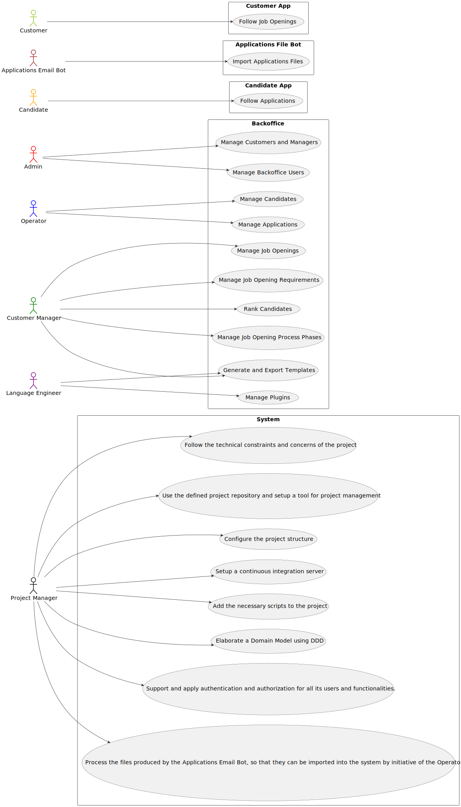

# Use Case Diagram (UCD)

# Use Cases / User Stories

| UC/US | Description |
| ----- | ----------- |
| **G001** | [_`As Project Manager, I want the team to follow the technical constraints and concerns of the project`_](../../sprinta/us_g001/readme.md) |
| **G002** | [_`As Project Manager, I want the team to use the defined project repository (i.e., GitHub) and setup a tool for project management`_](../../sprinta/us_g002/readme.md) |
| **G003** | [_`As Project Manager, I want the team to configure the project structure to facilitate / accelerate the development of upcoming user stories`_](../../sprinta/us_g003/readme.md) |
| **G004** | [_`As Project Manager, I want the team to setup a continuous integration server`_](../../sprinta/us_g004/readme.md) |
| **G005** | [_`As Project Manager, I want the team to add to the project the necessary scripts, so that build/executions/deployments/... can be executed effortlessly`_](../../sprinta/us_g005/readme.md) |
| **G006** | [_`As Project Manager, I want the team to elaborate a Domain Model using DDD`_](../../sprintb/us_g006/readme.md) |
| **G007** | [_`As a Project Manager, I want the system to support and apply authentication and authorization for all its users and functionalities`_](../../sprintb/us_g007/readme.md) |
| **1000** | [_`As Administrator, I want to be able to register, disable/enable, and list users of the backoffice`_](../../sprintb/us_1000/readme.md) |
| **1001** | [_`As Customer Manager I want to register a customer and that the system automatically creates a user for that customer`_](../../sprintb/us_1001/readme.md) |
| **1002** | [_`As Customer Manager, I want to register a job opening`_](../../sprintb/us_1002/readme.md) |
| **1003** | [_`As Customer Manager, I want to list job openings`_](../../sprintb/us_1003/readme.md) |
| **1005** | [_`As Customer Manager, I want to list all applications for a job opening`_](../../sprintb/us_1005/readme.md) |
| **1006** | [_`As Customer Manager, I want to display all the personal data of a candidate`_](../../sprintb/us_1006/readme.md) |
| **1006b** | [_`As Customer Manager, I want to display all the personal data of a candidate, including his/her applications`_](../../sprintb/us_1006b/readme.md) |
| **1007** | [_`As Customer Manager, I want to setup the phases of the process for a job opening`_](../../sprintb/us_1007/readme.md) |
| **1008** | [_`As Language Engineer, I want to deploy and configure a plugin (i.e., Job Requirement Specification or Interview Model) to be used by the system`_](../../sprintb/us_1008/readme.md) |
| **1009** | [_`As Customer Manager, I want to select the requirements specification to be used for a job opening`_](../../sprintb/us_1009/readme.md) |
| **1011** | [_`As Customer Manager, I want to select the interview model to use for the interviews of a job opening (for their evaluation/grading)`_](../../sprintb/us_1011/readme.md) |
| **1012** | [_`As Customer Manager, I want to generate and export a template text file to help collect the candidate answers during the interviews`_](../../sprintb/us_1012/readme.md) |
| **2000a** | [_`As Operator, I want to register a candidate and create a corresponding user`_](../../sprintb/us_2000a/readme.md) |
| **2000c** | [_` As Operator, I want to list all candidates`_](../../sprintb/us_2000c/readme.md) |
| **2001** | [_` As Product Owner, I want the system to, continuously, process the files produced by the Applications Email Bot, so that they can be imported into the system by initiative of the Operator`_](../../sprintb/us_2001/readme.md) |
| **2002** | [_`As Operator, I want to register an application of a candidate for a job opening and import all files received`_](../../sprintb/us_2002/readme.md) |
| **2003** | [_`As Operator, I want to generate and export a template text file to help collect data fields for candidates of a job opening (so the data is used to verify the requirements of the job opening)`_](../../sprintb/us_2003/readme.md) |

