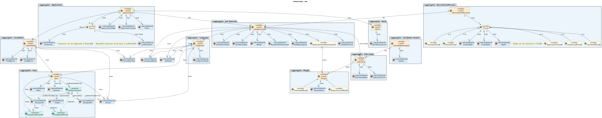

# Analysis

The process of building the domain model is based on the client's specifications, especially the nouns (for concepts) and verbs (for relationships) used.

## Rationale for identifying domain conceptual classes ##

To identify domain conceptual classes, start by making a list of candidate conceptual classes inspired by the list of categories suggested in the book "Applying UML and Patterns: An Introduction to Object-Oriented Analysis and Design and Iterative Development".

### **Rationale for identifying associations between conceptual classes** ###

An association is a relationship between instances of objects that indicates a relevant connection that is worth remembering, or is derivable from the Common Associations List:

| Concept (A)   |  Association |  Concept (B)  |
| ------------- |:------------:| ------------: |
| Application | has | ApplicationDate |
| Application | has | ApplicationNumber |
| Application | has | Result |
| Application | from | Candidate |
| ApplicationPhase | is a | Phase |
| AnalysisPhase | is a | Phase |
| Authentication | authenticated by | Email |
| Authentication | authenticated by | Password |
| Authentication | generates | CreatedOn |
| Authentication | generates | Token |
| Authentication | uses | PasswordPolicy |
| Authentication | uses | PasswordEncoder |
| Candidate | is a | User |
| Candidate | has | FirstName |
| Candidate | has | LastName |
| Candidate | has | PhoneNumber |
| Candidate | has | Email |
| CandidateAnswer | has | Grade |
| CandidateAnswer | for | Interview |
| Customer | has | CompanyName |
| Customer | has | PhoneNumber |
| Customer | has | Email |
| Customer | has | CustomerCode |
| Customer | has | Address |
| Interview | has | InterviewDate |
| Interview | has | InterviewTime |
| Interview | uses | Plugin |
| InterviewPhase | is a | Phase |
| JobOpening | has | JobReference |
| JobOpening | has | TitleOrFunction |
| JobOpening | has | ContractType |
| JobOpening | has | Mode |
| JobOpening | has | Address |
| JobOpening | has | CompanyName |
| JobOpening | has | NumbersOfVacancies |
| JobOpening | has | JobDescription |
| JobOpening | has | RequirementSpecification |
| Phase | has | State |
| Phase | has | InitialDate |
| Phase | has | FinalDate |
| Plugin | has | Description |
| Plugin | has | RequirementModel |
| Plugin | has | InterviewModel |
| Rank | for | JobOpening |
| RecruitmentProcess | for | JobOpening |
| RecruitmentProcess | has | Phase |
| RequirementSpecification | uses | Plugin |
| Result | has | Outcome |
| Result | can have | Justification |
| ResultPhase | is a | Phase |
| ScreeningPhase | is a | Phase |
| User | has | Email |
| User | has | Password |
| User | has | IsActive |
| User | has | Role |
| User | authenticated by | Authentication |

## Domain Model

