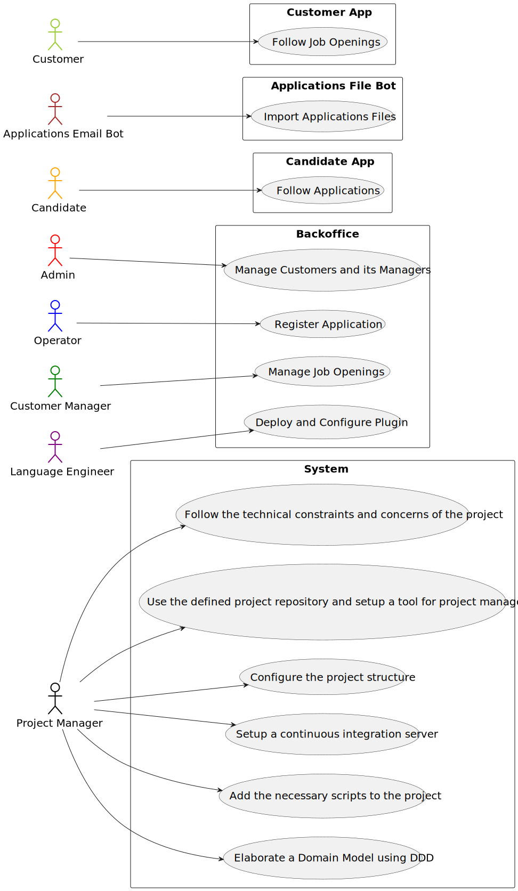

# US G003 - Configure the project structure to facilitate / accelerate the development of upcoming user stories

## 1. Requirements Engineering

* 

### 1.1. User Story Description

* 

### 1.2. Customer Specifications and Clarifications

**From the specifications document:**

>

**From the client clarifications:**

> **Question:** 
>
> **Answer:** 

> **Question:**
>
> **Answer:**

### 1.3. Acceptance Criteria

* **AC1:**

### 1.4. Found out Dependencies

* 

### 1.5 Input and Output Data

**Input Data:**

* 

**Output Data:**

* 

### 1.6. System Sequence Diagram (SSD)

