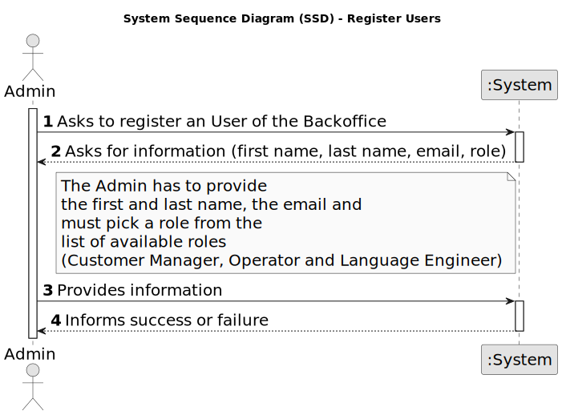

# US 1000 - Register, disable/enable, and list users of the backoffice

## 1. Requirements Engineering

### 1.1. User Story Description

* As Administrator, I want to be able to register, disable/enable, and list users of the backoffice.

### 1.2. Customer Specifications and Clarifications

**From the specifications document:**

- The system administrator (Admin) is responsible for managing customer entities as well as the company’s employees who are customer managers (Customer Manager). This responsibility involves registering entities as well as assigning different roles to system users (i.e., customer manager, operator). It also includes the customer’s registration as a user of the system.

- Alternatively this can be achieved by a bootstrap process.

- The Backoffice app is used by admins, customer managers and operators.

**From the client clarifications:**

> **Date:** 2024-03-14
>
> **Question 10:** O Admin é responsável por gerir apenas Customer managers ou outros, como por exemplo Operators? E qual o significado dessa responsabilidade? 
>
> **Answer:** A ideia é que o Admin fará a gestão desses utilizadores (e no limite também dos Operators). Na prática, as US que remetem para essas funcionalidades, podem ser “substituidas” por um processo de “bootstrap” que faça inicializações na base de dados para suportar esses utilizadores/papeis (tal como mencionado no texto das US).

> **Date:** 2024-03-21
>
> **Question 19:** Na criação de um utilizador no sistema o nome é definido pelo utilizador ou é o nome da pessoa (primeiro e último) e se a password é definida pelo utilizador ou gerada pelo sistema?
>
> **Answer:** No âmbito da US 2000a o Operator cria utilizadores do sistema para candidatos que ainda não estejam no sistema. Tem de fazer isso com base nos dados recebidos na candidatura (que incluem email e nome). O email servirá para identificar a pessoa. Neste contexto é necessário ter uma password para esse novo utilizador. Uma vez que essa informação não é transmitida pelo candidato, suponho que a solução mais “aconselhada” será o sistema gerar uma password para esse utilizador. Como o utilizador/candidato irá receber essa informação (a forma de autenticação na app) está out of scope, no sentido em que não existe nenhuma US que remete para isso. As US 1000 e 1001 também remetem para criação de utilizadores. Aqui, eventualmente poderia-se pensar em introduzir manualmente as passwords, mas pode ser pelo mesmo mecanismo de definição automática de password, descrito anteriormente. ``Relativamente ao nome ver novamente a Q11.``
>
> **Question 20:** Uma pessoa poderá ter vários papeis no sistema?
>
> **Answer:** Será muito difícil controlar que uma pessoa não consegue ter mais do que uma forma de acesso ao sistema (por exemplo, uma pessoa que é Customer Manager poderá ser, no limite, também uma candidato a uma oferta de emprego). Relativamente aos papéis “internos” eu diria que devemos considerar uma hierarquia de acessos. O Admin pode fazer “tudo” o que os outros fazem. Segue-se o Customer Manager e por último o Operator.
>
> **Question 23:** A mudança de estado é referente ao candidato ou à candidatura individual e como se relaciona com o enable/disable dos utilizadores?
>
> **Answer:** O enable/disable dos users é apenas para controlar os acessos ao sistema. O estado, no processo de candidatura, é o estado da candidatura de um candidato a um job opening, não está diretamente relacionado com o enable/disable dos users.

> **Date:** 2024-04-16
>
> **Question 72:** Multiple enable/disable (US1000) – Can a user (from the backoffice, for example) be enabled/disabled multiple times?
>
> **Answer:** Yes.

> **Date:** 2024-04-17
>
> **Question 80:** US1000 – Information about the users - Based on the user story description: "As Administrator, I want to be able to register, disable/enable, and list users of the backoffice.", I have the following questions: 1 - Can there be more than one admnistrator of the backoffice? 2 - What information about the backoffice users need to be registered?
>
> **Answer:** Regarding question 1, one admin is enough. Regarding question 2, see Q11.

> **Date:** 2024-04-18
>
> **Question 81:** US1000 – When we register a customer... are we registering the data of the customer without the data of the user of the company who manage the app or both at the same time? Should we consider the posibility that the Customer User who manage the app changes and we should save the data of the old user too?
>
> **Answer:** For registering a customer see US1001.
>
> **Question 86:** US1000 – Na US menciona "Como administrador do sistema (Admin), quero ser capaz de registar, ativar/desativar, e listar utilizadores do backoffice.", gostava que clarificasse a funcionalidade "ativar/desativar" o quê que pretende e a sua finalidade, se possível com um exemplo.
>
> **Answer:** Resposta já dada em Q23, Q30 (pergunta relacionada com a US2000b) e Q72.
>
> **Question 89:** US1000 - Editar dados de utilizador – É possível alterar os dados de qualquer utilizador (Customer manager, Customer, Candidate), depois de este ter sido criado? Se sim, que dados são passiveis de ser alterados? Cada utilizador que é criado, tem como estado "activo" por defeito?
>
> **Answer:** Não irei responder diretamente à questão. O product owner considera que devem usar as melhores práticas quando a esse assunto.

> **Date:** 2024-04-19
>
> **Question 97:** [1000] – Em relação ao registro de utilizadores, todos estes devem ser considerados por padrão "enable" ou deve haver a opção de "enable/disable" os utilizadores durante o processo de registro?
>
> **Answer:** No contexto da US1000 deve ser possível ativar e desativar utilizadores. Suponho que por omissão devem estar ativos.

### 1.3. Acceptance Criteria

**AC 1:** There must be only one admin of the backoffice.

**AC 2:** The admin must be able to enable/disable an user multiple times.

### 1.4. Found out Dependencies

_N/A_

### 1.5 Input and Output Data

#### 1.5.1. Register Users

**Input Data:**

* Typed data:
	* User data (name, email, role)

**Output Data:**

* (In)Success of the operation

---

#### 1.5.2. Enable/Disable Users

**Input Data:**

* Typed data:
	* User data (email, action)

**Output Data:**

* (In)Success of the operation

---

#### 1.5.3. List Users

**Input Data:**

* No input data required

**Output Data:**

* List of users

### 1.6. System Sequence Diagram (SSD)

#### 1.6.1. Register Users

---

#### 1.6.2. Enable/Disable Users

---

#### 1.6.3. List Users

