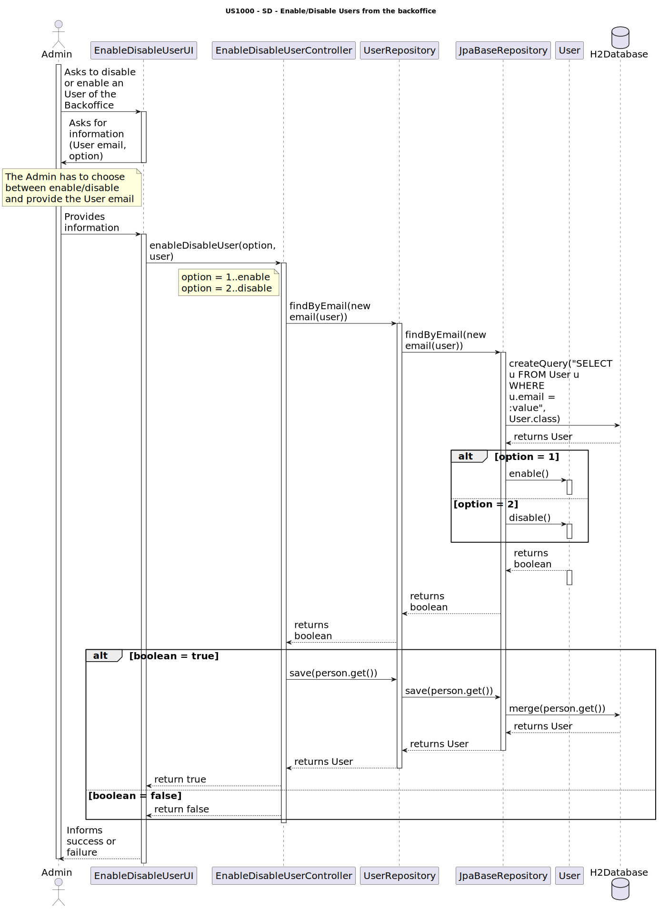
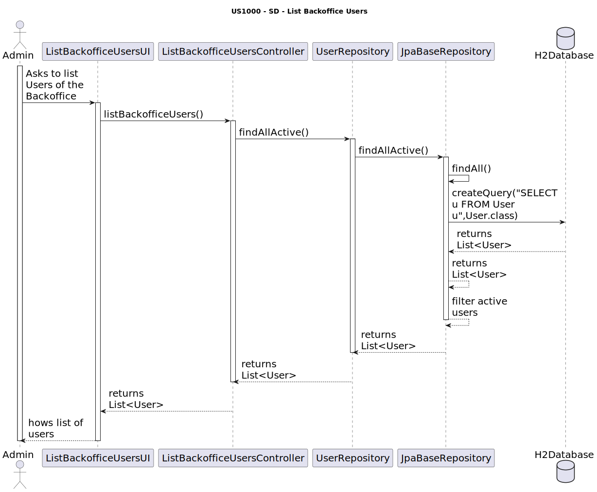

# US 1000 - Register, disable/enable, and list users of the Backoffice

## 3. Design - User Story Realization

### 3.1 Rationale

#### 3.1.1. Register Users

| Interaction ID | Question: Which class is responsible for... | Answer               | Justification (with patterns)                                                                                 |
|:-------------  |:--------------------- |:---------------------|:--------------------------------------------------------------------------------------------------------------|
| Step 1  		 |	... interacting with the actor? | EnableDisableUserUI          | Pure Fabrication: there is no reason to assign this responsibility to any existing class in the Domain Model. |
| 			  		 |	... coordinating the US? | EnableDisableUserController | Controller: The controller is responsible for handling the user's request and coordinating the use case.Controller                                                                                                    |
| 			  		 |	... finding the user by email?						 | BackofficeUserRepository         | Information Expert: The repository knows how to find a user by their email.                                                                               |
| 			  		 |	... querying the database?						 | JpaBaseRepository         | Information Expert: The JpaBaseRepository knows how to interact with the database.                                                                             |
| 			  		 |	... enabling or disabling the user?						 | User         | 	Information Expert: The User class knows how to enable or disable itself.                                                                               |
| 			  		 |	... saving the updated user?						 | BackofficeUserRepository	         | Information Expert: The repository knows how to save a user.                                                                               |

### Systematization ##

According to the taken rationale, the conceptual classes promoted to software classes are:

* User

Other software classes (i.e. Pure Fabrication) identified:

* EnableDisableUserUI
* EnableDisableUserController
* BackofficeUserRepository
* JpaBaseRepository

These classes are responsible for the user interface, controlling the use case, and interacting with the database, respectively.

#### 3.1.2. Enable/Disable Users

| Interaction ID | Question: Which class is responsible for... | Answer               | Justification (with patterns)                                                                                 |
|:-------------  |:--------------------- |:---------------------|:--------------------------------------------------------------------------------------------------------------|
| Step 1  		 |	... interacting with the actor? | ListBackofficeUsersUI          | Pure Fabrication: there is no reason to assign this responsibility to any existing class in the Domain Model. |
| 			  		 |	... coordinating the US? | ListBackofficeUsersController | Controller: The controller is responsible for handling the user's request and coordinating the use case.Controller                                                                                                    |
| 			  		 |	... finding all active users?							 | BackofficeUserRepository         | Information Expert: The repository knows how to find all active users.                                                                               |
| 			  		 |	... querying the database?						 | JpaBaseRepository         | Information Expert: The JpaBaseRepository knows how to interact with the database.                                                                             |
| 			  		 |	... filtering the active users?						 | JpaBaseRepository	         | 	Information Expert: The JpaBaseRepository knows how to filter the active users.                                                                                |

### Systematization ##

According to the taken rationale, the conceptual classes promoted to software classes are:

* User

Other software classes (i.e. Pure Fabrication) identified:

* ListBackofficeUsersUI
* ListBackofficeUsersController
* BackofficeUserRepository
* JpaBaseRepository

These classes are responsible for the user interface, controlling the use case, and interacting with the database, respectively.

#### 3.1.3. List Users

| Interaction ID | Question: Which class is responsible for... | Answer               | Justification (with patterns)                                                                                 |
|:-------------  |:--------------------- |:---------------------|:--------------------------------------------------------------------------------------------------------------|
| Step 1  		 |	... interacting with the actor? | RegisterBackofficeUserUI          | Pure Fabrication: there is no reason to assign this responsibility to any existing class in the Domain Model. |
| 			  		 |	... coordinating the US? | RegisterBackofficeUserController | Controller: The controller is responsible for handling the user's request and coordinating the use case.Controller                                                                                                    |
| 			  		 |	... asking for user information?								 | RegisterBackofficeUserUI         |   Information Expert: The UI knows how to interact with the user and ask for the necessary information.                                                                             |
| 			  		 |	... creating a user with a specific role?						 | UserTypesFactory         | Creator: The factory knows how to create a user with a specific role.                                                                               |
| 			  		 |	... saving the user?						 | UserRepository	         | Information Expert: The repository knows how to save a user.                                                                               |
| 			  		 |	... persisting the user in the database?						 | JpaUserRepository	         | Information Expert: The JpaRepository knows how to interact with the database to persist a user.                                                                               |
| 			  		 |	... informing the success or failure?						 | RegisterBackofficeUserUI	         | Information Expert: The UI knows how to display the result to the user.                                                                               |

### Systematization ##

According to the taken rationale, the conceptual classes promoted to software classes are:

* User

Other software classes (i.e. Pure Fabrication) identified:

* RegisterBackofficeUserUI
* RegisterBackofficeUserController
* UserTypesFactory
* UserRepository
* JpaUserRepository

These classes are responsible for the user interface, controlling the use case, and interacting with the database, respectively.

## 3.2. Sequence Diagram (SD)

#### 3.2.1. Register Users

---

#### 3.2.2. Enable/Disable Users

---

#### 3.2.3. List Users

## 3.3. Class Diagram (CD)

_N/A_

