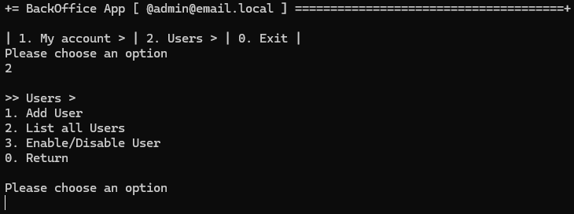
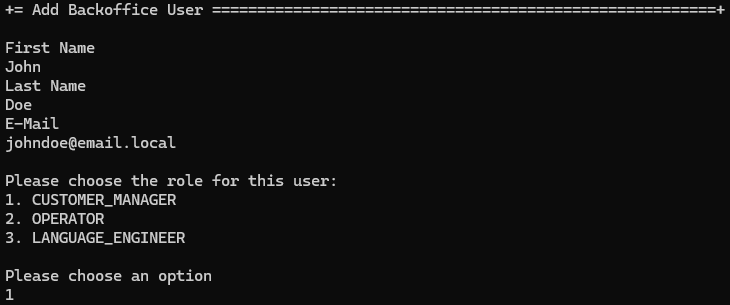
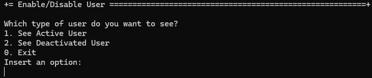
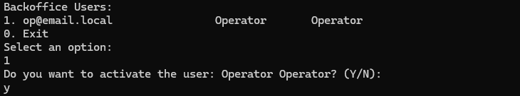
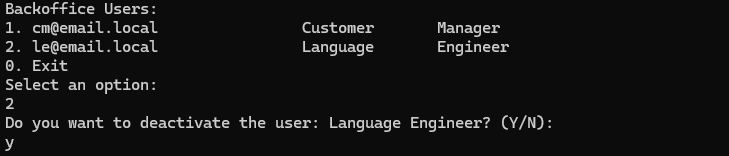
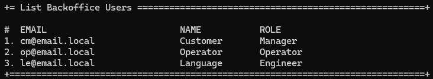

# US 1000 - Register, disable/enable, and list users of the backoffice

# 4. Tests 

_N/A_

# 5. Construction (Implementation)

**AddUserController**
```java
    public Role[] getRoleTypes() {
        return BaseRoles.nonUserValues();
    }

    public SystemUser addUser(final String email, final String password, final String firstName,
            final String lastName, final Set<Role> roles, final Calendar createdOn) {
        authz.ensureAuthenticatedUserHasAnyOf(BaseRoles.ADMIN, BaseRoles.CUSTOMER_MANAGER, BaseRoles.OPERATOR, BaseRoles.POWERUSER);

        return userSvc.registerNewUser(email, password, firstName, lastName, roles,
                createdOn);
    }

    public SystemUser addUser(final String email, final String firstName,
            final String lastName, final Set<Role> roles) {
        return addUser(email, new RandomRawPassword().toString(), firstName, lastName, roles, CurrentTimeCalendars.now());
    }
```

**EnableOrDisableUserController**
```java
    public Iterable<SystemUser> allUsers() {
        authz.ensureAuthenticatedUserHasAnyOf(BaseRoles.ADMIN, BaseRoles.POWERUSER);

        return userSvc.allUsers();
    }

    public Iterable<SystemUser> activeUsers() {
        authz.ensureAuthenticatedUserHasAnyOf(BaseRoles.ADMIN, BaseRoles.POWERUSER);

        return this.backOffice(userSvc.activeUsers());
    }

    public Iterable<SystemUser> deactivatedUsers() {
        authz.ensureAuthenticatedUserHasAnyOf(BaseRoles.ADMIN, BaseRoles.POWERUSER);

        return this.backOffice(userSvc.deactivatedUsers());
    }

    public Iterable<SystemUser> backOffice(Iterable<SystemUser> systemUsers) {
        authz.ensureAuthenticatedUserHasAnyOf(BaseRoles.ADMIN, BaseRoles.POWERUSER);

        List<SystemUser> userList = new ArrayList<>();
        systemUsers.forEach(userList::add);
        List<SystemUser> filtered = userList.stream()
                .filter(systemUser -> systemUser.hasAny(BaseRoles.nonUserValues()))
                .collect(Collectors.toList());
        return filtered;
    }

    public void enableOrDisableUser(SystemUser user, String newStatus) {
        authz.ensureAuthenticatedUserHasAnyOf(BaseRoles.ADMIN, BaseRoles.POWERUSER);

        if (newStatus.equalsIgnoreCase("enable")) {
            userSvc.activateUser(user);
        } else if (newStatus.equalsIgnoreCase("disable")) {
            userSvc.deactivateUser(user);
        }
    }
```

**ListUsersController**
```java
    public Iterable<SystemUser> allUsers() {
        authz.ensureAuthenticatedUserHasAnyOf(BaseRoles.ADMIN, BaseRoles.POWERUSER);

        return userSvc.allUsers();
    }

    public Optional<SystemUser> find(final Username u) {
        return userSvc.userOfIdentity(u);
    }

    public Iterable<SystemUser> backofficeUsers() {
        authz.ensureAuthenticatedUserHasAnyOf(BaseRoles.ADMIN, BaseRoles.POWERUSER);

        return listBackofficeUsersService.backofficeUsers();
    }
```

**ListBackofficeUsersService**
```java
    public Iterable<SystemUser> backofficeUsers() {
        final Iterable<SystemUser> systemUsers = userRepository.findAll();
        List<SystemUser> userList = new ArrayList<>();
        systemUsers.forEach(userList::add);
        List<SystemUser> filtered = userList.stream()
                .filter(systemUser -> systemUser.hasAny(BaseRoles.nonUserValues()))
                .collect(Collectors.toList());

        return filtered;
    }
```

# 6. Integration and Demo 

In the following images, we can see a demonstration of the registration, disable/enable, and list of users of the back office.

<p align="center">Main menu</p>



## 6.1 Registration of a backoffice user


<p align="center">Registration of a backoffice user</p>



## 6.2 Enabling/Disabling a backoffice user

<p align="center">Enabling/Disabling a backoffice user Menu</p>



<p align="center">Enabling a backoffice user</p>



<p align="center">Disabling a backoffice user</p>



## 6.3 Listing backoffice users

<p align="center">Listing backoffice users</p>



# 7. Observations

The implementation of the user registration, enable/disable, and listing of backoffice users was successfully implemented. The user registration is working as expected, and the user can be enabled or disabled. The listing of users is also working as expected.

