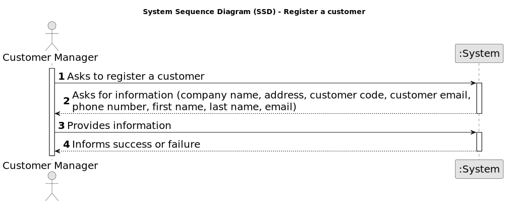

# US 1001 - Register a customer and the system automatically creates a user for that customer

## 1. Requirements Engineering

### 1.1. User Story Description

* As Customer Manager I want to register a customer and that the system automatically creates a user for that customer.

### 1.2. Customer Specifications and Clarifications

**From the specifications document:**

- Alternatively this can be achieved by a bootstrap process.

- The Backoffice app is used by admins, customer managers and operators.

**From the client clarifications:**

> **Date:** 2024-03-14
>
> **Question 6:** Por cada Customer, apenas existe um “representante” que acede à conta (i.e., Customer App)?
>
> **Answer:** Sim, parece-me suficiente.
>
> **Question 11:** No enunciado não está explicita a informação a recolher para os Customers? Qual a informação necessária? E quando aos funcionários da empresa?
>
> **Answer:** De facto isso não está explicito. No entanto, são referidos no nome da empresa e o seu endereço no âmbito de um job opening. Quanto aos utilizadores (representante da empresa que acede à Customer App) eu diria que serão dados similares ao do Candidate. Quando aos funcionários da empresa, eu diria que é importante garantir que é usado o email para identificar qualquer utilizador do sistema. Penso que será importante para cada utilizador termos o nome completo assim como um short user name (que deverá ser único). ``Actualização em 2024-03-21: O Product Owner reconsiderou e decidiu que o short user name é dispensável uma vez que para autenticação dos utilizadores se deve usar apenas o email e a password.``
>
> **Question 13:** Um customer manager pode gerir vários clientes?
>
> **Answer:** Sim.

> **Date:** 2024-03-21
>
> **Question 19:** Na criação de um utilizador no sistema o nome é definido pelo utilizador ou é o nome da pessoa (primeiro e último) e se a password é definida pelo utilizador ou gerada pelo sistema?
>
> **Answer:** No âmbito da US 2000a o Operator cria utilizadores do sistema para candidatos que ainda não estejam no sistema. Tem de fazer isso com base nos dados recebidos na candidatura (que incluem email e nome). O email servirá para identificar a pessoa. Neste contexto é necessário ter uma password para esse novo utilizador. Uma vez que essa informação não é transmitida pelo candidato, suponho que a solução mais “aconselhada” será o sistema gerar uma password para esse utilizador. Como o utilizador/candidato irá receber essa informação (a forma de autenticação na app) está out of scope, no sentido em que não existe nenhuma US que remete para isso. As US 1000 e 1001 também remetem para criação de utilizadores. Aqui, eventualmente poderia-se pensar em introduzir manualmente as passwords, mas pode ser pelo mesmo mecanismo de definição automática de password, descrito anteriormente. ``Relativamente ao nome ver novamente a Q11.``
>
> **Question 20:** Uma pessoa poderá ter vários papeis no sistema?
>
> **Answer:** Será muito difícil controlar que uma pessoa não consegue ter mais do que uma forma de acesso ao sistema (por exemplo, uma pessoa que é Customer Manager poderá ser, no limite, também uma candidato a uma oferta de emprego). Relativamente aos papéis “internos” eu diria que devemos considerar uma hierarquia de acessos. O Admin pode fazer “tudo” o que os outros fazem. Segue-se o Customer Manager e por último o Operator.
>
> **Question 22:** Relativamente ao Job Opening (secção 2.2.2), o job reference refere que deve ser gerado pelo sistema a partir de um customer code. O que é este customer code e se existe alguma regra para a sua criação?
>
> **Answer:** Eu diria que qualquer customer terá de ter um código identificativo (único) que poderá ser uma espécie de abreviatura do seu nome. Com um número limitado de caracteres. Por exemplo, para o cliente Instituto Superior de Engenharia do Porto, o customer code poderia ser ISEP e não poderia haver mais nenhum customer com este customer code. Um limite razoável seria talvez 8 a 10 carateres. Podemos definir 10. Este código é introduzido manualmente na criação do customer no sistema.

> **Date:** 2024-03-23
>
> **Question 28:** Pretende-se que cada Customer seja identificado no sistema como um utilizador?
>
> **Answer:** Remete-se a resposta para a Q6 (responde indiretamente).
>
> **Question 35:** Customer tem que ter morada e nome da empresa ou se basta essa informação estar no job opening?
>
> **Answer:** Devemos registar nome e morada do customer. Para cada job opening a morada pode ser especifica (e diferente da morada do customer).

> **Date:** 2024-04-12
>
> **Question 56:** No número de telémovel e no código postal as verificações são feitas apenas para domínios portugueses, ou temos de programar consuante o país referente?
>
> **Answer:** Basta para o caso português.

> **Date:** 2024-04-18
>
> **Question 81:** When we register a customer... are we registering the data of the customer without the data of the user of the company who manage the app or both at the same time? Should we consider the posibility that the Customer User who manage the app changes and we should save the data of the old user too?
>
> **Answer:** For registerinr a customer see US1001.

> **Date:** 2024-04-20
>
> **Question 104:** A criação de uma conta para o customer é feita ao inserir manualmente o email e nome do customer ou é expectavel ter uma lista de customers não registados no sistema para usar?
>
> **Answer:** Não percebi bem o conceito de customers não registados. Penso que esse conceito não existe. A US 1001 indica que se pretende registar um customer. Ao registar-se o customer deve-se também criar um utilizador para que o customer possa aceder à App de customers.

> **Date:** 2024-04-21
>
> **Question 110:** Na US1001, o customer manager ao registrar um customer deve definir uma password para este usuário ou será que deve ser gerado pelo sistema?
>
> **Answer:** Já respondida em Q19.
>
> **Question 111:** Quais são as regras de negócio do endereço do customer?
>
> **Answer:** Se me perguntar se é suficiente, nesta fase, que o sistema aceite apenas endereços nacionais, a minha resposta é afirmativa. Se a pergunta era outra, por favor coloque de novo, desta vez como se estivesse a falar com alguém que não sabe o que são regras de negócio, mas é especialista no negócio.
>
> **Question 112:** É correto assumir que o customer fica automaticamente atribuido ao customer manager que o registou?
>
> **Answer:** Sim. No âmbito deste projeto vamos assumir que isso deve acontecer.

> **Date:** 2024-04-23
>
> **Question 122:** Na US 1001 é pedido que a criação de um User através da CustomerEntity criada seja automática. Contudo, para a criação de um User é necessário um e-mail. Permite que seja pedido um e-mail ao Manager, para ficar associado á entidade? A password já será gerada automaticamente, por isso seria também possível a geração automática de um e-mail.
>
> **Answer:** Para essa US faze sentido assumir que o Customer Manager conhece o email a ser suado para esse Customer e pode introduzi-lo. Tal como para outras situações similares podem assumir que a password é gerada pelo sistema e que existe uam forma do utilizador conhecer essa password, mas que está forá do âmbito actual do sistema. Não percebi à referência a CustomerEntity. O que é?

> **Date:** 2024-04-29
>
> **Question 135:** Relativamente ao formato do customer code, em todos os exemplos fornecidos, este é uma sigla/acrónimo com letras maiúsculas (ex: "ISEP", "IBM"). Só pode ter este formato ou pode conter números e letras minúsculas?
>
> **Answer:** Ver Q22. Em Q22 sugere-se 10 caracteres no máximo. Penso que seria de manter apenas letras maiúsculas podendo ainda ter dígitos (0-9), mas começando sempre por letra.

### 1.3. Acceptance Criteria

* **AC1:** The system must automatically create a user for the customer that the Customer Manager registers.

* **AC2:** The address of the customer must be registered.

* **AC3:** The customer code must be unique and have a maximum of 10 characters, having only uppercase letters and digits (0-9) and starting with a letter.

### 1.4. Found out Dependencies

_N/A_

### 1.5 Input and Output Data

**Input Data:**

* Typed data:
	* company name
	* customer code
	* customer's e-mail
	* address
	* phone number
	* representative first name
	* representative last name
	* representative e-mail

**Output Data:**

* (In)Success of the operation

### 1.6. System Sequence Diagram (SSD)

