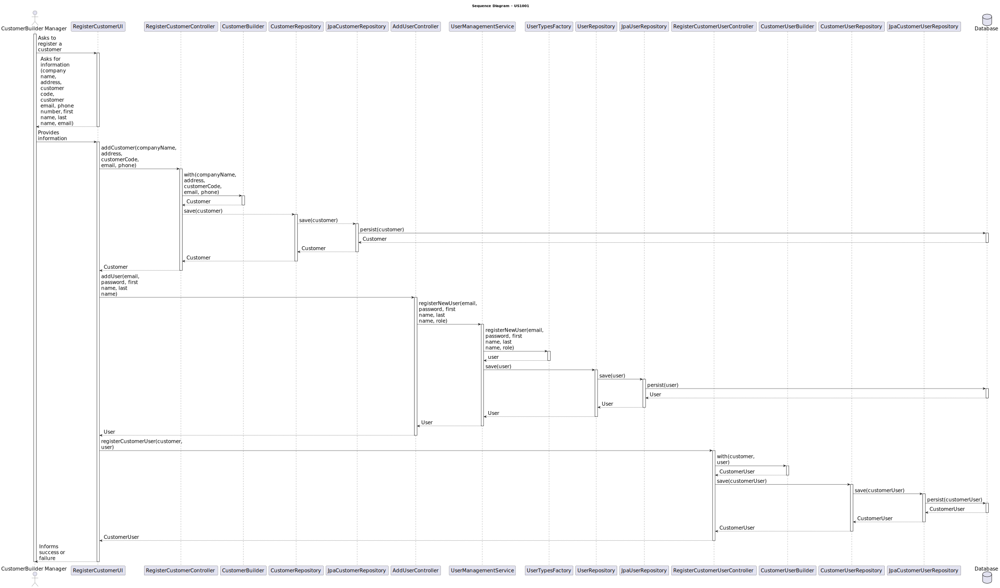
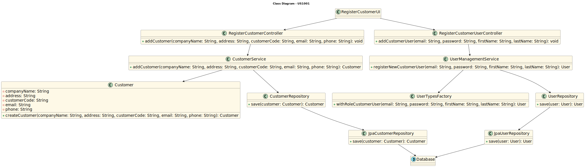

# US 1001 - Register a customer and the system automatically creates a user for that customer

## 3. Design - User Story Realization

### 3.1 Rationale

| Interaction ID | Question: Which class is responsible for... | Answer               | Justification (with patterns)                                                                                 |
|:-------------  |:--------------------- |:---------------------|:--------------------------------------------------------------------------------------------------------------|
| Step 1  		 |	... interacting with the actor? | RegisterCustomerUI          | Pure Fabrication: there is no reason to assign this responsibility to any existing class in the Domain Model. |
| 			  		 |	... coordinating the US? | RegisterCustomerController | Controller: The controller is responsible for handling the user's request and coordinating the use case. |
| 			  		 |	... creating the customer?						 | Customer         | Information Expert: The Customer class knows how to create a new customer. |
| 			  		 |	... saving the customer?						 | CustomerRepository         | Information Expert: The repository knows how to save a customer. |
| 			  		 |	... querying the database for customer?						 | JpaCustomerRepository         | Information Expert: The JpaCustomerRepository knows how to interact with the database. |
| 			  		 |	... coordinating the user creation?						 | RegisterCustomerUserController         | 	Controller: The controller is responsible for handling the user's request and coordinating the use case. |
| 			  		 |	... creating the user?						 | UserTypesFactory	         | Creator: The factory knows how to create a new user. |
| 			  		 |	... saving the user?						 | UserRepository	         | Information Expert: The repository knows how to save a user. |
| 			  		 |	... querying the database for user?						 | JpaUserRepository	         | Information Expert: The JpaUserRepository knows how to interact with the database. |

### Systematization ##

According to the taken rationale, the conceptual classes promoted to software classes are:

* Customer
* User

Other software classes (i.e. Pure Fabrication) identified:

* RegisterCustomerUI
* RegisterCustomerController
* CustomerService
* CustomerRepository
* JpaCustomerRepository
* RegisterCustomerUserController
* UserManagementService
* UserTypesFactory
* UserRepository
* JpaUserRepository

These classes are responsible for the user interface, controlling the use cases, creating and saving the customer and user, and interacting with the database, respectively.

## 3.2. Sequence Diagram (SD)

## 3.3. Class Diagram (CD)

