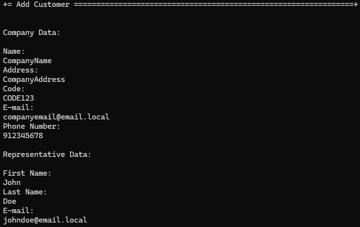

# US 1001 - Register a customer and the system automatically creates a user for that customer

# 4. Tests 

_N/A_

# 5. Construction (Implementation)

_N/A_

# 6. Integration and Demo 

In the following images, we can see a demonstration of the registration of a customer.

Customer Registration

The user must provide all the information shown above in order to register a customer.

# 7. Observations

The implementation of the customer registration was a success

