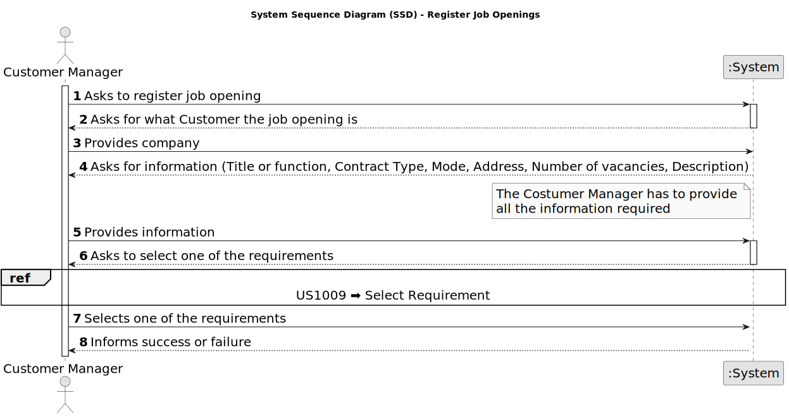

# US 1002 - Register a job opening.

## 1. Requirements Engineering

### 1.1. User Story Description

* As Customer Manager, I want to register a job opening.

### 1.2. Customer Specifications and Clarifications

**From the specifications document:**

- Entities send job offers to Jobs4U. This sending can be done by various means (e.g. email,
post, telephone), but the automation of this reception is outside the scope of the system.

- A customer manager will register job offers for the entities he manages in the backoffice.

- Job openings (or job vacancies) are created in the system by a customer manager. A job opening includes:
	- **Job Reference:** A unique identifier of the job opening (generated by the system for instance based on the customer code followed by a sequential number)
	- **Title or function:** Such as "front-end programmer"
	- **Contract Type:** Such as full-time or part-time
	- **Mode:** Such as remote, hybrid, onsite
	- **Address:** Address for job
	- **Company:** Customer name
	- **Number of vacancies**
	- **Description**
	- **Requirements:** The job requirements specification to use for this opening, as described in Section 2.2.4.

- Job vacancies (job openings) must include a Job Requirement Specification.

**From the client clarifications:**

> **Date:** 2024-03-14
>
> **Question 7:** No contexto em que o Customer Manager regista uma oferta de emprego, como são selecionados/definidos os requisitos para essa job offer?
>
> **Answer:** O Customer manager regista a job opening (US 1002) e de seguida (normalmente) seleciona qual o requirements specification que é adequado a esse job opening. O requirements specification será um dos que foi “criado” pelo language engineer e registado no sistema.

> **Date:** 2024-03-21
>
> **Question 22:** Relativamente ao Job Opening (secção 2.2.2), o job reference refere que deve ser gerado pelo sistema a partir de um customer code. O que é este customer code e se existe alguma regra para a sua criação?
>
> **Answer:** Eu diria que qualquer customer terá de ter um código identificativo (único) que poderá ser uma espécie de abreviatura do seu nome. Com um número limitado de caracteres. Por exemplo, para o cliente Instituto Superior de Engenharia do Porto, o customer code poderia ser ISEP e não poderia haver mais nenhum customer com este customer code. Um limite razoável seria talvez 8 a 10 carateres. Podemos definir 10. Este código é introduzido manualmente na criação do customer no sistema.
>
> **Question 25:** No job opening é tudo de preenchimento obrigatório ou existem opcionais?
>
> **Answer:** Os campos referidos na secção 2.2.2 são de preenchimento obrigatório. Os requirements vão ser dinâmicos uma vez que dependem do requirements specification selecionado para aquele job opening (que se baseia numa linguagem).

> **Date:** 2024-04-04
>
> **Question 37:** No job opening (secção 2.2.2), no campo company, deve ser o customer name ou o customer code, uma vez que o customer code é único e introduzido manualmente?
>
> **Answer:** A informação relativa ao job opening que aparece no final da página 5 deve ser vista como algo a ser usado na divulgação de uma oferta de emprego. Nesse contexto, para a Company faz mais sentido divulgar o nome da company e não o seu código. Dito isto, em termos de armazenamento numa base de dados poderá ficar o código.
>
> **Question 38:** (...) Assumimos que uma job opening só segue um interview model?
>
> **Answer:** (...) Ou seja, existirá apenas um interview model a usar nas entrevistas desse job opening.

> **Date:** 2024-04-17
>
> **Question 77:** US1002 Critérios de Aceitação – Relativamente à US1002 - "As Customer Manager, I want to register a job opening", existe algum critério de aceitação ainda não mencionado, relacionado com os atributos? Ou fica ao critério da equipa de desenvolvimento consoante boas práticas e senso comum? Alguns exemplos: - O "Number of Vacancies" não poder ser menor ou igual a 0 ou pode ser opcional; - A "Description" ter um tamanho de caracteres limite ou ser opcional;
>
> **Answer:** Sobre se existem critérios de aceitação não mencionados não me vou pronunciar, faz parte do processo descobrirem. Eu sugeria usarem algo mais que o senso comum.
>
> **Question 79:** US1002 - Could we use the same interview model for more than one job opening?
>
> **Answer:** See Q38. Yes.

> **Date:** 2024-04-18
>
> **Question 88:** US1002 – Quando o Customer Manager regista uma job offer, é ele que cria as requirement specifications e as interview models ou é-lhe dada uma lista destes para ele selecionar?
>
> **Answer:** Existe a US1002 e as US1009 e US1011. Penso que está claro qual a responsabilidade de cada uma. A criação dos modelos das entrevistas e dos requisitos é um caso de uso especifico e com um US especifica para registar no sistema os respectivos plugins (US1008).

> **Date:** 2024-04-19
>
> **Question 91:** [1002, 1007, 1009] - Validez de uma Job Openings – A nossa questão principal seria: quando é que uma job opening é considerada válida? Tendo em conta as funcionalidades 1002, 1007, 1009, surgiu-nos uma duvida relativamente às job openings e à sua constituiçao. Na US1002, é suposto resgistar uma job opening e apenas depois, na US1009, devemos selecionar os requirements specifications para a dada job opening. Posto isto, aquando o registo da job opening, esta não iria possuir toda a informaçao obrigatória como requerido. Assim sendo, deveria haver uma ligação direta entre estas user stories de forma a que, aquando o registo, passamos automaticamente a selecionar os requirements obtendo assim uma job opening válida? Adicionalmente, queremos esclarecer se o recruitment process é algo obrigatório para a validez de um job opening.
>
> **Answer:** O product owner não é especialista do dominio da solução (apenas têm conhecimentos do problema) mas, quanto à primeira questão, sugere que talvez user stories não sejam (podem não ser) opções de menu “distintas”. Quanto à segunda questão (recruitment process) julgo que também está mais ligada à solução que ao problema, pelo que não vou sugerir nada que possa até complicar mais do que esclarecer.

### 1.3. Acceptance Criteria

* **AC 1:** The job opening must include the following information:
	- Job Reference
	- Title or function
	- Contract Type
	- Mode
	- Address
	- Company
	- Number of vacancies
	- Description
	- Requirements (US 1009)

* **AC 2:** The job reference must be generated by the system based on the customer code followed by a sequential number.

* **AC 3:** The fields of the job opening are mandatory.

* **AC 4:** The job opening must include a job requirement specification.

* **AC 5:** The Company field must contain the name of the company.

### 1.4. Found out Dependencies

* **US 1001 - Register Customers:** The job openings are registered for the entities managed by the Customer Manager so the entities must be registered in the system before the job openings can be registered.

* **US 1008 - Register Plugins (Interview Models and Requirements Specifications):** The plugins must be registered in the system before they can be used in the job openings.

* **US 1009 - Select Requirements Specification for a Job Opening:** The Customer Manager must have the possibility to select the requirements specification to use for the job opening.

### 1.5 Input and Output Data

**Input Data:**

* Generated data:
	* Job Reference

* Typed data:
	* Title or function
	* Contract Type
	* Mode
	* Address
	* Company
	* Number of vacancies
	* Description

* Selected data:
	* Requirements (US 1009)

**Output Data:**

* (In)Success of the operation

### 1.6. System Sequence Diagram (SSD)

