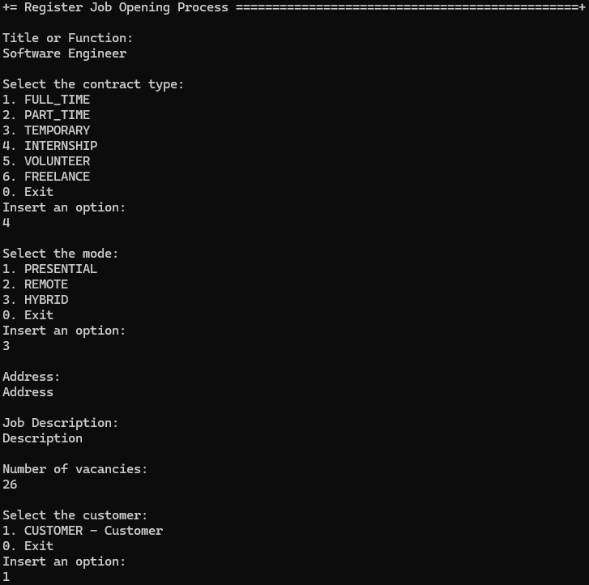

# US 1002 - Register a job opening.

# 4. Tests 

**Some tests of the JobOpening class**
```java
    @Test
    public void ensureJobOpeningEqualsPassesForTheSameJobOpeningCode() throws Exception {

        final JobOpening aJobOpening = getNewDummyJobOpening(aJobReference);

        final JobOpening anotherJobOpening = getNewDummyJobOpening(aJobReference);

        final boolean expected = aJobOpening.equals(anotherJobOpening);

        assertTrue(expected);
    }

    @Test
    public void ensureJobOpeningEqualsFailsForDifferenteJobOpeningCode() throws Exception {
        final Set<Role> roles = new HashSet<>();
        roles.add(BaseRoles.ADMIN);

        final JobOpening aJobOpening = getNewDummyJobOpening(aJobReference);

        final JobOpening anotherJobOpening = getNewDummyJobOpening(anotherJobReference);

        final boolean expected = aJobOpening.equals(anotherJobOpening);

        assertFalse(expected);
    }

    @Test
    public void ensureJobOpeningEqualsAreTheSameForTheSameInstance() throws Exception {
        final JobOpening aJobOpening = getNewDummyJobOpening(aJobReference);

        final boolean expected = aJobOpening.equals(aJobOpening);

        assertTrue(expected);
    }

    @Test
    public void ensureJobOpeningEqualsFailsForDifferenteObjectTypes() throws Exception {
        final JobOpening aJobOpening = getNewDummyJobOpening(aJobReference);

        final boolean expected = aJobOpening.equals(getNewDummyJobOpening(anotherJobReference));

        assertFalse(expected);
    }

    @Test
    public void ensureJobOpeningIsTheSameAsItsInstance() throws Exception {
        final JobOpening aJobOpening = getNewDummyJobOpening(aJobReference);

        final boolean expected = aJobOpening.sameAs(aJobOpening);

        assertTrue(expected);
    }

    @Test
    public void ensureTwoJobOpeningWithDifferentJobOpeningCodesAreNotTheSame() throws Exception {
        final JobOpening aJobOpening = dummyJobOpening(aJobReference);
        final JobOpening anotherJobOpening = dummyJobOpening(anotherJobReference);

        final boolean expected = aJobOpening.sameAs(anotherJobOpening);

        assertFalse(expected);
    }
```

# 5. Construction (Implementation)

**RegisterJobOpeningController**
```java

    public JobOpening SetUpJobOpening(final String titleOrFunction, final String contractType,
            final String mode, final String address, final Customer customer, final String jobDescription,
            final String numberOfVacancies) {
        authz.ensureAuthenticatedUserHasAnyOf(BaseRoles.CUSTOMER_MANAGER, BaseRoles.POWERUSER);
        String jobReference = registerJobOpeningService.nextJobOpeningReference(customer.identity());
        return registerJobOpening(jobReference, titleOrFunction, contractType, mode, address, customer, jobDescription,
                numberOfVacancies);
    }

    private JobOpening registerJobOpening(final String jobReference, final String titleOrFunction,
            final String contractType, final String mode, final String address, final Customer customer,
            final String jobDescription, final String numberOfVacancies) {
        final JobOpening jobOpening = doSetUpJobOpening(jobReference, titleOrFunction, contractType, mode, address,
                customer, jobDescription, CurrentTimeCalendars.now(), numberOfVacancies);
        return jobOpeningRepository.save(jobOpening);
    }

    private JobOpening doSetUpJobOpening(final String jobReference, final String titleOrFunction,
            final String contractType, final String mode, final String address, final Customer customer,
            final String jobDescription, Calendar createdOn, final String numberOfVacancies) {
        return new JobOpeningBuilder()
                .with(jobReference, titleOrFunction, contractType, mode, address, customer, jobDescription, createdOn,
                        numberOfVacancies)
                .build();
    }
```
**RegisterJobOpeningService**
```java
    public String nextJobOpeningReference(final CustomerCode customerCode) {
        return customerCode.toString() + "-" + jobOpeningRepository.findHighestSequenceForCustomer(customerCode);
    }
```	

# 6. Integration and Demo 

In the following image, we can see a demonstration of the registration of a job opening.

<p align="center">Registration of a job opening</p>



# 7. Observations

The implementation of job opening registration was successfully implemented. The job opening registration is working as expected.

