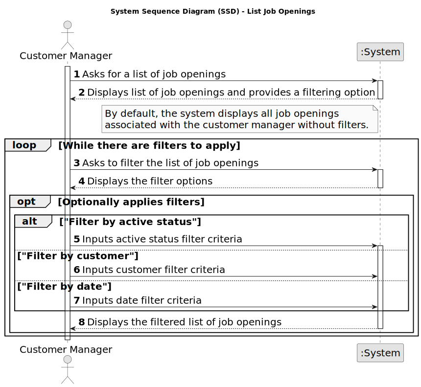

# US 1003 - List job openings.

## 1. Requirements Engineering

### 1.1. User Story Description

* As Customer Manager, I want to list job openings.

### 1.2. Customer Specifications and Clarifications

**From the specifications document:**

_N/A_

**From the client clarifications:**

> **Date:** 2024-04-04
>
> **Question 37:** No job opening (secção 2.2.2), no campo company, deve ser o customer name ou o customer code, uma vez que o customer code é único e introduzido manualmente?
>
> **Answer:** A informação relativa ao job opening que aparece no final da página 5 deve ser vista como algo a ser usado na divulgação de uma oferta de emprego. Nesse contexto, para a Company faz mais sentido divulgar o nome da company e não o seu código. Dito isto, em termos de armazenamento numa base de dados poderá ficar o código.

> **Date:** 2024-04-11
>
> **Question 52:** Um job opening só tem um customer manager?
>
> **Answer:**  Sim, um customer manager em principio gere todas as ofertas de emprego de um cliente (customer). E, consequentemente, existe só um customer manager para cada job opening.

> **Date:** 2024-04-15
>
> **Question 68:**  Na us1003 é pedido que se liste job openings, há algum critério para definir quais listar? Ou são as do sistema inteiro?
>
> **Answer:**  Suponho que poder filtrar por Customer e data seja útil. Também poder filtrar apenas as activas ou todas parece-me útil.

> **Date:** 2024-04-18
>
> **Question 87:**  Relativamente a uma questão já colocada foi referido que "pode-se filtrar por Customer" nesta US. Nesta caso qual será a forma que o Customer Manager utilizará para filtrar as Job Openings por Costumer (nome, email,...)? E quando se refere a "poder filtrar por data" significa que é uma determinada data ou um intervalo de tempo?
>
> **Answer:**  O Customer é tipicamente uma empresa e tem um nome. Também já foi referida a existência de um customer code. Quanto ao filtro por data se estiverem no papel do customer manager que tem de consultar job openings faz sentido ser para um dia? Ou seja ele teria de sabe em que dia é que registou o job opening que está a pesquisar…

> **Date:** 2024-04-19
>
> **Question 95:**  A resposta à questão Q68 suscitou-nos algumas dúvidas sobre uma job opening no estado "ativa". Em que instante uma job opening se torna ativa? É quando é criada e tem um conjunto de requisitos associada a si? É quando está ligada a um processo de recrutamento ainda a decorrer? Agradecíamos alguns esclarecimentos.
>
> **Answer:**  No contexto da Q68 a referência a activa surge no contexto de datas. Uma job opening cujo processo já tenha terminado não está ativa.
>
> **Question 96:** Em relação à listagem dos jobs openings, um customer manager pode listar todos os jobs openings ou apenas os que lhe foram atribuídos. Posto de outra forma, os job openings são atribuídos a um customer manager específico, e o mesmo só pode ter acesso à sua lista de job openings?
>
> **Answer:**  Penso que faz sentido listar apenas os “seus” job openings.

> **Date:** 2024-04-23
>
> **Question 120:** O cliente esclareceu o aspeto do status de uma job opening nas questões Q68 e Q95. Disse que uma job opening deixava de estar ativa quando o seu processo de recrutamento termina-se. Contudo, em que estado estão as job openings que já foram registadas mas ainda não têm um processo de recrutamento associado a si?
>
> **Answer:**  Relativamente ao estado (nome do estado) em que estão depois de serem registadas mas ainda não terem um processo eu não sei o que responder. Mas posso acrescentar que se não têm processo então não têm datas para as fases do processo e, portanto, parece-me que ainda não entraram na fase de application, pelo que ninguém tem “oficialmente” conhecimento dessa oferta de emprego e não devem haver candidaturas para essa oferta.

### 1.3. Acceptance Criteria

**AC 1:** The system must list only the job openings that belong to the customer manager.

**AC 2:** The system must provide filters to list job openings by:
  * active
  * customer
  * date

**AC 3:** When listing job openings, the system must display the company name and not the company code.

### 1.4. Found out Dependencies

* **US 1002 - Register Job Openings:** To list all job openings, it is necessary to have a job opening registered.

### 1.5 Input and Output Data

**Input Data:**

* Selected data:
  * filters:
    * active
    * customer
    * date
* Inserted data:
  * initial date
  * final date

**Output Data:**

* List of Job Openings

### 1.6. System Sequence Diagram (SSD)

