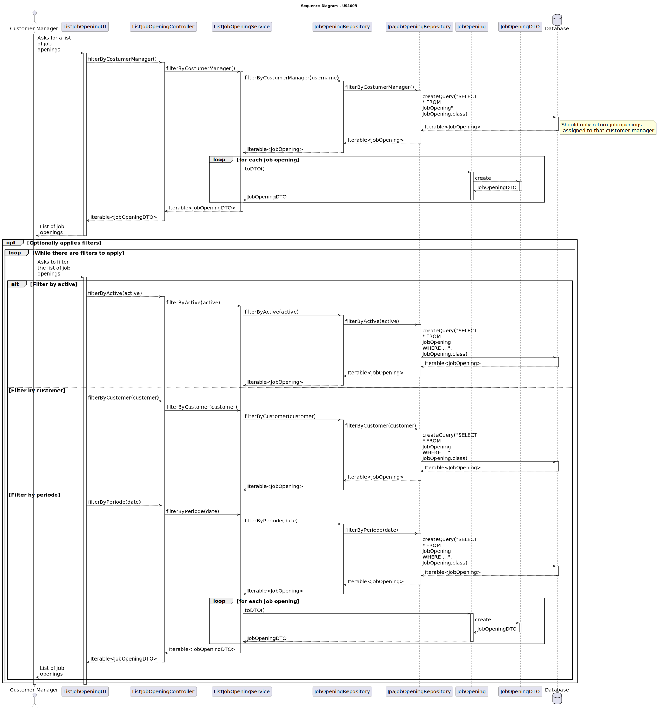

# US 1003 - List job openings.

## 3. Design - User Story Realization

### 3.1 Rationale

| Interaction ID | Question: Which class is responsible for... | Answer               | Justification (with patterns)                                                                                 |
|:-------------  |:--------------------- |:---------------------|:--------------------------------------------------------------------------------------------------------------|
| Step 1  		 |	... interacting with the actor? | ListJobOpeningUI          | Pure Fabrication: there is no reason to assign this responsibility to any existing class in the Domain Model. |
| 			  		 |	... coordinating the US? | JobOpeningController | Controller: The controller is responsible for handling the user's request and coordinating the use case. |
| 			  		 |	... creating the job opening DTO?						 | JobOpening         | Information Expert: The JobOpening class knows how to create a new JobOpeningDTO. |
| 			  		 |	... saving the job opening?						 | JobOpeningRepository         | Information Expert: The repository knows how to save a job opening. |
| 			  		 |	... querying the database for job opening?						 | JpaJobOpeningRepository         | Information Expert: The JpaJobOpeningRepository knows how to interact with the database. |
| 			  		 |	... coordinating the job opening listing?						 | JobOpeningController         | 	Controller: The controller is responsible for handling the user's request and coordinating the use case. |
| 			  		 |	... applying the filter?						 | JobOpeningService	         | Creator: The service knows how to apply a filter to the job openings. |
| 			  		 |	... saving the filtered job openings?						 | JobOpeningRepository	         | Information Expert: The repository knows how to save the filtered job openings. |
| 			  		 |	... querying the database for filtered job openings?						 | JpaJobOpeningRepository	         | Information Expert: The JpaJobOpeningRepository knows how to interact with the database. |

### Systematization ##

According to the taken rationale, the conceptual classes promoted to software classes are:

* JobOpening
* JobOpeningDTO

Other software classes (i.e. Pure Fabrication) identified:

* ListJobOpeningUI
* JobOpeningController
* JobOpeningService
* JobOpeningRepository
* JpaJobOpeningRepository

These classes are responsible for the user interface, controlling the use cases, creating and saving the job openings, applying filters, and interacting with the database, respectively.

## 3.2. Sequence Diagram (SD)

## 3.3. Class Diagram (CD)

