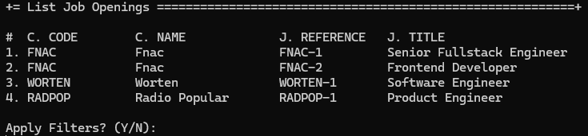
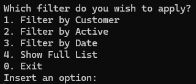

# US 1003 - List job openings.

# 4. Tests 

_N/A_

# 5. Construction (Implementation)

_N/A_

# 6. Integration and Demo 

In the following images, we can see a demonstration of listing the job openings and filtering them.

Job Openings List

Filtering Options

The user can filter the job openings by the following options:
- Active job openings
- Job Openings by period
- Job Openings by customer

# 7. Observations

The implementation of listing job openings was a success

