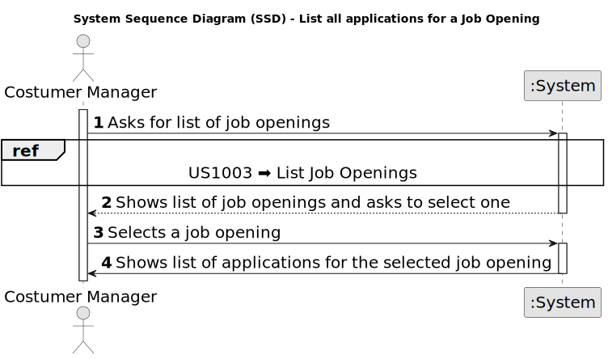

# US 1005 - List all applications for a job opening.

## 1. Requirements Engineering

### 1.1. User Story Description

* As Customer Manager, I want to list all applications for a job opening.

### 1.2. Customer Specifications and Clarifications

**From the specifications document:**

_N/A_

**From the client clarifications:**

> **Date:** 2024-04-13
>
> **Question 63:** Relativamente aos critérios para a listagem das candidaturas: Devem aparecer candidaturas que estão a decorrer ou podem aparecer candidaturas feitas no passado? Podem aparecer quaisquer candidaturas ou apenas as que tenham sido aceites? Que informação deverá ser mostrada em cada candidatura?
>
> **Answer:** Tal como refere a descrição da US, devem ser listadas todas as candidaturas para um job opening. Faz sentido mostrar todas as candidaturas, independentemente do seu estado. Assim, para cada cada candidatura deve ser identificado o candidato e o estado da sua candidatura.

> **Date:** 2024-04-17
>
> **Question 76:** A lista deve conter applications que ainda não concluíram todo o processo de seleção definido no setup da Job Opening ? Se sim, a lista deve conter o estado/fase de cada application?
>
> **Answer:** O processo de seleção/recrutamento termina apenas no “fim”, pelo que não percebo muito bem a primeira pergunta. Quanto à segunda pergunta penso que faz sentido incluir o estado da aplicação, até para o Customer Manager perceber as applications que foram rejeitadas por não passarem os requisitos. 

### 1.3. Acceptance Criteria

**AC 1:** All applications for a job opening must be listed independently of their state.

**AC 2:** For each application, the candidate and the state of the application must be identified.

### 1.4. Found out Dependencies

* **US 1002 - Register Job Openings: ** To list all applications for a job opening, it is necessary to have a job opening registered.

* **US 1003 - List Applications: ** The Customer Manager must have the possibility to list all applications for a job opening.

* **US 2002 - Register Applications: ** The applications must be registered in the system before they can be listed.

### 1.5 Input and Output Data

**Input Data:**

* Selected data:
  * Job Opening

**Output Data:**

* List of Job Openings
* List of applications for a job opening

### 1.6. System Sequence Diagram (SSD)

