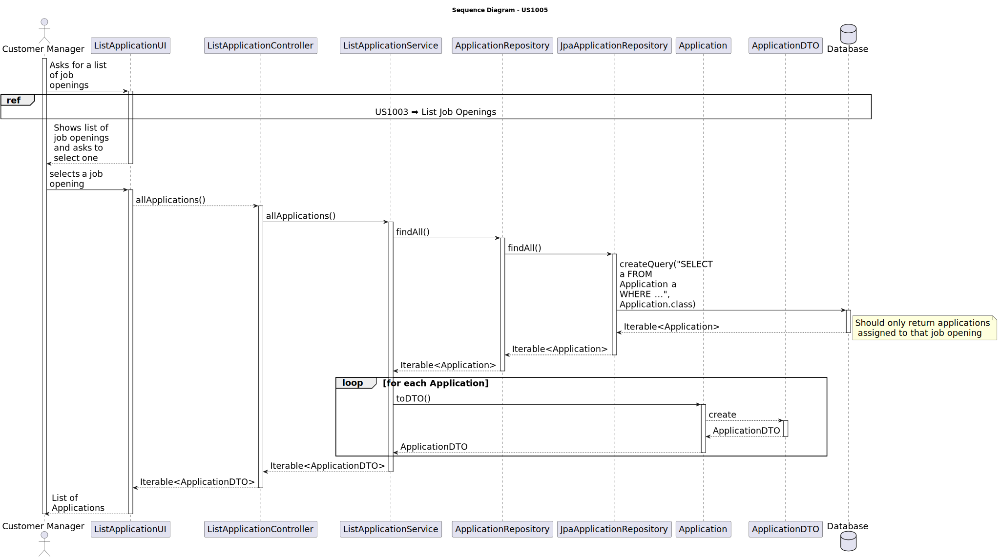

# US 1005 - List all applications for a job opening.

## 3. Design - User Story Realization

### 3.1. Rationale

| Interaction ID | Question: Which class is responsible for... | Answer               | Justification (with patterns)                                                                                 |
|:-------------  |:--------------------- |:---------------------|:--------------------------------------------------------------------------------------------------------------|
| Step 1  		 |	... interacting with the actor? | ListApplicationUI          | Pure Fabrication: there is no reason to assign this responsibility to any existing class in the Domain Model. |
| 			  		 |	... coordinating the US? | ListApplicationController | Controller: The controller is responsible for handling the user's request and coordinating the use case. |
| 			  		 |	... creating the job opening?						 | Application         | Information Expert: The Application class knows how to create a new application. |
| 			  		 |	... saving the job opening?						 | ApplicationRepository         | Information Expert: The repository knows how to save an application. |
| 			  		 |	... querying the database for job opening?						 | JpaApplicationRepository         | Information Expert: The JpaApplicationRepository knows how to interact with the database. |

### Systematization

According to the taken rationale, the conceptual classes promoted to software classes are:

* Application

Other software classes (i.e. Pure Fabrication) identified:

* ListApplicationUI
* ListApplicationController
* ApplicationService
* ApplicationRepository
* JpaApplicationRepository

These classes are responsible for the user interface, controlling the use cases, creating and saving the application, and interacting with the database, respectively.

## 3.2. Sequence Diagram (SD)

## 3.3. Class Diagram (CD)

