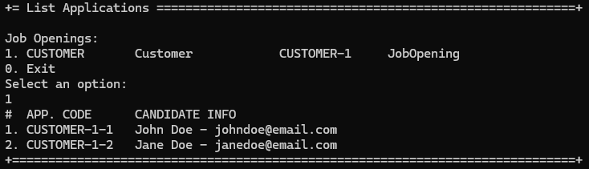

# US 1005 - List all applications for a job opening.

# 4. Tests 

**Some tests of the ListApplictionsController**
```java
    @Test
    void testSelectApplicationNotNull() {
        Application result = controller.selectedApplication(mockApplicationDTO);
        assertNotNull(result);
    }

    @Test
    void testSelectApplicationReturnsExpectedJobOpening() {
        Application result = controller.selectedApplication(mockApplicationDTO);
        assertEquals(mockApplication, result);
    }

    @Test
    void testSelectApplicationCallsOfIdentity() {
        controller.selectedApplication(mockApplicationDTO);
        verify(mockRepo).ofIdentity(applicationCode);
    }
```

**Some tests of the ListApplictionsService**
```java
    @Test
    void testSelectApplicationNotNull() {
        Application result = service.selectedApplication(mockApplicationDTO);
        assertNotNull(result);
    }

    @Test
    void testSelectApplicationReturnsExpectedApplication() {
        Application result = service.selectedApplication(mockApplicationDTO);
        assertEquals(mockApplication, result);
    }

    @Test
    void testSelectApplicationCallsOfIdentity() {
        service.selectedApplication(mockApplicationDTO);
        verify(mockRepo).ofIdentity(applicationCode);
    }
```	

# 5. Construction (Implementation)

**ListApplicationsController**
```java
    public Iterable<ApplicationDTO> filterByJobOpening(final JobOpening jobOpening) {
        authz.ensureAuthenticatedUserHasAnyOf(BaseRoles.CUSTOMER_MANAGER, BaseRoles.POWERUSER);
        return applicationService.filterByJobOpening(jobOpening);
    }

    public Application selectedApplication(final ApplicationDTO applicationDTO) {
        authz.ensureAuthenticatedUserHasAnyOf(BaseRoles.CUSTOMER_MANAGER, BaseRoles.POWERUSER);
        return applicationService.selectedApplication(applicationDTO);
    }
```

**ListApplicationsService**
```java
    public Iterable<ApplicationDTO> filterByJobOpening(final JobOpening jobOpening) {
        return applicationRepository.filterByJobOpening(jobOpening);
    }

    public Application selectedApplication(final ApplicationDTO applicationDTO) {
        return applicationRepository.ofIdentity(applicationDTO.getCode());
    }
```

# 6. Integration and Demo 

In the following image, we can see a demonstration listing all applications for a job opening.

<p align="center">Listing all applications for a job opening</p>



# 7. Observations

The implementation of listing applications for a job opening was completed.

