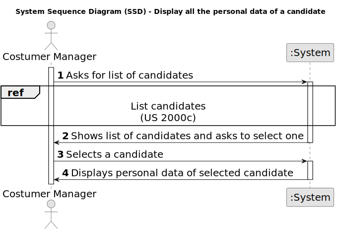

# US 1006 - Display all the personal data of a candidate.

## 1. Requirements Engineering

### 1.1. User Story Description

* As Customer Manager, I want to display all the personal data of a candidate.

### 1.2. Customer Specifications and Clarifications

**From the specifications document:**

_N/A_

**From the client clarifications:**

> **Date:** 2024-04-04
>
> **Question 42:** Qual a informação do nome do candidato deve aparecer (nome completo, primeiro e ultimo nome , etc)?
> 
> **Answer:** À partida diria que seria o nome, tal como foi recebido na application que fez (página 6, “name of the candidate”).

> **Date:** 2024-04-17
>
> **Question 75:** Em relação à listagem dos dados pessoais de um determinado candidato, um customer manager vai ter acesso a todos os candidatos do sistema ou apenas aos candidatos que submeteram uma application para uma job opening de um cliente que é gerido por esse customer manager?
>
> **Answer:** No contexto actual vamos assumir que o Customer Manager pode aceder (consultar) os dados pessoais de qualquer candidato. 

> **Date:** 2024-04-19
>
> **Question 90:** Em relação ao processo de selecionar um candidato e mostrar a sua informação pessoal, para facilitar a procura de um candidato especifico. Faria sentido perguntar ao utilizador se quer listar todos os candidatos existentes ou se quer reduzir a lista, selecionando um job opening e assim mostrar todos os candidatos para esse job opening, e por fim selecionar um candidato dessa lista mais pequena?
>
> **Answer:** O product owner espera que o sistema aplique as melhores práticas de UI/UX mas, não sendo especialista nessa área técnica, não arrisca sugerir soluções.

### 1.3. Acceptance Criteria

**AC 1:** The name used to identify the candidate should just be the one used in the application. 

**AC 2:** The Customer Manager should be able to access the personal data of any candidate.

### 1.4. Found out Dependencies

* **US 2000a:** To list a candidate said candidate should first be registered.

* **US 2000c:** The Customer Manager must have the possibility to list all candidates.

### 1.5 Input and Output Data

**Input Data:**

* Selected data:
  * Candidate

**Output Data:**

* List of Candidates
* Personal details of selected Candidate

### 1.6. System Sequence Diagram (SSD)

