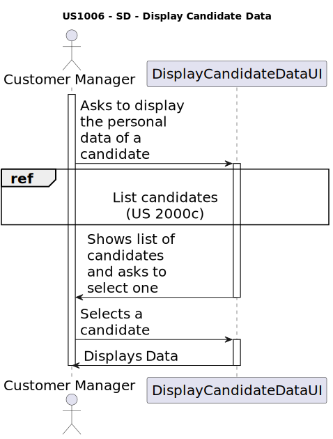
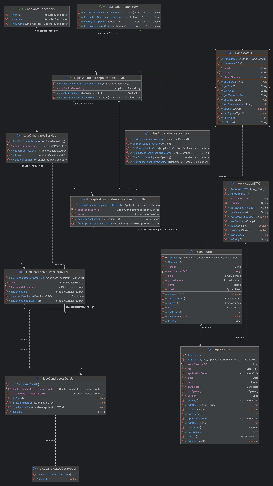

# US 1006 - Display all the personal data of a candidate.

## 3. Design - User Story Realization

### 3.1 Rationale

| Interaction ID | Question: Which class is responsible for...     | Answer               | Justification (with patterns)                                                                                 |
|:---------------|:------------------------------------------------|:---------------------|:--------------------------------------------------------------------------------------------------------------|
| Step 1  		     | 	... interacting with the actor?                | ListCandidateDataUI  | Pure Fabrication: there is no reason to assign this responsibility to any existing class in the Domain Model. |
| 			  		        | 	... asking to select the candidate?						   		 | ListCandidateDataUI  | Information Expert: The UI knows how to interact with the user and ask for the candidate to be displayed.     |
### Systematization ##

According to the taken rationale, the conceptual classes promoted to software classes are:

* Candidate

Other software classes (i.e. Pure Fabrication) identified:

* ListCandidateDataUI

These classes are responsible for the user interface.

## 3.2. Sequence Diagram (SD)

## 3.3. Class Diagram (CD)

