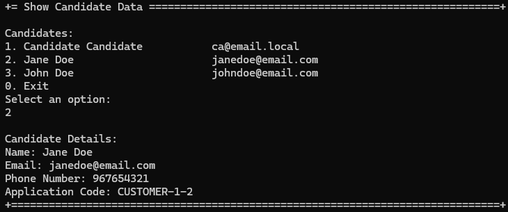

# US 1006b - Display all the personal data of a candidate, including their applications.

# 4. Tests

**Some tests of the DisplayCandidateController**
```java
    @Test
    void testSelectCandidateNotNull() {
        Application result = controller.selectedApplication(mockApplicationDTO);
        assertNotNull(result);
    }

    @Test
    void testSelectCandidateReturnsExpectedCandidate() {
        Application result = controller.selectedApplication(mockApplicationDTO);
        assertEquals(mockApplication, result);
    }

    @Test
    void testSelectCandidateCallsOfIdentity() {
        controller.selectedApplication(mockApplicationDTO);
        verify(mockApplicationRepo).ofIdentity(applicationCode);
    }
```

# 5. Construction (Implementation)

**DisplayCandidateController**
```java
    public Iterable<ApplicationDTO> findApplicationsFromCandidate(final Candidate candidate) {
        authz.ensureAuthenticatedUserHasAnyOf(BaseRoles.CUSTOMER_MANAGER, BaseRoles.POWERUSER);
        return applicationService.findApplicationsFromCandidate(candidate);
    }

    public Application selectedApplication(final ApplicationDTO applicationDTO) {
        authz.ensureAuthenticatedUserHasAnyOf(BaseRoles.CUSTOMER_MANAGER, BaseRoles.POWERUSER);
        return applicationService.selectedApplication(applicationDTO);
    }
```

**DisplayCandidateService**
```java
    public Iterable<ApplicationDTO> findApplicationsFromCandidate(final Candidate candidate) {
        final Iterable<Application> applications = this.applicationRepository.findApplicationsFromCandidate(candidate);

        List<ApplicationDTO> applicationsDTO = new ArrayList<>();
        applications.forEach(application -> applicationsDTO.add(application.toDTO()));
        return applicationsDTO;
    }

    public Application selectedApplication(ApplicationDTO applicationDTO) {
        Application selectedCandidate = applicationRepository
                .ofIdentity(ApplicationCode.valueOf(applicationDTO.getApplicationCode()))
                .orElseThrow(IllegalArgumentException::new);
        return selectedCandidate;
    }
```

# 6. Integration and Demo 

In the following image, we can see a demonstration of displaying all the personal data of a candidate and their applications.

<p align="center">Displaying all the personal data of a candidate and their applications</p>



# 7. Observations

The implementation of displaying all the personal data of a candidate and their applications was completed.

