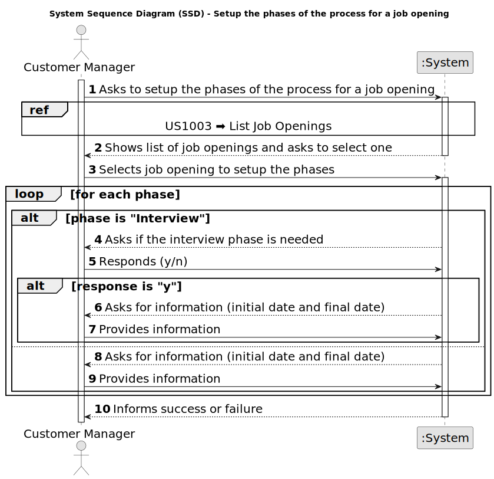

# US 1007 - Setup the phases of the process for a job opening.

## 1. Requirements Engineering

### 1.1. User Story Description

* As Customer Manager, I want to setup the phases of the process for a job opening.

### 1.2. Customer Specifications and Clarifications

**From the specifications document:**

- The customer manager will also manage other aspects of job offers, namely the entire candidate selection process.

- The recruitment process for a job opening follows a sequence of phases: application; resume screen; interviews; analysis; result.
	
	* Application This is the first phase of the process. During this phase candidates submit their applications.
	* Screening This phase follows the application phase. In this phase, applications are verified against a set of requirements. Applications that do not meet mandatory requirements are rejected.
	* Interviews This phase is not mandatory, but is common. During this phase, accepted candidates may be interviewed. Results for the interviews are registered for further analysis.
	* Analysis During this phase, the applications are analyzed (using all available information like interviews and curriculum) and candidates are ranked.
	* Result In this phase, candidates as well as customers are notified of the final result.

- The customer manager is responsible to setup the process, defining the dates for the phases and if the process includes interviews.

**From the client clarifications:**

> **Date:** 2024-03-16
>
> **Question 16:** Relativamente à secção 2.2.1 e às fases do processo de recrutamento, para passarmos para a fase seguinte a anterior tem de fechar ou podemos avançar sem ter a anterior fechada?
>
> **Answer:** A resposta curta é que as fases devem ser sequenciais e não sobrepostas. Quando fecha uma fase abre a próxima. A US 1007 prevê a definição das fases. A US 1010 prevê a abertura e fecho de fases do processo. A decisão do Customer Manager de fechar uma fase deve assumir que o processo avança para a próxima fase automaticamente (independentemente das datas definidas para as fases).

> **Date:** 2024-03-23
>
> **Question 26:** Em que momento é que o processo de recrutamento é iniciado? Existe mais que uma fase do recrutamento, como é que distinguem as fases, é pela data?
>
> **Answer:** Remete-se a resposta para a Q16.
>
> **Question 39:** O recruitment process é como está definido ou pode haver alterações no futuro?
>
> **Answer:** O processo é o que está descrito na secção 2.2.1. Neste momento a única fase opcional é a das entrevistas.

> **Date:** 2024-04-06
>
> **Question 46:** O identificar do processo de recrutamento pode ser um numero automático ou seja mais especific?
>
> **Answer:** O job opening tem um identificar. O processo de recrutamento de um job opening é um “tributo” desse job opening. À partida não vejo necessidade de ter um identificador “especial” para o processo de recrutamento (i.e., fases do processo de recrutamento desse job opening).

> **Date:** 2024-04-11
>
> **Question 53:** O recruitment process pode ser identificado pelo job reference?
>
> **Answer:** A US 1007 refere que quando o Customer Manager vai definir as fases do recrutamento para cada job opening. Penso que não haverá necessidade de ter um identificar explicito para o processo de recrutamento, uma vez que apenas existe um para cada job reference e é especifico de cada job reference. Em termos técnicos, se houver necessidade de um ID para o processo de recrutamento, não tenho nada contra que este seja igual ao job reference.

> **Date:** 2024-04-13
>
> **Question 62:** Segundo estas US's e a Q16, cada Job Opening deve ter fases definidas. Nas perguntas Q23, Q32 e Q45 é referido o estado da candidatura. A fase da Job Opening e o estado da candidatura são conceitos separados ou referem-se ao mesmo?
>
> **Answer:** Tal como referido anteriormente, estão relacionados mas são conceitos diferentes.

> **Date:** 2024-04-17
>
> **Question 73:** Em termos de user interface, neste caso para o customer manager como é que deverá ser realizado o setup do recruitment process.
>
> **Answer:** Não tenho requisitos específicos para a user interface. Deve usar princípios de boas práticas de desenho de user interfaces tendo em conta “The customer manager is responsible to setup the process, defining the dates for the phases and if the process includes interviews” (secção 2.2.1).

> **Date:** 2024-04-18
>
> **Question 85:** Depois de definir os estados de recrutamento para uma JobOpening, o Customer Manager poderá selecionar o Job Requirement Specification para esse mesmo Job Opening? Se sim, até que fase de recrutamento poderá executar a ação?
>
> **Answer:** O Customer Manager define as fases do processo de recrutamento, não define os estados. A avaliação de requisitos é feita na fase de Screening. Assim, não percebo bem a questão colocada.

> **Date:** 2024-04-19
>
> **Question 92:** Tendo em conta a US1007, de setup das diferentes fases do processo de recrutamento, gostaríamos que nos fosse esclarecido se, caso seja selecionada uma fase de Interview, é necessário haver uma ligação direta com a US1011, seleção de um interview model, ou serão funcionalidades separadas? Na eventualidade de serem separadas, passa então um recruitment process a ser válido apenas após a seleção de um interview model?
>
> **Answer:** Posso adiantar que podemos considerar que a empresa para já pretende usar sempre um processo de avaliaçao de entrevistas “automático”, pelo que este deve estar definido para se poderem “executar/processar” as entrevistas.

> **Date:** 2024-04-20
>
> **Question 103:** Para um recruitment process vamos ter várias fases. O que é pretendido para o “Setup”?
>
> **Answer:** Ver Q73. O processo de recrutamento, explicado na secção 2.2.1, define uma sequência de fases na qual apenas se indica como opcional a fase das entrevistas. O Setup consiste essencialmente em definir as datas para cada fase e se temos ou não a fase das entrevistas.

> **Date:** 2024-04-22
>
> **Question 116:** As fases do processo de recrutamento têm que ter datas atribuidas. É possivel terminar uma fase e começar outra no mesmo dia?
>
> **Answer:** Ver Q16. Não deve haver sobreposição de datas, mas podemos permitir que terminem e acabem no mesmo dia (ex: uma termina de manhã e a seguinte inicia-se de tarde).

> **Date:** 2024-04-23
>
> **Question 123:** Quando o customer manager quer dar setup das fases de uma job opening, como é que ele escolhe a mesma? Lista-se todas as job openings de todos os customers que ele é responsável? Ou lista-se todos os customers e ele seleciona o desejado e só depois seleciona a Job Opening?
>
> **Answer:** Eu queria evitar constrangir a forma como desenham a UI/UX (para esta ou outras US). Penso que devem usar as melhores práticas. Como product owner gostava que aplicassem as melhores praticas supondo que essas melhoram a interação dos utilizadores. Note ainda que existe a US1003.

> **Date:** 2024-04-24
>
> **Question 123:** Um costumer manager deve conseguir fazer setup a todas os Job Openings disponíveis no sistema ou apenas as que ele registou(US1002)?
>
> **Answer:** Deve fazer o Setup dos job openings do qual é responsável (que está a gerir).

### 1.3. Acceptance Criteria

* **AC1:** The phases must be sequential and not overlapping.

* **AC2:** The customer manager must only be able to setup the phases of the process for a job opening that he is responsible for

### 1.4. Found out Dependencies

_N/A_

### 1.5 Input and Output Data

**Input Data:**

* Selected data:
  * Job Opening

* Typed data:
	* initial date
	* final date

**Output Data:**

* (In)Success of the operation

### 1.6. System Sequence Diagram (SSD)

