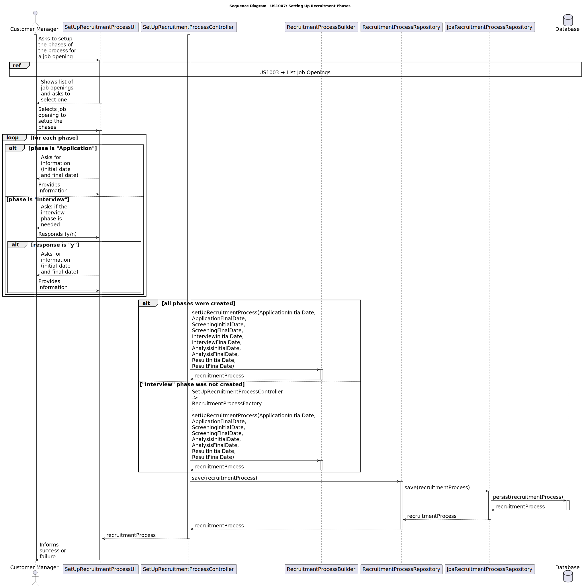

# US 1007 - Setup the phases of the process for a job opening.

## 3. Design - User Story Realization

### 3.1 Rationale

| Interaction ID | Question: Which class is responsible for... | Answer               | Justification (with patterns)                                                                                 |
|:-------------  |:--------------------- |:---------------------|:--------------------------------------------------------------------------------------------------------------|
| Step 1  		 |	... interacting with the actor? | SetUpRecruitmentProcessUI          | Pure Fabrication: there is no reason to assign this responsibility to any existing class in the Domain Model. |
| 			  		 |	... coordinating the US? | SetUpRecruitmentProcessController | Controller: The controller is responsible for handling the user's request and coordinating the use case. |
| 			  		 |	... creating the recruitment process?						 | RecruitmentProcessFactory         | Creator: The factory knows how to create a new recruitment process. |
| 			  		 |	... saving the recruitment process?						 | RecruitmentProcessRepository         | Information Expert: The repository knows how to save a recruitment process. |
| 			  		 |	... querying the database for recruitment process?						 | JpaRecruitmentProcessRepository         | Information Expert: The JpaRecruitmentProcessRepository knows how to interact with the database. |

### Systematization

According to the taken rationale, the conceptual classes promoted to software classes are:

* RecruitmentProcess
* Phase
* ApplicationPhase
* ScreeningPhase
* InterviewPhase
* AnalysisPhase
* ResultPhase

Other software classes (i.e. Pure Fabrication) identified:

* SetUpRecruitmentProcessUI
* SetUpRecruitmentProcessController
* RecruitmentProcessService
* RecruitmentProcessFactory
* RecruitmentProcessRepository
* JpaRecruitmentProcessRepository

These classes are responsible for the user interface, controlling the use cases, creating and saving the recruitment process, and interacting with the database, respectively.

## 3.2. Sequence Diagram (SD)

## 3.3. Class Diagram (CD)

