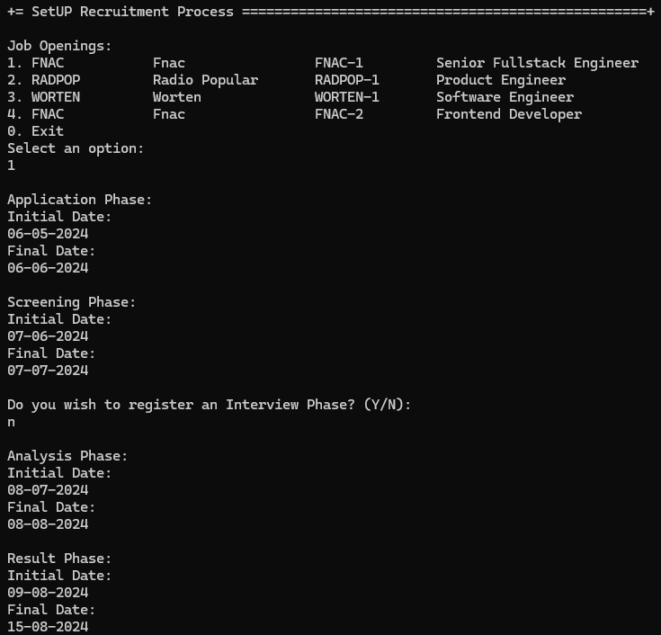

# US 1007 - Setup the phases of the process for a job opening.

# 4. Tests 

**Some tests of the RecruitmentProcess class**
```java
    @Test
    public void ensureRecruitmentProcessIsSequential() throws Exception {
        SimpleDateFormat format = new SimpleDateFormat("dd-MM-yyyy");

        String[] dates = new String[10];
        for (int i = 0; i < dates.length; i++) {
            calendar.add(Calendar.MONTH, i);
            java.util.Date date = calendar.getTime();
            dates[i] = format.format(date);
        }

        assertThrows(IllegalArgumentException.class, () -> {
            getNewDummyJobOpening(dates[0], dates[1], dates[4], dates[5],
                    dates[3], dates[4], dates[6], dates[7], dates[8], dates[9]);
        });
    }

    @Test
    public void ensureRecruitmentProcessApplicationDateIsAfterJobOpeningReg() throws Exception {
        SimpleDateFormat format = new SimpleDateFormat("dd-MM-yyyy");
        String[] dates = new String[10];
        for (int i = 0; i < dates.length; i++) {
            calendar.add(Calendar.MONTH, i);
            java.util.Date date = calendar.getTime();
            dates[i] = format.format(date);
        }

        assertThrows(IllegalArgumentException.class, () -> {
            getNewDummyJobOpening("01-01-1950", dates[1], dates[4], dates[5],
                    dates[3], dates[3], dates[6], dates[7], dates[8], dates[9]);
        });
    }

    @Test
    public void ensureRecruitmentProcessWithNullArgs() throws Exception {

        assertThrows(IllegalArgumentException.class, () -> {
            getNewDummyJobOpening(null, null, null, null, null, null, null, null, null, null);
        });
    }

    @Test
    public void ensureRecruitmentProcessWithEmptyArgs() throws Exception {

        assertThrows(IllegalArgumentException.class, () -> {
            getNewDummyJobOpening("", "", "", "", "", "", "", "", "", "");
        });
    }
```

# 5. Construction (Implementation)

**SetUpRecruitmentProcessController class**
```java
    public RecruitmentProcess SetUpRecruitmentProcess(final String applicationInitialDate,
                    final String applicationFinalDate,
                    final String screeningInitialDate, final String screeningFinalDate,
                    final String interviewInitialDate,
                    final String interviewFinalDate, final String analysisInitialDate,
                    final String analysisFinalDate,
                    final String resultInitialDate, final String resultFinalDate, final JobOpening jobOpening) {
            authz.ensureAuthenticatedUserHasAnyOf(BaseRoles.CUSTOMER_MANAGER, BaseRoles.POWERUSER);
            return registerRecruitmentProcess(applicationInitialDate, applicationFinalDate, screeningInitialDate,
                            screeningFinalDate, interviewInitialDate, interviewFinalDate, analysisInitialDate,
                            analysisFinalDate,
                            resultInitialDate, resultFinalDate, jobOpening);
    }

    public RecruitmentProcess SetUpRecruitmentProcess(final String applicationInitialDate,
                    final String applicationFinalDate,
                    final String screeningInitialDate, final String screeningFinalDate,
                    final String analysisInitialDate,
                    final String analysisFinalDate,
                    final String resultInitialDate, final String resultFinalDate, final JobOpening jobOpening) {
            authz.ensureAuthenticatedUserHasAnyOf(BaseRoles.CUSTOMER_MANAGER, BaseRoles.POWERUSER);
            return registerRecruitmentProcess(applicationInitialDate, applicationFinalDate, screeningInitialDate,
                            screeningFinalDate, analysisInitialDate, analysisFinalDate, resultInitialDate,
                            resultFinalDate, jobOpening);
    }

    private RecruitmentProcess registerRecruitmentProcess(final String applicationInitialDate,
                    final String applicationFinalDate,
                    final String screeningInitialDate, final String screeningFinalDate,
                    final String interviewInitialDate,
                    final String interviewFinalDate, final String analysisInitialDate,
                    final String analysisFinalDate,
                    final String resultInitialDate, final String resultFinalDate, final JobOpening jobOpening) {
            SimpleDateFormat format = new SimpleDateFormat("dd-MM-yyyy");
            Calendar calendar = CurrentTimeCalendars.now();
            Date date = calendar.getTime();
            String formattedDate = format.format(date);
            final RecruitmentProcess recruitmentProcess = doSetUpRecruitmentProcess(applicationInitialDate,
                            applicationFinalDate,
                            screeningInitialDate, screeningFinalDate, interviewInitialDate, interviewFinalDate,
                            analysisInitialDate,
                            analysisFinalDate, resultInitialDate, resultFinalDate, jobOpening,
                            formattedDate);
            RecruitmentProcess re = recruitmentProcessRepository.save(recruitmentProcess);
            activateJobOpening(jobOpening);
            return re;
    }

    private RecruitmentProcess registerRecruitmentProcess(final String applicationInitialDate,
                    final String applicationFinalDate,
                    final String screeningInitialDate, final String screeningFinalDate,
                    final String analysisInitialDate,
                    final String analysisFinalDate,
                    final String resultInitialDate, final String resultFinalDate, final JobOpening jobOpening) {
            SimpleDateFormat format = new SimpleDateFormat("dd-MM-yyyy");
            Calendar calendar = CurrentTimeCalendars.now();
            Date date = calendar.getTime();
            String formattedDate = format.format(date);
            final RecruitmentProcess recruitmentProcess = doSetUpRecruitmentProcess(applicationInitialDate,
                            applicationFinalDate,
                            screeningInitialDate, screeningFinalDate, analysisInitialDate, analysisFinalDate,
                            resultInitialDate,
                            resultFinalDate, jobOpening, formattedDate);
            RecruitmentProcess re = recruitmentProcessRepository.save(recruitmentProcess);
            activateJobOpening(jobOpening);
            return re;
    }

    private RecruitmentProcess doSetUpRecruitmentProcess(final String applicationInitialDate,
                    final String applicationFinalDate,
                    final String screeningInitialDate, final String screeningFinalDate,
                    final String interviewInitialDate,
                    final String interviewFinalDate, final String analysisInitialDate,
                    final String analysisFinalDate,
                    final String resultInitialDate, final String resultFinalDate, final JobOpening jobOpening,
                    final String registeredOn) {
            return new RecruitmentProcessBuilder()
                            .with(applicationInitialDate, applicationFinalDate, screeningInitialDate,
                                            screeningFinalDate,
                                            interviewInitialDate, interviewFinalDate, analysisInitialDate,
                                            analysisFinalDate,
                                            resultInitialDate, resultFinalDate, jobOpening, registeredOn)
                            .build();
    }

    private RecruitmentProcess doSetUpRecruitmentProcess(final String applicationInitialDate,
                    final String applicationFinalDate,
                    final String screeningInitialDate, final String screeningFinalDate,
                    final String analysisInitialDate,
                    final String analysisFinalDate,
                    final String resultInitialDate, final String resultFinalDate, final JobOpening jobOpening,
                    final String registeredOn) {
            return new RecruitmentProcessBuilder()
                            .with(applicationInitialDate, applicationFinalDate, screeningInitialDate,
                                            screeningFinalDate,
                                            analysisInitialDate, analysisFinalDate, resultInitialDate,
                                            resultFinalDate, jobOpening, registeredOn)
                            .build();
    }

    private void activateJobOpening(final JobOpening jobOpening) {
            jobOpening.activate();
            jobOpeningRepository.save(jobOpening);
    }
```

# 6. Integration and Demo 

In the following images, we can see a demonstration of the process of setting up the phases for a job opening.

<p align="center">Set up the phases of a recruitment process for a job opening</p>



The interview phase is optional.

# 7. Observations

The implementation of setting up the phases for a job opening was a success

