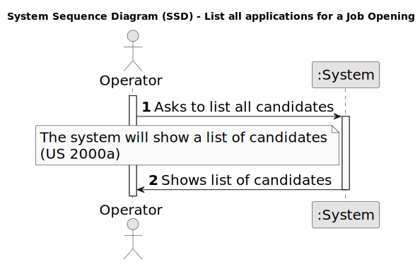

# US 1005 - List all candidates.

## 1. Requirements Engineering

### 1.1. User Story Description

* As Operator, I want to list all candidates.

### 1.2. Customer Specifications and Clarifications

**From the specifications document:**

- The operator is a company employee whose main responsibility is to monitor the automatic process that registers applications for job offers.

**From the client clarifications:**

> **Date:** 2024-04-15
>
> **Question Q66:** Ordem dos candidatos. Na US 2000c é pedido que implementemos a função de listar todos os candidatos. É necessário ordenar os candidatos (por exemplo por ordem alfabética do nome)? Se for, qual é o critério que devemos seguir?
>
> **Answer:** Sim a listagem pode ser por ordem alfabética do nome.
  
> **Date:** 2024-04-15
> 
> **Question Q60:** Na US 2000c, existem politicas de negócio em relação a listar os candidatos?
>
> **Answer:** Devem seguir eventuais condicionante relativas ao possível estado do candidato.

> **Date:** 2024-04-13
> 
> **Question Q60:** US 2000c, quando estiver a listar os candidatos basta listar os emails?
>
> **Answer:** Eu diria que faz sentido apresentar para cada candidato o seu email e o seu nome.

> **Date:** 2024-04-13
> 
> **Question Q53:** Quais às politicas de negócio para registar um candidato, quais as caracteristicas da password, email, telemóvel?
> 
> **Answer:** Sobre o telemóvel, seguir o Q56. Sobre email, seria qualquer email válido. Sobre a password, podemos seguir algo como: ter no mínimo 8 caracteres, letras maiúsculas e minúsculas, dígitos e pelo menos, um caracter não alfanumérico.

### 1.3. Acceptance Criteria

**AC 1:** The list is dysplayed to the operator

### 1.4. Found out Dependencies

* **US 2000a - Register a candidate and create a corresponding user :** To list all candidates, it is necessary to have candidates registered.

### 1.5 Input and Output Data

**Input Data:**

* Selected data:
  * Existing candidates

**Output Data:**

* List of candidates

### 1.6. System Sequence Diagram (SSD)

