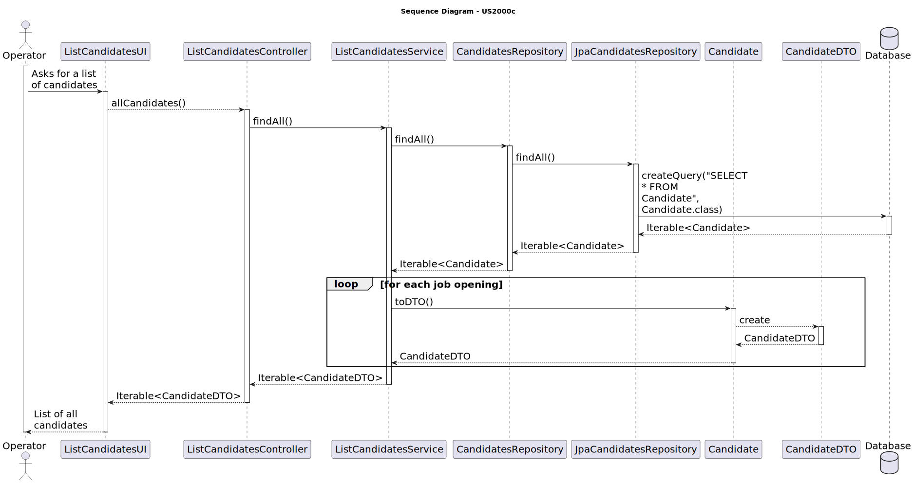

# US 2000c - List all candidates.

## 3. Design - User Story Realization

### 3.1 Rationale

| Interaction ID | Question: Which class is responsible for... | Answer               | Justification (with patterns)                                                                                 |
|:-------------  |:--------------------- |:---------------------|:--------------------------------------------------------------------------------------------------------------|
| Step 1  		 |	... interacting with the actor? | ListCandidatesUI          | Pure Fabrication: there is no reason to assign this responsibility to any existing class in the Domain Model. |
| 			  		 |	... coordinating the US? | ListCandidatesController | Controller: The controller is responsible for handling the user's request and coordinating the use case. |
| 			  		 |	... creating the candidate DTO?						 | Candidate         | Information Expert: The Candidate class knows how to create a new CandidateDTO. |
| 			  		 |	... saving the candidate?						 | CandidatesRepository         | Information Expert: The repository knows how to save a candidate. |
| 			  		 |	... querying the database for candidates?						 | JpaCandidatesRepository         | Information Expert: The JpaCandidatesRepository knows how to interact with the database. |
| 			  		 |	... coordinating the candidate listing?						 | ListCandidatesController         | 	Controller: The controller is responsible for handling the user's request and coordinating the use case. |
| 			  		 |	... applying the filter?						 | ListCandidatesService	         | Creator: The service knows how to apply a filter to the candidates. |
| 			  		 |	... saving the filtered candidates?						 | CandidatesRepository	         | Information Expert: The repository knows how to save the filtered candidates. |
| 			  		 |	... querying the database for filtered candidates?						 | JpaCandidatesRepository	         | Information Expert: The JpaCandidatesRepository knows how to interact with the database. |

### Systematization ##

According to the taken rationale, the conceptual classes promoted to software classes are:

* Candidate
* CandidateDTO

Other software classes (i.e. Pure Fabrication) identified:

* ListCandidatesUI
* ListCandidatesController
* ListCandidatesService
* CandidatesRepository
* JpaCandidatesRepository

These classes are responsible for the user interface, controlling the use cases, creating and saving the candidates, applying filters, and interacting with the database, respectively.

## 3.2. Sequence Diagram (SD)

## 3.3. Class Diagram (CD)

