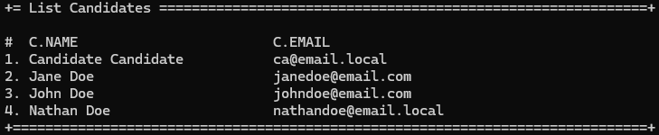

# US 2000c - List all candidates.

# 4. Tests 

**Some tests of the ListCandidateController**
```java
    @Test
    void testSelectCandidateNotNull() {
        Candidate result = controller.selectedCandidate(mockCandidateDTO);
        assertNotNull(result);
    }

    @Test
    void testSelectCandidateReturnsExpectedCandidate() {
        Candidate result = controller.selectedCandidate(mockCandidateDTO);
        assertEquals(mockCandidate, result);
    }

    @Test
    void testSelectCandidateCallsOfIdentity() {
        controller.selectedCandidate(mockCandidateDTO);
        verify(mockRepo).ofIdentity(email);
    }
```

**Some tests of the ListCandidateService**
```java
    @Test
    void testSelectCandidateNotNull() {
        Candidate result = service.selectedCandidate(mockCandidateDTO);
        assertNotNull(result);
    }

    @Test
    void testSelectCandidateReturnsExpectedCandidate() {
        Candidate result = service.selectedCandidate(mockCandidateDTO);
        assertEquals(mockCandidate, result);
    }

    @Test
    void testSelectCandidateCallsOfIdentity() {
        service.selectedCandidate(mockCandidateDTO);
        verify(mockRepo).ofIdentity(email);
    }
```

# 5. Construction (Implementation)

**ListCandidatesController**
```java
    public Iterable<CandidateDTO> allCandidates() {
        authz.ensureAuthenticatedUserHasAnyOf(BaseRoles.OPERATOR, BaseRoles.POWERUSER);
        return listCandidatesService.allUsers();
    }

    public Iterable<CandidateDTO> allCandidatesSortedAsc() {
        authz.ensureAuthenticatedUserHasAnyOf(BaseRoles.OPERATOR, BaseRoles.POWERUSER);
        return listCandidatesService.allUsersSortedAsc();
    }

    public Candidate selectedCandidate(final CandidateDTO candidateDTO) {
        authz.ensureAuthenticatedUserHasAnyOf(BaseRoles.OPERATOR, BaseRoles.POWERUSER);
        return listCandidatesService.selectedCandidate(candidateDTO);
    }
```

**ListCandidatesService**
```java
    public Iterable<CandidateDTO> allUsersSortedAsc() {
        final Iterable<Candidate> candidates = this.candidateRepository.sortedAsc();
        List<CandidateDTO> CandidatesDTO = new ArrayList<>();
        candidates.forEach(candidate -> CandidatesDTO.add(candidate.toDTO()));

        return CandidatesDTO;
    }

    public Candidate selectedCandidate(CandidateDTO candidateDTO) {
        Candidate selectedCandidate = candidateRepository
            .ofIdentity(EmailAddress.valueOf(candidateDTO.getEmail()))
            .orElseThrow(IllegalArgumentException::new);
        return selectedCandidate;
    }
```

# 6. Integration and Demo 

In the following image, we can see a demonstration of listing all candidates.

<p align="center">Listing all candidates</p>



# 7. Observations

The implementation of listing all candidates was completed.

