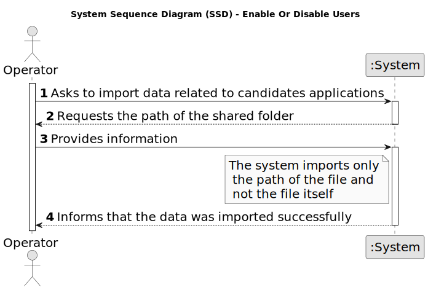

# US 2002 - Register an application of a candidate for a job opening and import all files received

## 1. Requirements Engineering

### 1.1. User Story Description

* As Operator, I want to register an application of a candidate for a job opening and import all files received.

### 1.2. Customer Specifications and Clarifications

**From the specifications document:**
- The Operator is responsible for managing and validate candidates applications and all files that are associated.
- The System should import the data from the file that was processed by the Application
File Bot in Req 2001. The files should be kept in the shared folder, but the Backoffice
application needs to know the references to the file locations.

**From the client clarifications:**

> **Date:** 2024-03-16
>
> **Question 15:** É o Operador que regista uma candidatura ou é o sistema que o faz automaticamente? E como integra o “plugin” de verificação da candidatura neste processo? 
>
> **Answer:** Na US 2002 o Operator regista a candidatura. Para isso, é o Operator que inicia o processo mas o sistema deve importar os dados resultantes do Application File Bot de forma “automática” (Ver References da US 2002). O plugin referido entra neste processo através da US 2003, em que o Operador gera um ficheiro template com os dados a introduzir para validar uma candidatura. Na US 2004, o Operador, após preencher os dados específicos da candidatura (com base no ficheiro template anterior) submete no sistema esse ficheiro que vai ser usado para o sistema avaliar/verificar a candidatura. Se os critérios não forem atingidos a candidatura é recusada.

> **Date:** 2024-03-21
>
> **Question 65:** – US2002 - UI and UX. I'd like to know what is the expected flow of executing US2002 (application registration and files import, by the operator). Can you reproduce step by step which actions should the operator execute? Example: 1. The system asks the operator for the candidate's email. 2. The operator enters the candidate's email. 3. The system asks for the job reference. 4. The operator enters the job reference. 5. The system creates the job application, if there is data for it in the shared folder.
>
> **Answer:** There are no specific requirements for the UI/UX but I think it will be more user friendly if the Operator could start the process by selecting the shared folder for the application to be imported.

> **Date:** 2024-04-18
>
> **Question 83:** Na descrição da US o PO refere uma importação de ficheiros e depois na referência à mesma a importação dos dados do ficheiro. Poderia esclarecer a que se refere a importação? São importações distintas? Têm destinos diferentes?
>
> **Answer:** Nessa US refiro-me à importação dos ficheiros gerados pelo Application File Bot. Quando me refiro aos dados, serão os dados do ficheiro de texto “A text file with the data of the application and candidate”, secção 2.2.3, um dos ficheiros gerados.
>
> **Question 84:** – Após a informação dos ficheiros que estiverem na shared folder forem utilizados pelo Operator para registar uma candidatura, devem estes permanecer na pasta ou serem eliminados? Caso não sejam apagados como determinamos quais é que ainda não foram "utilizados"?
>
> **Answer:** Admitindo que já foram importados para o sistema, não tenho requisitos adicionais quanto aos ficheiros. A segunda pergunta é um problema que deve ser resolvido pela solução proposta. Eu não tenho nada a dizer sobre esse aspeto.

> **Date:** 2024-04-20
>
> **Question 100:** O que é que tem de ser registado no sistema
>
> **Answer:** Tem de haver um registo que indique que o candidato em questão fez a candidatura e têm de ser registados/importados para o sistema todos os ficheiros submetidos.

### 1.3. Acceptance Criteria

* **AC 1:** There must be only one admin of the backoffice.

* **AC 2:** The admin must be able to enable/disable an user multiple times.

### 1.4. Found out Dependencies

* US2001, since The Application File Bot need to be working to the operator 
register new applications and new cadidates

### 1.5 Input and Output Data

#### 1.5.1. Register Users

**Input Data:**

* Typed data:
	* Path for the shared folder

* Selected data:
	* Candidates Application

**Output Data:**

* (In)Success of the operation

### 1.6. System Sequence Diagram (SSD)

#### 1.6.1. Register Users

