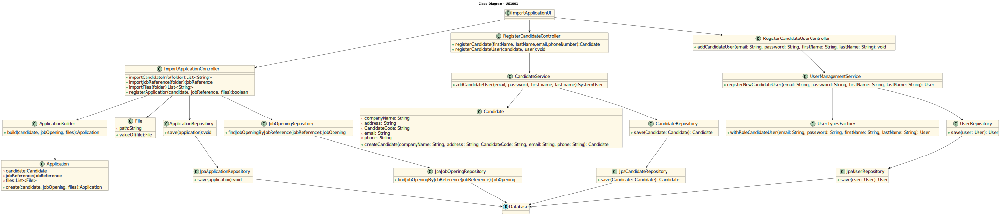

# US 2002 - Register an application of a candidate for a job opening and import all files received

## 3. Design - User Story Realization

### 3.1 Rationale

| Interaction ID | Question: Which class is responsible for... | Answer               | Justification (with patterns)                                                                                 |
|:-------------  |:--------------------- |:---------------------|:--------------------------------------------------------------------------------------------------------------|
| Step 1  		 |	... interacting with the actor? | RegisterApplicationUI          | Pure Fabrication: there is no reason to assign this responsibility to any existing class in the Domain Model. |
|  |	... coordinating the US? | RegisterApplicationController | Controller: The controller is responsible for handling the user's request and coordinating the use case. |
|  |	... creating the candidate?	| Candidate         | Information Expert: The Candidate class knows how to create a new candidate. |
|  |	... saving the candidate?	| CandidateRepository         | Information Expert: The repository knows how to save a candidate. |
|  |	... querying the database for candidate?	| JpaCandidateRepository         | Information Expert: The JpaCandidateRepository knows how to interact with the database. |
| Step 2  |  ... creating the application?  | Application  | Information Expert: The Customer class knows how to create a new application. |
|  |     ... saving the application?   | ApplicationRepository | Information Expert: The repository knows how to save a application. |
|  |	... querying the database for application?	| JpaApplicationRepository         | Information Expert: The JpaApplicaitonRepository knows how to interact with the database. |
| Step 3 |   ... coordinating the US? | ImportFilesController | Controller: The controller is responsible for handling the user's request and coordinating the use case. |
|  |	... creating the files?	| File         | Information Expert: The Customer class knows how to create a new file. |
|  |	... saving the file?	| FileRepository         | Information Expert: The repository knows how to save a file. |
|  |	... querying the database for file?	| JpaFileRepository         | Information Expert: The JpaCustomerRepository knows how to interact with the database. |

### Systematization ##

According to the taken rationale, the conceptual classes promoted to software classes are:

* Application
* Candidate
* File

Other software classes (i.e. Pure Fabrication) identified:

* RegisterApplicationUI
* RegisterApplicationController
* ApplicationService
* ApplicationRepository
* JpaApplicationRepository
* ImportFileController
* FileRepository
* JpaFileRepository

These classes are responsible for the user interface, controlling the use cases, creating and saving the applications and files that are related, and interacting with the database, respectively.

## 3.2. Sequence Diagram (SD)

## 3.3. Class Diagram (CD)

