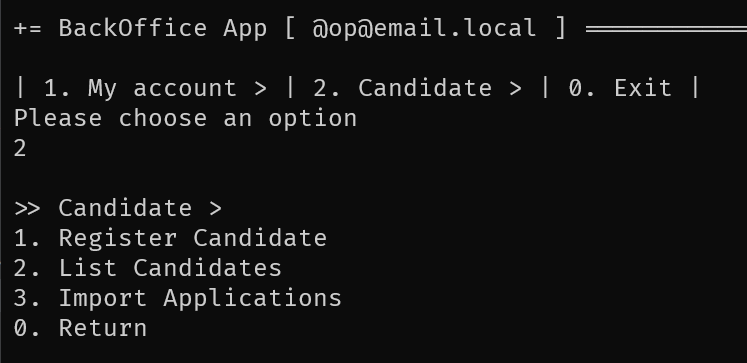
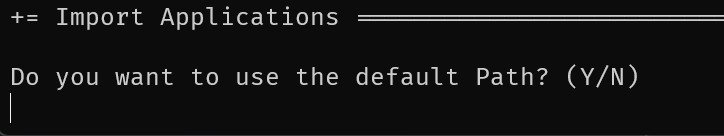
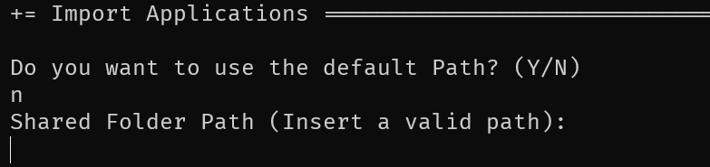

# US 2002 - Register an application of a candidate for a job opening and import all files received

# 4. Tests

## Domain Tests

**Test 1:** Application Domain

```java

@Test
    public void ensureApplicationEqualsPassesForTheSameApplicationValues() throws Exception {

        final Application aApplication = getNewDummyApplication(APPLICATION_NUMBER);

        final Application anotherApplication = getNewDummyApplication(APPLICATION_NUMBER);

        final boolean expected = aApplication.equals(anotherApplication);

        assertTrue(expected);
    }

    @Test
    public void ensureApplicationEqualsFailsForDifferenteApplicationValues() throws Exception {

        final Application aApplication = getNewDummyApplication(APPLICATION_NUMBER);

        final Application anotherApplication = getNewDummyApplication(APPLICATION_NUMBER2);

        final boolean expected = aApplication.equals(anotherApplication);

        assertFalse(expected);
    }

    @Test
    public void ensureApplicationEqualsAreTheSameForTheSameInstance() throws Exception {
        final Application applicationaApplication = getNewDummyApplication(APPLICATION_NUMBER);

        final boolean expected = applicationaApplication.equals(applicationaApplication);

        assertTrue(expected);
    }

    @Test
    public void ensureApplicationEqualsFailsForDifferenteObjectTypes() throws Exception {
        final Application application = getNewDummyApplication(APPLICATION_NUMBER);

        final boolean expected = application.equals(getNewDummyApplication(APPLICATION_NUMBER2));

        assertFalse(expected);
    }

```

**Test 2:** Controller Tests
```java

 @Test
    public void testGetCandidates() {
        candidates = controller.getCandidates(folder);

        assertNotNull(candidates);
    }

    @Test
    public void testGetCandidateInfo() {
        List<String> values = new ArrayList<>();
        testGetCandidates();
        candidates.forEach((jobOffer, candidateSet) -> {
            candidateSet.forEach(candidateId -> {
                values.addAll(controller.getCandidateInfo(folder, candidateId, jobOffer));
            });
        });
        assertNotNull(values);
    }

    @Test
    public void testGetJobOpennig() {
        testGetCandidates();
        JobOpening job = controller.getJobOpennig(JobReference.valueOf(candidates.keySet().iterator().next()));

    }

    @Test
    public void testHaveReportFile() {
        assertTrue(controller.haveReportFile(folder));
    }

```

# 5. Construction (Implementation)

_N/A_

# 6. Integration and Demo 

In the following images, we can see a demonstration of the registeration and importation of a Application in the Jobs4U application.

<p align="center">Main menu</p>



**1.** The user can access the import Applications page by choosing the option 3 in the main menu.

<p align="center">Default Folder</p>



**2.1** The user can choose the default folder path where the files will be stored.

<p align="center">Insert Folder</p>



**2.2** The user can insert a new folder path.

# 7. Observations

The implementation of the authentication and authorization system was a success

