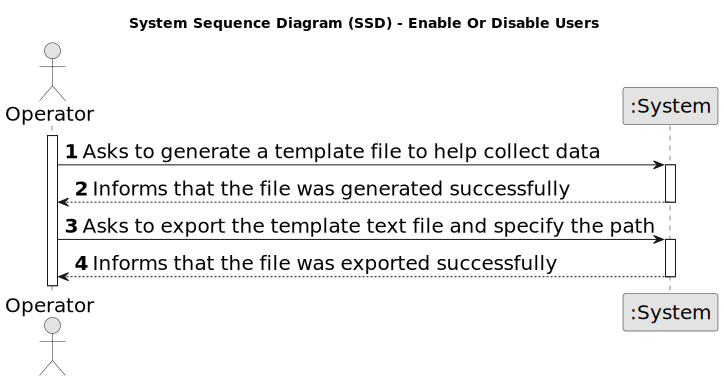

# US 2003 - Generate and export a template text file to help collect data fields for candidates of a job opening

## 1. Requirements Engineering

### 1.1. User Story Description

* As Operator, I want to generate and export a template text file to help collect data fields for candidates of a job opening (so the data is used to verify the requirements of the job opening).

### 1.2. Customer Specifications and Clarifications

**From the specifications document:**
- The support
for this functionality must follow specific technical requirements, specified in LPROG.
- The ANTLR tool should be used (https://www.antlr.org/).

**From the client clarifications:**

> **Date:** 2024-03-16
>
> **Question 15:** É o Operador que regista uma candidatura ou é o sistema que o faz automaticamente? E como integra o “plugin” de verificação da candidatura neste processo? 
>
> **Answer:** Na US 2002 o Operator regista a candidatura. Para isso, é o Operator que inicia o processo mas o sistema deve importar os dados resultantes do Application File Bot de forma “automática” (Ver References da US 2002). O plugin referido entra neste processo através da US 2003, em que o Operador gera um ficheiro template com os dados a introduzir para validar uma candidatura. Na US 2004, o Operador, após preencher os dados específicos da candidatura (com base no ficheiro template anterior) submete no sistema esse ficheiro que vai ser usado para o sistema avaliar/verificar a candidatura. Se os critérios não forem atingidos a candidatura é recusada.

> **Date:** 2024-04-20
>
> **Question 101:** – US2003 – Quais são os campos/informação que têm de ser extraídos do candidato para verificar os requisitos de uma job opening?
>
> **Answer:** Vai depender do que estiver desenhado/especificado no modelo de Requirements Specification usado para esse job opening.

>
> **Question 102:** US2003 – Quem vai preencher as respostas no ficheiro template?
>
> **Answer:** Será o Operador e, no âmbito da US2004, este submete o ficheiro já preenchido no sistema.
>
> **Date:** 2024-04-23
>
> **Question 119:** – Management of screening data - We have a question about the management of the screen phase of the recruitment process. Specifically, after the applications are filtered during the screening process, I'm unsure about who manages the results and oversees this phase. Could you please clarify if the responsibility for managing the screening results falls under the customer manager, the operators, or both?
>
> **Answer:** In US2003 and US2004 it is the Operator that “downloads” a template file to register the requirements, registers the answers for the requirements in the file, and then uploads the file. It is then the Costumer manager that executes the verification process (US1015) and executes the notification of the results (US1016)

### 1.3. Acceptance Criteria

* **AC 1:** The ANTLR tool should be used (https://www.antlr.org/).

* **AC 2:** All work done in this US is made by the Operator.

### 1.4. Found out Dependencies

* US2002, since the application files need to be already imported.

### 1.5 Input and Output Data

#### 1.5.1. Register Users

**Input Data:**

* None 

**Output Data:**

* (In)Success of the operation

### 1.6. System Sequence Diagram (SSD)

#### 1.6.1. Register Users

