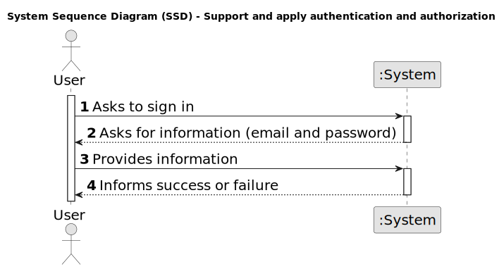

# US G007 - Support and apply authentication and authorization

## 1. Requirements Engineering

### 1.1. User Story Description

* As a Project Manager, I want the system to support and apply authentication and authorization for all its users and functionalities.

### 1.2. Customer Specifications and Clarifications

**From the specifications document:**

- The system must support and apply authentication and authorization for all its users and functionalities.

**From the client clarifications:**

> **Date:** 2024-03-14
>
> **Question 1:** Por cada Customer, apenas existe um “representante” que acede à conta (i.e., Customer App)?
>
> **Answer:** Sim, parece-me suficiente.
>
> **Question 11:** No enunciado não está explicita a informação a recolher para os Customers? Qual a informação necessária? E quando aos funcionários da empresa?
>
> **Answer:** De facto isso não está explicito. No entanto, são referidos no nome da empresa e o seu endereço no âmbito de um job opening. Quanto aos utilizadores (representante da empresa que acede à Customer App) eu diria que serão dados similares ao do Candidate. Quando aos funcionários da empresa, eu diria que é importante garantir que é usado o email para identificar qualquer utilizador do sistema. Penso que será importante para cada utilizador termos o nome completo assim como um short user name (que deverá ser único). ``Actualização em 2024-03-21: O Product Owner reconsiderou e decidiu que o short user name é dispensável uma vez que para autenticação dos utilizadores se deve usar apenas o email e a password. ``

> **Date:** 2024-03-21
>
> **Question 19:** Na criação de um utilizador no sistema o nome é definido pelo utilizador ou é o nome da pessoa (primeiro e último) e se a password é definida pelo utilizador ou gerada pelo sistema?
> 
> **Answer:** No âmbito da US 2000a o Operator cria utilizadores do sistema para candidatos que ainda não estejam no sistema. Tem de fazer isso com base nos dados recebidos na candidatura (que incluem email e nome). O email servirá para identificar a pessoa. Neste contexto é necessário ter uma password para esse novo utilizador. Uma vez que essa informação não é transmitida pelo candidato, suponho que a solução mais “aconselhada” será o sistema gerar uma password para esse utilizador. Como o utilizador/candidato irá receber essa informação (a forma de autenticação na app) está out of scope, no sentido em que não existe nenhuma US que remete para isso. As US 1000 e 1001 também remetem para criação de utilizadores. Aqui, eventualmente poderia-se pensar em introduzir manualmente as passwords, mas pode ser pelo mesmo mecanismo de definição automática de password, descrito anteriormente. ``Relativamente ao nome ver novamente a Q11.``
>
> **Question 21:** Relativamente às Empresas, e relacionado com a Q11, o que é que significava o endereço mencionado na resposta?
>
> **Answer:** Estava a referir-me ao endereço postal da empresa (não ao endereço email).

> **Date:** 2024-03-23
>
> **Question 28:** Pretende-se que cada Customer seja identificado no sistema como um utilizador?
>
> **Answer:** Remete-se a resposta para a Q6 (responde indiretamente).
>
> **Question 33:** O candidato tem um código identificativo ou é o email que o identifica?
>
> **Answer:** A identificação do candidato é por email. Não haverá necessidade de um código.
>

> **Date:** 2024-04-06
>
> **Question 43:** Para os candidato e para os utilizadores do sistema que informações são necessárias?
>
> **Answer:** Alguma informação anterior é referida na Q11. Para além disso a secção 2.2.3 refere que relativamente aos candidatos temos a seguinte informação: email of the candidate, name of the candidate, phone number of the candidate.

> **Date:** 2024-04-12
>
> **Question 56:** No número de telémovel e no código postal as verificações são feitas apenas para domínios portugueses, ou temos de programar consuante o país referente?
>
> **Answer:** Basta para o caso português.
>
> **Question 57:** Quais às politicas de negócio para registar um candidato, quais as caracteristicas da password, email, telemóvel?
>
> **Answer:** Sobre o telemóvel, seguir o Q56. Sobre email, seria qualquer email válido. Sobre a password, podemos seguir algo como: ter no mínimo 8 caracteres, letras maiúsculas e minúsculas, dígitos e pelo menos, um caracter não alfanumérico.
>
> **Question 59:** Pretende-se que todos os utilizadores acedam à mesma aplicação e que consoante as credências tenham acesso a funcionalidades diferentes ou são aplicações diferentes (que acedem à mesma base de dados)?
>
> **Answer:** Do ponto de vista do product owner faz sentido ter aplicações distintas. Ou seja, quando, por exemplo, um utilizador “executa” a aplicação “Candidate App” mesmo que se identifique como um user válido do tipo “Customer” a aplicação não deve aceitar esse login.

### 1.3. Acceptance Criteria

* **AC1:** A password deve seguir as seguintes regras: 
    * ter no mínimo 8 caracteres;
    * letras maiúsculas e minúsculas;
    * dígitos;
    * pelo menos um caracter não alfanumérico.

* **AC2:** A palavra-passe deve ser gerada automaticamente pelo sistema.

* **AC3:** A autenticação dos utilizadores deve ser feita através do email e da palavra-passe.

* **AC4:** Para cada entidade Customer, apenas existe um representante que acede à conta.

* **AC5:** O candidato é identificado no sistema pelo email.

### 1.4. Found out Dependencies

**US 1000 - Register, disable/enable, and list users of the backoffice** - To support and apply authentication and authorization, it is necessary to have users registered in the system.

**US 1001 - Register a customer and that the system automatically creates a user for that customer** -  To support and apply authentication and authorization, it is necessary to have customers registered in the system.

**US 2000a - Register a candidate and create a corresponding user** - To support and apply authentication and authorization, it is necessary to have candidates registered in the system.

### 1.5 Input and Output Data

**Input Data:**

* Typed data:
	* email
    * password

**Output Data:**

* (In)Success of the operation

### 1.6. System Sequence Diagram (SSD)

