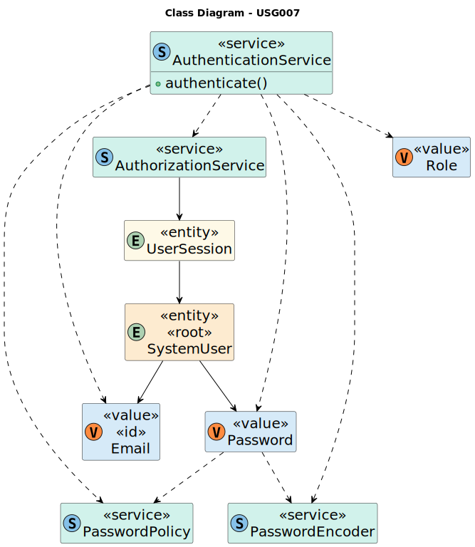

# US G007 - Support and apply authentication and authorization

## 3. Design - User Story Realization

### 3.1. Rationale

Since we're using the [EAPLI framework](https://bitbucket.org/pag_isep/eapliframework/src/master/) for our project, we have a foundational authentication and authorization system in place. The _`AuthenticationService`_ is the main component that facilitates user identity verification. This service interacts seamlessly with other key components:

- _`AuthorizationService`_: Manages user sessions and ensures that they align with security protocols.

- _`PasswordPolicy`_: Verifies password compliance with the system’s standards.

_`SystemUser`_ is an entity that signifies a user within our system, and the _`Role`_ value object specifies user roles and corresponding permissions.

## 3.2. Sequence Diagram (SD)

_N/A_

## 3.3. Class Diagram (CD)

