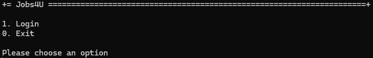
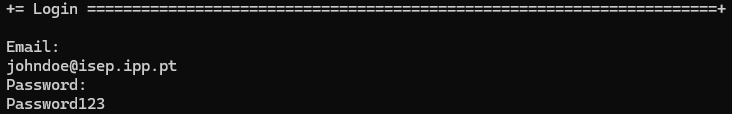

# US G007 - Support and apply authentication and authorization

# 4. Tests 

_N/A_

# 5. Construction (Implementation)

_N/A_

# 6. Integration and Demo 

In the following images, we can see a demonstration of the authentication and authorization system in the Jobs4U application.

Main menu

**1.** The user can access the login page by choosing the `Login` option in the main menu.

Login menu

**2.** The user can log in by entering the email and password.

# 7. Observations

The implementation of the authentication and authorization system was a success

