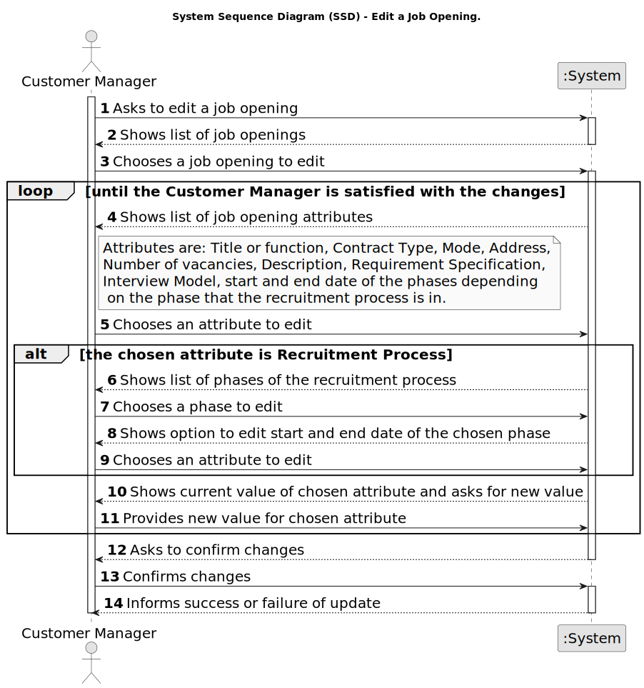

# US 1004 - Edit a Job Opening

## 1. Requirements Engineering

### 1.1. User Story Description

* As Customer Manager, I want to edit a job opening.

### 1.2. Customer Specifications and Clarifications

**From the specifications document:**

- A customer manager will register job offers for the entities he manages in the backoffice. The customer manager will also manage other aspects of job offers.

**From the client clarifications:**

> **Date:** 2024-05-13
>
> **Question 144:** No seguimento da US 1004 para permitir editar um job opening, estamos a assumir que é permitido alterar: Nº de vagas; Morada; Contract Type('FULL_TIME', 'PART_TIME'); Mode ('ON_SITE','REMOTE'); Description; Funcao. Estamos na linha de raciocício correta, ou é necessário alterar a lista para incluir outra informação adicional ou suprimir alguma desta lista?
>
> **Answer:** Do meu ponto de vista deve ser possível alterar “tudo” exceto o próprio job reference. Deve-se ter em conta a manutenção do estado de consistência do sistema.

> **Date:** 2024-05-14
>
> **Question 150:** Quando o Costumer Manager quer editar uma Job Opening, é suposto ele escolher qual Job Opening quer editar a partir de uma pesquisa pela referência?
>
> **Answer:** A questão refere-se um pouco a boas práticas de UI/UX. O contexto indicado na pergunta refere-se a uma situação em que o utilizador tem de identificar a entidade/objeto que deseja editar. Pode-se assumir que o utilizador sabe esse identificador. Mas, em termos de UX/UI deve ser possível obter esse identificar por outras vias (até porque é um identificar gerado pelo sistema). Penso que, para este caso particular, existe já uma US que permite fazer isso.
>
> **Question 154:** Em quais ou até que fases de recrutamento de um Job Opening em que pode-se editar as informações dela? E quais são as informações que podem ser editadas dentro de uma Job Opening?
>
> **Answer:** As alterações devem ser compatíveis com o “momento” em que estamos nessa job opening. Por exemplo, não faz sentido alterar o contrat type se já estamos a receber candidaturas. Essas candidaturas foram feitas segundo uma descrição da oferta de emprego e não faz sentido estar a alterar depois de as pessoas se candidatarem. Mas, por exemplo, deve ser possível alterar o job requirements specification (refere-se a outra US) enquanto as pessoas se candidatam, pois é um aspeto técnico, que não é do conhecimento público. Portanto, devem ter em conta este tipo de preocupações.

### 1.3. Acceptance Criteria

* **AC1:** The system must allow the full edition of a job opening, except for the job reference.

* **AC2:** The system must maintain the consistency of the system when editing a job opening depending on the phase of the recruitment process.

### 1.4. Found out Dependencies

* **US 1002 - Register a Job Opening:** Job openings must be registered before they can be edited.

### 1.5 Input and Output Data

**Input Data:**

* Typed data:
	* Title or function
	* Address
	* Number of vacancies
	* Description

* Selected data:
	* Contract Type
	* Mode
	* Company
	* Requirements (US 1009)

**Output Data:**

* (In)Success of the operation

### 1.6. System Sequence Diagram (SSD)

