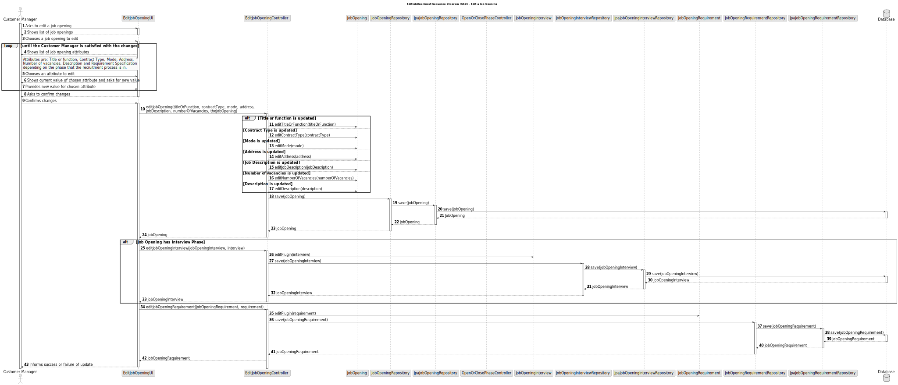
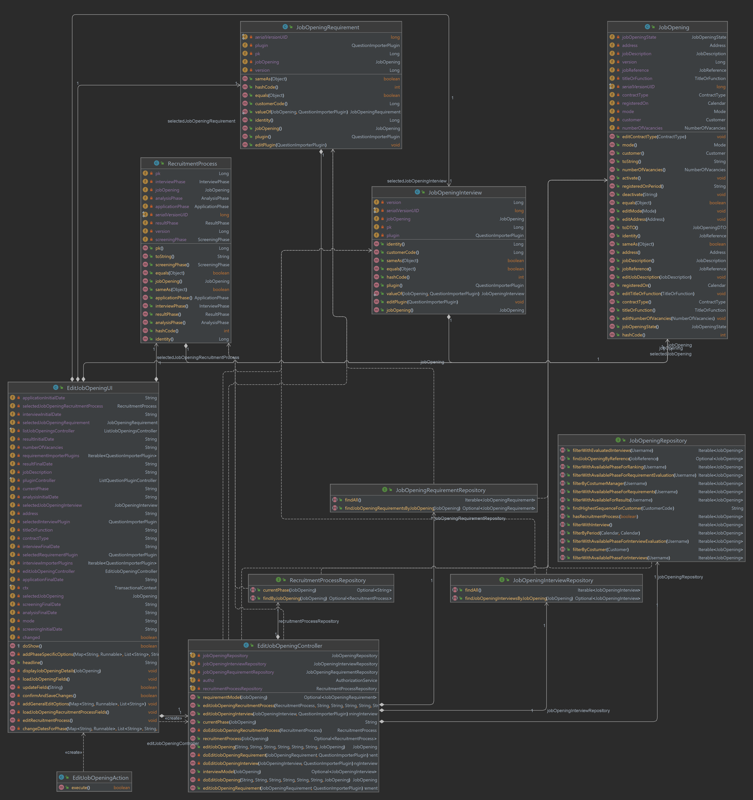

# US 1004 - Edit a Job Opening

## 3. Design - User Story Realization

### 3.1 Rationale

| Interaction ID | Question: Which class is responsible for... | Answer               | Justification (with patterns)                                                                                 |
|:-------------  |:--------------------- |:---------------------|:--------------------------------------------------------------------------------------------------------------|
| Step 1  		 |	... interacting with the actor? | EditJobOpeningUI          | Pure Fabrication: there is no reason to assign this responsibility to any existing class in the Domain Model. |
| 			  		 |	... coordinating the US? | EditJobOpeningController | Controller: The controller is responsible for handling the user's request and coordinating the use case. |
| 			  		 |	... editing the job opening?						 | JobOpening         | Information Expert: The JobOpening class knows how to edit a JobOpening. |
| 			  		 |	... saving the job opening?						 | JobOpeningRepository         | Information Expert: The repository knows how to save a job opening. |
| 			  		 |	... querying the database for job openings?						 | JpaJobOpeningRepository         | Information Expert: The JpaJobOpeningRepository knows how to interact with the database. |
| 			  		 |	... coordinating the job opening editing?						 | EditJobOpeningController         | 	Controller: The controller is responsible for handling the user's request and coordinating the use case. |
| 			  		 |	... editing the job opening interview?						 | JobOpeningInterview	         | Information Expert: The JobOpeningInterview knows how to edit a JobOpeningInterview. |
| 			  		 |	... saving the job opening interview?						 | JobOpeningInterviewRepository	         | Information Expert: The repository knows how to save a job opening interview. |
| 			  		 |	... querying the database for job opening interviews?						 | JpaJobOpeningInterviewRepository	         | Information Expert: The JpaJobOpeningInterviewRepository knows how to interact with the database. |
| 			  		 |	... editing the job opening requirement?						 | JobOpeningRequirement	         | Information Expert: The JobOpeningRequirement knows how to edit a JobOpeningRequirement. |
| 			  		 |	... saving the job opening requirement?						 | JobOpeningRequirementRepository	         | Information Expert: The repository knows how to save a job opening requirement. |
| 			  		 |	... querying the database for job opening requirements?						 | JpaJobOpeningRequirementRepository	         | Information Expert: The JpaJobOpeningRequirementRepository knows how to interact with the database. |
| 			  		 |	... editing the recruitment process?						 | RecruitmentProcess	         | Information Expert: The RecruitmentProcess knows how to edit a RecruitmentProcess. |
| 			  		 |	... saving the recruitment process?						 | RecruitmentProcessRepository	         | Information Expert: The repository knows how to save a recruitment process. |
| 			  		 |	... querying the database for recruitment processes?						 | JpaRecruitmentProcessRepository	         | Information Expert: The JpaRecruitmentProcessRepository knows how to interact with the database. |

### Systematization ##

According to the taken rationale, the conceptual classes promoted to software classes are:

* JobOpening
* JobOpeningInterview
* JobOpeningRequirement
* RecruitmentProcess

Other software classes (i.e. Pure Fabrication) identified:

* EditJobOpeningUI
* EditJobOpeningController
* JobOpeningRepository
* JpaJobOpeningRepository
* JobOpeningInterviewRepository
* JpaJobOpeningInterviewRepository
* JobOpeningRequirementRepository
* JpaJobOpeningRequirementRepository
* RecruitmentProcessRepository
* JpaRecruitmentProcessRepository

These classes are responsible for the user interface, controlling the use cases, editing and saving the job openings, job opening interviews, job opening requirements, and recruitment processes, and interacting with the database, respectively.

## 3.2. Sequence Diagram (SD)

## 3.3. Class Diagram (CD)

