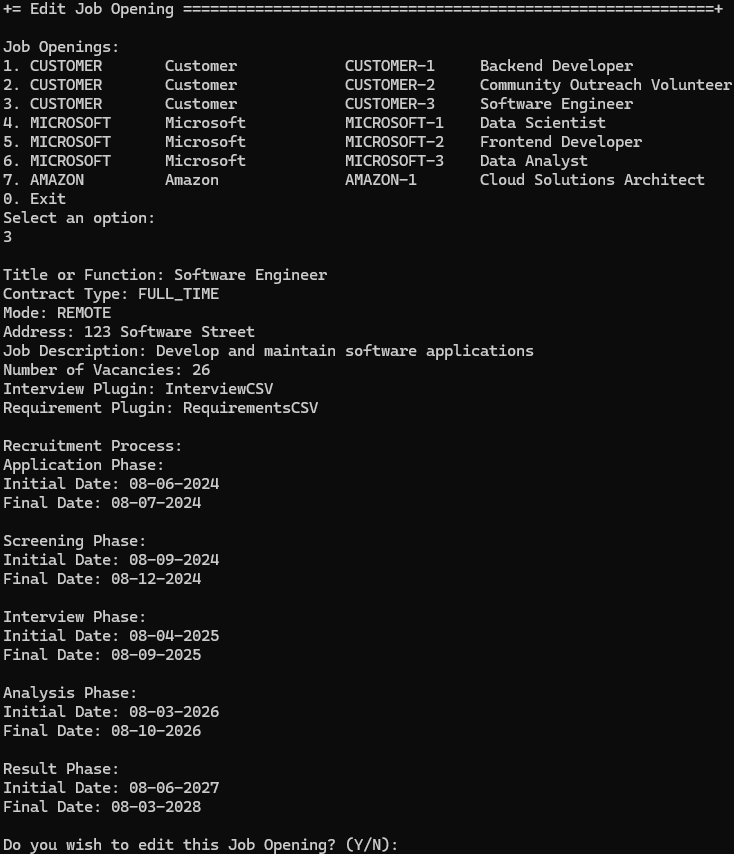
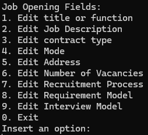
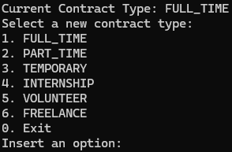
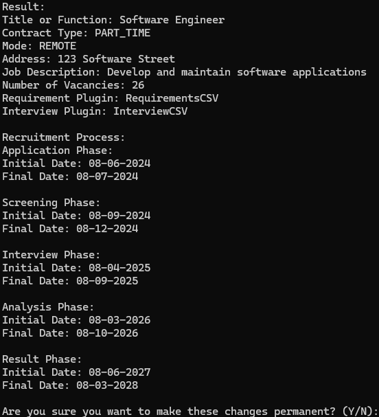

# US 1004 - Edit a Job Opening

# 4. Tests

**Some tests of the EditJobOpeningController**
```java
@BeforeEach
void setUp() {
    MockitoAnnotations.openMocks(this);
    when(mockJobOpening.titleOrFunction()).thenReturn(TitleOrFunction.valueOf("someTitleOrFunction"));
    when(mockJobOpening.contractType()).thenReturn(ContractType.valueOf(TypesOfContract.FULL_TIME.toString()));
    when(mockJobOpening.mode()).thenReturn(Mode.valueOf(ModeTypes.PRESENTIAL.toString()));
    when(mockJobOpening.address()).thenReturn(Address.valueOf("someAddress"));
    when(mockJobOpening.jobDescription()).thenReturn(JobDescription.valueOf("someJobDescription"));
    when(mockJobOpening.numberOfVacancies()).thenReturn(NumberOfVacancies.valueOf("123"));
    controller = new EditJobOpeningController(mockJobOpeningRepo, mockJobOpeningInterviewRepo,
            mockJobOpeningRequirementRepo, mockRecruitmentProcessRepository, mockAuthz);
}

@Test
void testEditJobOpening() {
    when(mockJobOpeningRepo.save(any(JobOpening.class))).thenReturn(mockJobOpening);
    JobOpening result = controller.editJobOpening("newTitleOrFunction", TypesOfContract.FREELANCE.toString(),
            ModeTypes.HYBRID.toString(), "newAddress", "newJobDescription", "321", mockJobOpening);
    assertEquals(mockJobOpening, result);
    verify(mockJobOpeningRepo).save(any(JobOpening.class));
}

@Test
void testEditJobOpeningInterview() {
    when(mockJobOpeningInterviewRepo.save(any(JobOpeningInterview.class))).thenReturn(mockJobOpeningInterview);
    JobOpeningInterview result = controller.editJobOpeningInterview(mockJobOpeningInterview, null);
    assertEquals(mockJobOpeningInterview, result);
    verify(mockJobOpeningInterviewRepo).save(any(JobOpeningInterview.class));
}

@Test
void testEditJobOpeningRequirement() {
    when(mockJobOpeningRequirementRepo.save(any(JobOpeningRequirement.class)))
            .thenReturn(mockJobOpeningRequirement);
    JobOpeningRequirement result = controller.editJobOpeningRequirement(mockJobOpeningRequirement, null);
    assertEquals(mockJobOpeningRequirement, result);
    verify(mockJobOpeningRequirementRepo).save(any(JobOpeningRequirement.class));
}

@Test
void testInterviewModel() {
    when(mockJobOpeningInterviewRepo.findJobOpeningInterviewsByJobOpening(any(JobOpening.class)))
            .thenReturn(Optional.of(mockJobOpeningInterview));
    Optional<JobOpeningInterview> result = controller.interviewModel(mockJobOpening);
    assertEquals(Optional.of(mockJobOpeningInterview), result);
}

@Test
void testRequirementModel() {
    when(mockJobOpeningRequirementRepo.findJobOpeningRequirementsByJobOpening(any(JobOpening.class)))
            .thenReturn(Optional.of(mockJobOpeningRequirement));
    Optional<JobOpeningRequirement> result = controller.requirementModel(mockJobOpening);
    assertEquals(Optional.of(mockJobOpeningRequirement), result);
}
```

# 5. Construction (Implementation)

**EditJobOpeningController**
```java
@UseCaseController
public class EditJobOpeningController {

    private final JobOpeningRepository jobOpeningRepository;
    private final JobOpeningInterviewRepository jobOpeningInterviewRepository;
    private final JobOpeningRequirementRepository jobOpeningRequirementRepository;
    private final RecruitmentProcessRepository recruitmentProcessRepository;
    private final AuthorizationService authz;

    public EditJobOpeningController(final JobOpeningRepository jobOpeningRepository,
            final JobOpeningInterviewRepository jobOpeningInterviewRepository,
            final JobOpeningRequirementRepository jobOpeningRequirementRepository,
            final RecruitmentProcessRepository recruitmentProcessRepository,
            final AuthorizationService authz) {

        this.jobOpeningRepository = jobOpeningRepository;
        this.jobOpeningInterviewRepository = jobOpeningInterviewRepository;
        this.jobOpeningRequirementRepository = jobOpeningRequirementRepository;
        this.recruitmentProcessRepository = recruitmentProcessRepository;
        this.authz = authz;

    }

    public JobOpening editJobOpening(final String titleOrFunction, final String contractType,
            final String mode, final String address, final String jobDescription,
            final String numberOfVacancies, final JobOpening jobOpening) {
        authz.ensureAuthenticatedUserHasAnyOf(BaseRoles.CUSTOMER_MANAGER, BaseRoles.POWERUSER);

        return doEditJobOpening(titleOrFunction, contractType, mode, address, jobDescription,
                numberOfVacancies, jobOpening);
    }

    private JobOpening doEditJobOpening(final String titleOrFunction, final String contractType, final String mode,
            final String address, final String jobDescription, final String numberOfVacancies,
            final JobOpening jobOpening) {

        if (!jobOpening.titleOrFunction().toString().equals(titleOrFunction)) {
            jobOpening.editTitleOrFunction(TitleOrFunction.valueOf(titleOrFunction));
        }
        if (!jobOpening.contractType().toString().equals(contractType)) {
            jobOpening.editContractType(ContractType.valueOf(contractType));
        }
        if (!jobOpening.mode().toString().equals(mode)) {
            jobOpening.editMode(Mode.valueOf(mode));
        }
        if (!jobOpening.address().toString().equals(address)) {
            jobOpening.editAddress(Address.valueOf(address));
        }
        if (!jobOpening.jobDescription().toString().equals(jobDescription)) {
            jobOpening.editJobDescription(JobDescription.valueOf(jobDescription));
        }
        if (!jobOpening.numberOfVacancies().toString().equals(numberOfVacancies)) {
            jobOpening.editNumberOfVacancies(NumberOfVacancies.valueOf(numberOfVacancies));
        }
        return jobOpeningRepository.save(jobOpening);
    }

    public JobOpeningInterview editJobOpeningInterview(final JobOpeningInterview jobOpeningInterview,
            final QuestionImporterPlugin plugin) {
        authz.ensureAuthenticatedUserHasAnyOf(BaseRoles.CUSTOMER_MANAGER, BaseRoles.POWERUSER);
        return doEditJobOpeningInterview(jobOpeningInterview, plugin);
    }

    private JobOpeningInterview doEditJobOpeningInterview(final JobOpeningInterview jobOpeningInterview,
            final QuestionImporterPlugin plugin) {
        jobOpeningInterview.editPlugin(plugin);
        return jobOpeningInterviewRepository.save(jobOpeningInterview);
    }

    public JobOpeningRequirement editJobOpeningRequirement(final JobOpeningRequirement jobOpeningRequirement,
            final QuestionImporterPlugin plugin) {
        authz.ensureAuthenticatedUserHasAnyOf(BaseRoles.CUSTOMER_MANAGER, BaseRoles.POWERUSER);
        return doEditJobOpeningRequirement(jobOpeningRequirement, plugin);
    }

    private JobOpeningRequirement doEditJobOpeningRequirement(final JobOpeningRequirement jobOpeningRequirement,
            final QuestionImporterPlugin plugin) {
        jobOpeningRequirement.editPlugin(plugin);
        return jobOpeningRequirementRepository.save(jobOpeningRequirement);
    }

    public RecruitmentProcess editJobOpeningRecruitmentProcess(
            final RecruitmentProcess jobOpeningRecruitmentProcess, final String applicationInitialDate,
            final String applicationFinalDate, final String screeningInitialDate,
            final String screeningFinalDate, final String interviewInitialDate,
            final String interviewFinalDate, final String analysisInitialDate,
            final String analysisFinalDate, final String resultInitialDate, final String resultFinalDate) {
        authz.ensureAuthenticatedUserHasAnyOf(BaseRoles.CUSTOMER_MANAGER, BaseRoles.POWERUSER);
        if (applicationInitialDate != jobOpeningRecruitmentProcess.applicationPhase().initialDate().toString())
            jobOpeningRecruitmentProcess.applicationPhase().changeInitialDate(applicationInitialDate);
        if (applicationFinalDate != jobOpeningRecruitmentProcess.applicationPhase().finalDate().toString())
            jobOpeningRecruitmentProcess.applicationPhase().changeFinalDate(applicationFinalDate);
        if (screeningInitialDate != jobOpeningRecruitmentProcess.screeningPhase().initialDate().toString())
            jobOpeningRecruitmentProcess.screeningPhase().changeInitialDate(screeningInitialDate);
        if (screeningFinalDate != jobOpeningRecruitmentProcess.screeningPhase().finalDate().toString())
            jobOpeningRecruitmentProcess.screeningPhase().changeFinalDate(screeningFinalDate);
        if (interviewInitialDate != null && interviewInitialDate != jobOpeningRecruitmentProcess
                .interviewPhase().initialDate().toString())
            jobOpeningRecruitmentProcess.interviewPhase().changeInitialDate(interviewInitialDate);
        if (interviewFinalDate != null && interviewFinalDate != jobOpeningRecruitmentProcess.interviewPhase()
                .finalDate().toString())
            jobOpeningRecruitmentProcess.interviewPhase().changeFinalDate(interviewFinalDate);
        if (analysisInitialDate != jobOpeningRecruitmentProcess.analysisPhase().initialDate().toString())
            jobOpeningRecruitmentProcess.analysisPhase().changeInitialDate(analysisInitialDate);
        if (analysisFinalDate != jobOpeningRecruitmentProcess.analysisPhase().finalDate().toString())
            jobOpeningRecruitmentProcess.analysisPhase().changeFinalDate(analysisFinalDate);
        if (resultInitialDate != jobOpeningRecruitmentProcess.resultPhase().initialDate().toString())
            jobOpeningRecruitmentProcess.resultPhase().changeInitialDate(resultInitialDate);
        if (resultFinalDate != jobOpeningRecruitmentProcess.resultPhase().finalDate().toString())
            jobOpeningRecruitmentProcess.resultPhase().changeFinalDate(resultFinalDate);
        return doEditJobOpeningRecruitmentProcess(jobOpeningRecruitmentProcess);
    }

    private RecruitmentProcess doEditJobOpeningRecruitmentProcess(
            final RecruitmentProcess jobOpeningRecruitmentProcess) {
        return recruitmentProcessRepository.save(jobOpeningRecruitmentProcess);
    }

    public Optional<JobOpeningInterview> interviewModel(final JobOpening jobOpening) {
        return jobOpeningInterviewRepository.findJobOpeningInterviewsByJobOpening(jobOpening);
    }

    public Optional<JobOpeningRequirement> requirementModel(final JobOpening jobOpening) {
        return jobOpeningRequirementRepository.findJobOpeningRequirementsByJobOpening(jobOpening);
    }

    public Optional<RecruitmentProcess> recruitmentProcess(final JobOpening jobOpening) {
        return recruitmentProcessRepository.findByJobOpening(jobOpening);
    }

    public String currentPhase(JobOpening jobOpening) {
        authz.ensureAuthenticatedUserHasAnyOf(BaseRoles.CUSTOMER_MANAGER, BaseRoles.POWERUSER);
        Optional<String> phaseOpt = recruitmentProcessRepository.currentPhase(jobOpening);
        if (!phaseOpt.isPresent()) {
            return null;
        }
        String phase = phaseOpt.get();
        return phase;
    }

}
```

# 6. Integration and Demo 

In the following image, we can see a demonstration of the editing of a job opening. The user can edit the job opening by changing the job opening's information, as shown in the images below.

<p align="center">Edit Job Opening</p>



To ensure the user selects the correct job opening to edit, the system will display key information such as the title or function, contract type, mode, address, job description, number of vacancies, plugin, and recruitment process dates. This information will help the user accurately identify and select the job opening they wish to edit.

<p align="center">Job Opening Fields</p>



The user can choose the field they wish to edit by selecting it. The listed fields may vary depending on the current phase of the recruitment process.

<p align="center">Edit Field</p>



After selecting the field to edit, The system will display the field's current information, allowing the user to edit the field.

<p align="center">Result</p>



The system will display a preview of the edited fields. The user can then confirm the changes.

# 7. Observations

The implementation of the editing of a job opening was successful. The user can edit the job opening by changing the job opening's information.

