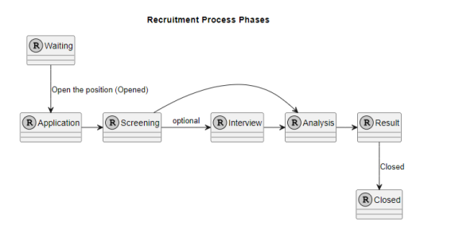

# US 1010 - Open or close phases of the process for a job opening

## 1. Requirements Engineering

### 1.1. User Story Description

* As Customer Manager, I want to open or close phases of the process for a job opening.

### 1.2. Customer Specifications and Clarifications

**From the specifications document:**

_N/A_

**From the client clarifications:**

> **Date:** 16/03/2024
>
> **Question 16:** Relativamente à secção 2.2.1 e às fases do processo de recrutamento, para passarmos para a fase seguinte a anterior tem de fechar ou podemos avançar sem ter a anterior fechada?
>
> **Answer:** A resposta curta é que as fases devem ser sequenciais e não sobrepostas. Quando fecha uma fase abre a próxima. A US 1007 prevê a definição das fases. A US 1010 prevê a abertura e fecho de fases do processo. A decisão do Customer Manager de fechar uma fase deve assumir que o processo avança para a próxima fase automaticamente (independentemente das datas definidas para as fases)

> **Date:** 13/04/2024
>
> **Question 62:** US1007/US1010. Segundo estas US's e a Q16, cada Job Opening deve ter fases definidas. Nas perguntas Q23, Q32 e Q45 é referido o estado da candidatura. A fase da Job Opening e o estado da candidatura são conceitos separados ou referem-se ao mesmo?
>
> **Answer:** Tal como referido anteriormente, estão relacionados mas são conceitos diferentes.

> **Date:** 13/05/2024
>
> **Question 143:** US 1010 - Open or close phases of the process for a job opening. – Quando o Customer Manager deseja abrir ou fechar uma fase de recrutamento, este deve ter a oportunidade de escolher qual fase deseja abrir ou fechar, ou automaticamente ele avança para a próxima fase, isto é fecha a fase atual e abre a seguinte.
>
> **Answer:** Já respondida em Q16. Mas, resumindo, a ideia desta US é permitir avançar nas fases de um job opening. As fases devem ser sempre sequenciais. Podemos considerar que o fecho de uma fase resulta na abertura da fase seguinte (e o avançar para a fase seguinte, significa fechar a anterior). Não deve ser possível “saltar” fases, a não ser fases que não façam parte do processo (por exemplo, se não tiver entrevistas).
>
> **Question 147:** US 1010 – gostaria de saber em quê que consiste abrir ou fechar as fases de uma job opening, tendo em conta a US1007 as datas já foram definidas para cada fase.
>
> **Answer:** Por favor ver Q16 (e outras perguntas sobre o mesmo tema). Esta US permite que o processo mude de fase (tipicamente para avançar no processo). As fases têm datas mas, como referido em Q16, podemos “ativar” uma fase mesmo que ainda não estejamos no seu intervalo temporal. As datas das fases são “indicativas”, no sentido em que sugerem, em particular ao Customer Manager, como gerir temporalmente o processo. Existem “operações” que devem acontecer quando a fase respetiva esta “ativa”.

> **Date:** 14/05/2024
>
> **Question 149:** US 1010 – No ultimo sprint foi definido as datas em que começa cada fase de uma job opening, neste é possivel fechar e abrir fases. A minha pergunta seria a seguinte, caso se queira fechar uma fase antes da seguinte começar, o inicio dessa seguinte fase é antecipado? No cenário que já tenho passado a data de inicio de uma fase y tendo a x (antecessora) sido fechado, caso se queira re-abrir a fazer x, é possivel? Ou o sistema deve proibir essa tentativa visto violar as datas definidas?
>
> **Answer:** Ver Q147 e Q16. A “mudança” de fases para “recuar” deve ser possível caso a fase que se deseje “abandonar” ainda não esteja, de facto, a ser “executada/ativa”. Por exemplo, se estou na fase de screening e já comecei a verificar requisitos de candidatos não faz sentido poder “regressar” à fase de application. Mas se eu estava na fase de application e decidi passar para a próxima (de screening) e passado algum tempo quero regressar à anterior (por exemplo, porque me enganei e ainda estou a receber candidaturas), devo poder faze-lo se ainda não tiver feito nenhuma “operação/processamento” especifico da fase de screening. No que se refere ao avançar deve-se aplicar um principio semelhante: deve ser possível avançar para a próxima fase se a anterior estiver “concluída”, por exemplo, posso avançar para as entrevistas se o screening estiver concluído, ou seja, se todos os candidatos foram verificados e notificados. Tipicamente/normalmente, as fases são para avançar de forma sequencial.
>
> **Question 151:** US1010 - Fechar e abrir fases de recrutamento – Venho por este meio perguntar se a maneira como interpretei esta funcionalidade é o que espera para o produto final. Quando o Customer Manager entende que deve fechar uma fase, este vai ás job openings que o sistema lhe mostra que tenham fases para fechar ou começar e após escolher, tem acesso ás fases. Este escolhe que fase abrir, fechando a anterior (se houver) automaticamente, e depois mostrando uma mensagem de sucesso após realizar isso. Esta interpretação é semelhante ao que espera?
>
> **Answer:** Ver Q16, Q143, Q147 e Q149.
>
> **Question 153:** US 1010 - Na US 1010, considerando que quando fechamos uma fase a próxima começa, quando consideramos o caso de chegarmos á ultima fase, quando fecharmos a fase devemos também mudar o estado do job opening?
>
> **Answer:** Ver Q151. Quanto à segunda questão, quando se fecha a última fase de um processo esse processo termina, ou seja, esse job opening já não está “activo”.

> **Date:** 15/05/2024
>
> **Question 161:** US1010 - O sistema para a Us1010 deve fazer validações de, por exemplo, o utilizador não pode abrir a fase de interview se o interview model ainda não tiver sido definido, ou o utilizador pode mudar de fase mas não vai conseguir, neste caso, executar o processo de avaliação de entrevistas enquanto não tiver um interview specification atribuído?
>
> **Answer:** Penso que poderá fazer isso. O que não deve conseguir é fazer entrevistas sem ter o interview model especificado.

> **Date:** 16/05/2024
>
> **Question 168:** US1010 – O utilizador deve escolher a fase que quer abrir ou fechar?
>
> **Answer:** Sem querer condicionar a UI/UX, penso que uma possibilidade seria o sistema apresentar a fase atual do processo e indicar o que é possível fazer. Se for possível avançar ou recuar, deve indicar que é possível e qual a fase resultante. Se não (ainda) possível avançar/recuar deve indicar a justificação desse facto.
>
> **Question 171:** US1010 - Consideramos que uma fase "open" não é o mesmo que uma fase "active". A fase "open" é uma fase que está disponível para ser executada, enquanto que a fase "active" é uma fase que está a ser executada. Concorda com esta distinção? Porque se o sistema quando fecha uma fase automaticamente considera a fase seguinte como "open" e se "open" for o mesmo que "active/in progress" então nunca vai ser possível "recuar" de fase.
>
> **Answer:** Sim, penso que o que refere está de acordo com o que tentei explicar nas perguntas anteriores sobre esta US. Usei o termo “open” e “close” para indicar a abertura e o fecho das fases. Usei o termo “active” para indicar que alguma operação especifica da fase já teria sido executada (ou estava em execução) e consierava então essa fase como “activa”, o que significava que não podia mudar de fase enquanto essas “operações” não terminassem.

> **Date:** 20/05/2024
>
> **Question 194:** 1010 - Open or close phases of the process for a job opening – Para esta User Story, considerando que a fase de "Application" foi fechada em 19/05 e atualmente estamos na fase de "Screening". Caso seja necessário retroceder para a fase anterior, as datas devem ser ajustadas? Uma vez que pode afetar as datas das fases subsequentes que ainda não foram iniciadas.
>
> **Answer:** A possibilidade indicada anteriormente que permite “retroceder” nas fases deve ser considerada excecional, mas possível se garantida a consistência do sistema. Quando isso acontece não estou a ver necessidade de ajustar datas.
>
> **Question 195:** 1010 – Já falou da possibilidade de reabrir uma fase quando uma fase se encontra no estado "open". A minha dúvida é se por exemplo a fase resume_screen se estiver concluída mas não estiver fechada pode ser colocada em progresso. Resumindo, quando uma fase está concluída devemos dar a possibilidade de fechar a fase e abrir a seguinte e também a possiblidade de voltar ao estado "in progress"?
>
> **Answer:** Não consigo dar uma resposta clara pois existem alguns conceitos que carecem esclarecimento: “resume_screen”, “in progress”, etc. O que posso reforçar é que devem sempre garantir que a consistência do sistema se mantém.
>
> **Question 196:** US1010 – Se estiver na primeira fase e se esta estiver no estado "open" posso recuar a fase e colocar o recruitment process como não começado?
>
> **Answer:** Parece-me um caso particular das repostas anteriores deste tema.

> **Date:** 21/05/2024
>
> **Question 199:** US1018 – Relativamente à US1018, após a execução do processo de avalição de todas as entrevistas da job opening, a fase em que esta se encontra deve ser automaticamente mudado para "Result" ou deve ser mantida em "Analysis" e apenas pode ser mudada pela execução da US1010?
>
> **Answer:** A US1018 não deve alterar a fase actual. A US1010 permite fazer a mudança de fases do processo de recrutamento.
>
> **Question 200:** US 1010 - Ciclo de uma "Job Offer" – Venho por este meio questionar se é correto considerar que o ciclo de uma "job offer" é o seguinte:  Ou seja, uma job offer no momento em que é criada fica no estado "Waiting", de seguida quando o customer manager "abre" a fase de candidaturas (Application) o estado da job offer passa a ser "open", de seguida esta mesma job offer tem de passar pelas 4 (ou 5) fases de recrutamento (Application,Screening,Interview,Analysys e Result) sendo que cada uma tem as suas regras, por exemplo não é possível avançar para a fase de screening se o customer manager ainda não tiver escolhido o plugin que deve ser usado para este efeito (us 1009). Por fim, depois destas 4/5 fases a job offer passa ao seu estado final que é closed. Posto isto, questiono novamente, se este "ciclo" de vida de uma job offer é correto?
>
> **Answer:** Parece-me que o diagrama e a sua descrição contemplam o essencial do que já foi discutido.
>
> **Question 201:** US1010 – Em termos de estados da fase, os estado concluída e fechada são sinónimos ou representam conceitos diferentes? Deu um exemplo para a fase de "screening" que encontra-se concluída quando todos os candidatos forem verificados e notificados. Consegue dar uma explicação para as outras fases existentes, quando é que as podemos considerar fechadas?
>
> **Answer:** Quando, em questões anteriores sobre este tópico, usei o termos concluído era no sentido de indicar que as atividades relativas ao “propósito” da fase tinham sido terminadas, concluídas, portanto estariam reunidas as condições para poder avançar para a fase seguinte (i.e., fechar a atual). Quando às condições para cada fase penso que devem pensar no problema e tentar identificá-las. Como está colocada a questão parece-me muito ampla e julgo que devem conseguir chegar a elas através da análise detalhada do problema. Mas se tiverem questões mais especificas posso tentar responder.

> **Date:** 22/05/2024
>
> **Question 207:** US1010 - Ativar Fase "Result"- Já foi referido anteriormente que para uma fase estar no estado "active" é necessário que processos estejam a ser realizados. Sendo assim, que tipo de processos tem esta fase para poder colocá-la no estado "active"? Penso que não existe nenhuma US relacionada a esta fase.
>
> **Answer:** Na fase “Result”, secção 2.2.1: “candidates as well as customers are notified of the final result “. Este texto parece o texto da US 1020.

> **Date:** 23/05/2024
>
> **Question 212:** US1010 – Quando se pode recuar de fase?
>
> **Answer:** O princípio geral é, se não estiver a fazer nada específico da fase atual pode-se recuar. Por exemplo, se estiver na fase das entrevistas e ainda não comecei a avaliar nenhuma entrevista, então pode-se recuar para a fase de screening. Embora não faça sentido voltar a avaliar os requisitos dos candidatos se eles já foram avisados do resultado. Numa situação real, em que aconteça um erro que invalide um resultado que já foi notificado a terceiros (candidatos ou empresas) podemos assumir que isso será resolvido no âmbito de um processo excecional que está for do âmbito do nosso sistema atual (o sistema não tem atualmente de suportar esses casos).

### 1.3. Acceptance Criteria

* **AC 1:** It must be possible to close and open a phase of the process for a job opening independently of the defined dates for the phases.

* **AC 2:** It must not be possible to open a phase that is not the next one in the sequence of phases.

* **AC 3:** When closing a phase, the next phase must be opened automatically.

* **AC 4:** To open a phase, the previous phase must be closed.

* **AC 5:** To go back to a previous phase, the current phase must not have any operations in progress.

* **AC 6:** The system must not allow the opening of a phase if the necessary conditions for that phase are not met.

### 1.4. Found out Dependencies

* **US 1007 - Setup the phases of the process for a job opening:** The Recruitment Process must be defined before the verification process can be executed.

### 1.5 Input and Output Data

**Input Data:**

* Selected data:
	* Job Opening
	* Operation (Go Back or Go forward)

**Output Data:**

* (In)Success of the operation

### 1.6. System Sequence Diagram (SSD)

