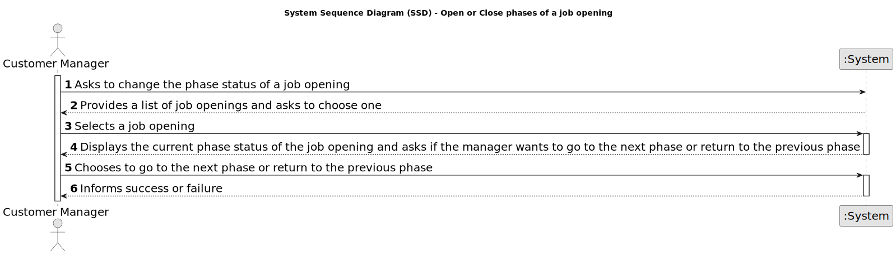

# US 1010 - Open or close phases of the process for a job opening

## 1. Requirements Engineering

### 1.1. User Story Description

* As Customer Manager, I want to open or close phases of the process for a job opening.

### 1.2. Customer Specifications and Clarifications

**From the specifications document:**

_N/A_

**From the client clarifications:**

> **Date:** 16/03/2024
>
> **Question 16:** Relativamente à secção 2.2.1 e às fases do processo de recrutamento, para passarmos para a fase seguinte a anterior tem de fechar ou podemos avançar sem ter a anterior fechada?
>
> **Answer:** A resposta curta é que as fases devem ser sequenciais e não sobrepostas. Quando fecha uma fase abre a próxima. A US 1007 prevê a definição das fases. A US 1010 prevê a abertura e fecho de fases do processo. A decisão do Customer Manager de fechar uma fase deve assumir que o processo avança para a próxima fase automaticamente (independentemente das datas definidas para as fases)

> **Date:** 13/04/2024
>
> **Question 62:** US1007/US1010. Segundo estas US's e a Q16, cada Job Opening deve ter fases definidas. Nas perguntas Q23, Q32 e Q45 é referido o estado da candidatura. A fase da Job Opening e o estado da candidatura são conceitos separados ou referem-se ao mesmo?
>
> **Answer:** Tal como referido anteriormente, estão relacionados mas são conceitos diferentes.

### 1.3. Acceptance Criteria

* **AC 1:** It must be possible to close and open a phase of the process for a job opening independently of the defined dates for the phases.

* **AC 2:** It must not be possible to open a phase that is not the next one in the sequence of phases.

* **AC 3:** When closing a phase, the next phase must be opened automatically.

* **AC 4:** To open a phase, the previous phase must be closed.

### 1.4. Found out Dependencies

* **US 1007 - Setup the phases of the process for a job opening:** The Recruitment Process must be defined before the verification process can be executed.

### 1.5 Input and Output Data

**Input Data:**

* Selected data:
	* Job Opening
	* Phase of the process
	* Operation (open or close)

**Output Data:**

* (In)Success of the operation

### 1.6. System Sequence Diagram (SSD)

