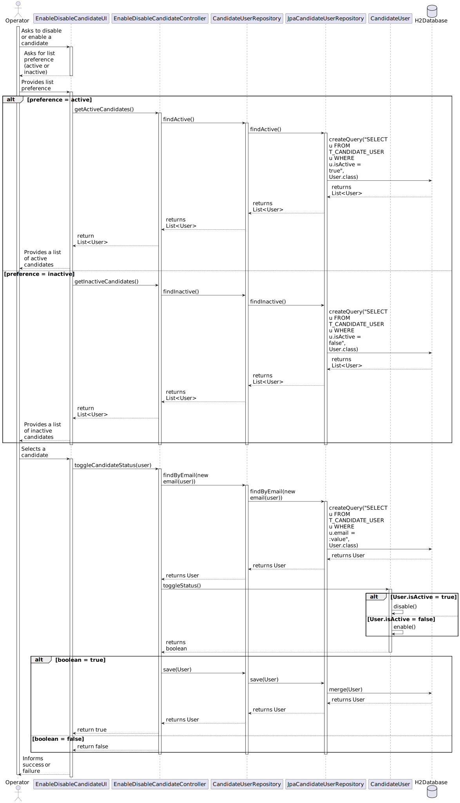
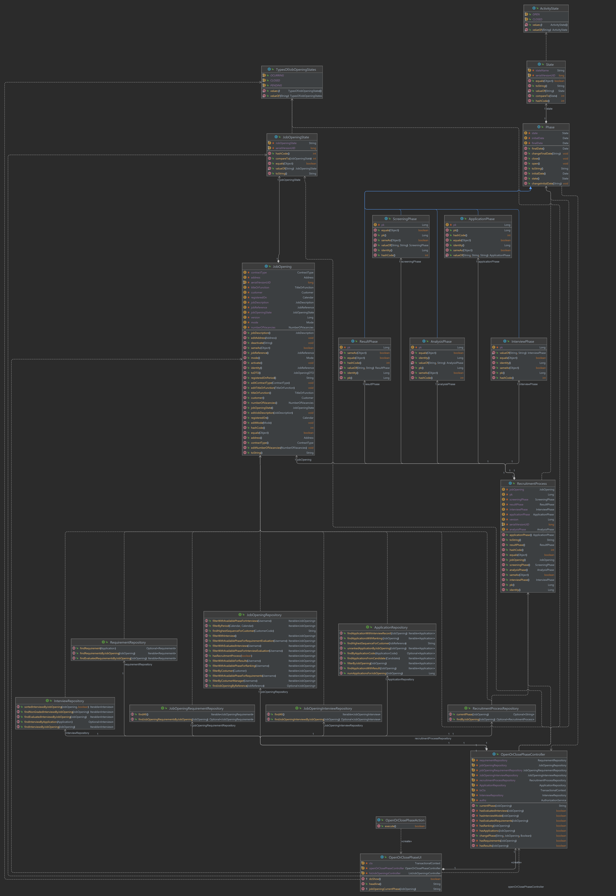

# US 1010 - Open or close phases of the process for a job opening

## 3. Design - User Story Realization

### 3.1 Rationale

| Interaction ID | Question: Which class is responsible for... | Answer               | Justification (with patterns)                                                                                 |
|:-------------  |:--------------------- |:---------------------|:--------------------------------------------------------------------------------------------------------------|
| Step 1  		 |	... interacting with the actor? | OpenOrClosePhaseUI	          | Pure Fabrication: there is no reason to assign this responsibility to any existing class in the Domain Model.     |
| Step 2  		 |	... coordinating the US? | OpenOrClosePhaseController	 | Controller: The controller is responsible for handling the user's request and coordinating the use case.     |
| Step 3		 |	... finding the recruitment process?							 | RecruitmentProcessRepository		         | Information Expert: The repository knows how to find recruitment processes based on their job reference.     |
| Step 4		 |	... querying the database?						 | JpaRecruitmentProcessRepository	         | Information Expert: The JpaRecruitmentProcessRepository knows how to interact with the database.      |
| Step 5		 |	... getting the current phase?						 | RecruitmentProcess      | 	Information Expert: The RecruitmentProcess class knows its current phase.                                                                               |
| Step 6		 |	... changing the phase status?							 | ApplicationPhase, ScreeningPhase, InterviewPhase, AnalysisPhase, ResultPhase		         | nformation Expert: Each phase class knows how to open or close itself.                                                                               |
| Step 7		 |	... saving the updated phases?								 | RecruitmentProcessRepository			         | Information Expert: The repository knows how to save a recruitment process.       |

Systematization
According to the taken rationale, the conceptual classes promoted to software classes are:

* RecruitmentProcess
* ApplicationPhase
* ScreeningPhase
* InterviewPhase
* AnalysisPhase
* ResultPhase

Other software classes (i.e. Pure Fabrication) identified:

* OpenOrClosePhaseUI
* OpenOrClosePhaseController
* RecruitmentProcessRepository
* JpaRecruitmentProcessRepository

These classes are responsible for the user interface, controlling the use case, and interacting with the database, respectively.

## 3.2. Sequence Diagram (SD)

## 3.3. Class Diagram (CD)

