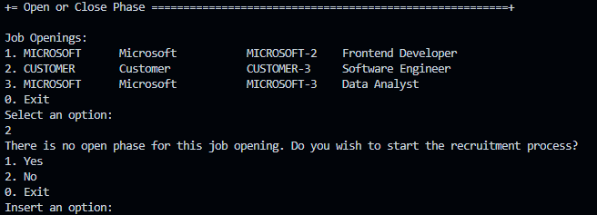
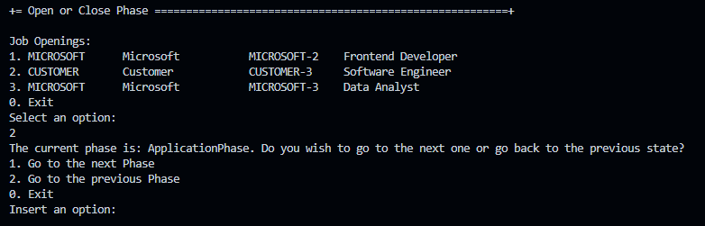
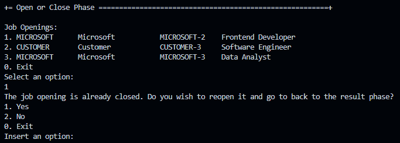

# US 1010 - Open or close phases of the process for a job opening

# 4. Tests 

**Tests for the OpenOrClosePhasesController**
```java
public class OpenOrClosePhaseControllerTest {

    @Mock
    private RecruitmentProcessRepository recruitmentProcessRepository;
    @Mock
    private JobOpeningRepository jobOpeningRepository;
    @Mock
    private JobOpeningRequirementRepository jobOpeningRequirementRepository;
    @Mock
    private JobOpeningInterviewRepository jobOpeningInterviewRepository;
    @Mock
    private ApplicationRepository applicationRepository;
    @Mock
    private RequirementRepository requirementRepository;
    @Mock
    private InterviewRepository interviewRepository;
    @Mock
    private AuthorizationService authz;
    @Mock
    private TransactionalContext txCtx;

    private OpenOrClosePhaseController controller;

    @BeforeEach
    public void setup() {
        MockitoAnnotations.openMocks(this);
        controller = new OpenOrClosePhaseController(recruitmentProcessRepository, jobOpeningRepository,
                jobOpeningRequirementRepository, jobOpeningInterviewRepository, applicationRepository,
                requirementRepository, interviewRepository, authz, txCtx);
    }

    @Test
    public void testNullPhase() {
        JobOpening jobOpening = mock(JobOpening.class);
        when(recruitmentProcessRepository.currentPhase(jobOpening)).thenReturn(Optional.empty());
        String phase = controller.currentPhase(jobOpening);
        verify(recruitmentProcessRepository).currentPhase(jobOpening);
        assertEquals(null, phase);
    }

    @Test
    public void testApplicationPhase() {
        JobOpening jobOpening = mock(JobOpening.class);
        when(recruitmentProcessRepository.currentPhase(jobOpening)).thenReturn(Optional.of("ApplicationPhase"));
        String phase = controller.currentPhase(jobOpening);
        verify(recruitmentProcessRepository).currentPhase(jobOpening);
        assertEquals("ApplicationPhase", phase);
    }

    @Test
    public void testScreeningPhase() {
        JobOpening jobOpening = mock(JobOpening.class);
        when(recruitmentProcessRepository.currentPhase(jobOpening)).thenReturn(Optional.of("ScreeningPhase"));
        String phase = controller.currentPhase(jobOpening);
        verify(recruitmentProcessRepository).currentPhase(jobOpening);
        assertEquals("ScreeningPhase", phase);
    }

    @Test
    public void testInterviewPhase() {
        JobOpening jobOpening = mock(JobOpening.class);
        when(recruitmentProcessRepository.currentPhase(jobOpening)).thenReturn(Optional.of("InterviewPhase"));
        String phase = controller.currentPhase(jobOpening);
        verify(recruitmentProcessRepository).currentPhase(jobOpening);
        assertEquals("InterviewPhase", phase);
    }

    @Test
    public void testAnalysisPhase() {
        JobOpening jobOpening = mock(JobOpening.class);
        when(recruitmentProcessRepository.currentPhase(jobOpening)).thenReturn(Optional.of("AnalysisPhase"));
        String phase = controller.currentPhase(jobOpening);
        verify(recruitmentProcessRepository).currentPhase(jobOpening);
        assertEquals("AnalysisPhase", phase);
    }

    @Test
    public void testResultPhase() {
        JobOpening jobOpening = mock(JobOpening.class);
        when(recruitmentProcessRepository.currentPhase(jobOpening)).thenReturn(Optional.of("ResultPhase"));
        String phase = controller.currentPhase(jobOpening);
        verify(recruitmentProcessRepository).currentPhase(jobOpening);
        assertEquals("ResultPhase", phase);
    }

    @Test
    public void testErrorApplicationNextPhase() {
        JobOpening jobOpening = mock(JobOpening.class);
        RecruitmentProcess recruitmentProcess = mock(RecruitmentProcess.class);
        ApplicationPhase applicationPhase = mock(ApplicationPhase.class);
        when(recruitmentProcessRepository.currentPhase(jobOpening)).thenReturn(Optional.of("ApplicationPhase"));
        when(recruitmentProcessRepository.findByJobOpening(jobOpening)).thenReturn(Optional.of(recruitmentProcess));
        when(recruitmentProcess.applicationPhase()).thenReturn(applicationPhase);
        when(applicationPhase.state()).thenReturn(State.valueOf(ActivityState.OPEN.toString()));

        assertThrows(Exception.class, () -> {
            controller.changePhase("ApplicationPhase", jobOpening, true);
        });
    }

    @Test
    public void testErrorScreeningNextPhase() {
        JobOpening jobOpening = mock(JobOpening.class);
        RecruitmentProcess recruitmentProcess = mock(RecruitmentProcess.class);
        ApplicationPhase applicationPhase = mock(ApplicationPhase.class);
        when(recruitmentProcessRepository.currentPhase(jobOpening)).thenReturn(Optional.of("ScreeningPhase"));
        when(recruitmentProcessRepository.findByJobOpening(jobOpening)).thenReturn(Optional.of(recruitmentProcess));
        when(recruitmentProcess.applicationPhase()).thenReturn(applicationPhase);
        when(applicationPhase.state()).thenReturn(State.valueOf(ActivityState.OPEN.toString()));

        assertThrows(Exception.class, () -> {
            controller.changePhase("ScreeningPhase", jobOpening, true);
        });
    }

    @Test
    public void testErrorInterviewNextPhase() {
        JobOpening jobOpening = mock(JobOpening.class);
        RecruitmentProcess recruitmentProcess = mock(RecruitmentProcess.class);
        ApplicationPhase applicationPhase = mock(ApplicationPhase.class);
        when(recruitmentProcessRepository.currentPhase(jobOpening)).thenReturn(Optional.of("InterviewPhase"));
        when(recruitmentProcessRepository.findByJobOpening(jobOpening)).thenReturn(Optional.of(recruitmentProcess));
        when(recruitmentProcess.applicationPhase()).thenReturn(applicationPhase);
        when(applicationPhase.state()).thenReturn(State.valueOf(ActivityState.OPEN.toString()));

        assertThrows(Exception.class, () -> {
            controller.changePhase("InterviewPhase", jobOpening, true);
        });
    }

    @Test
    public void testErrorAnalysisNextPhase() {
        JobOpening jobOpening = mock(JobOpening.class);
        RecruitmentProcess recruitmentProcess = mock(RecruitmentProcess.class);
        ApplicationPhase applicationPhase = mock(ApplicationPhase.class);
        when(recruitmentProcessRepository.currentPhase(jobOpening)).thenReturn(Optional.of("AnalysisPhase"));
        when(recruitmentProcessRepository.findByJobOpening(jobOpening)).thenReturn(Optional.of(recruitmentProcess));
        when(recruitmentProcess.applicationPhase()).thenReturn(applicationPhase);
        when(applicationPhase.state()).thenReturn(State.valueOf(ActivityState.OPEN.toString()));

        assertThrows(Exception.class, () -> {
            controller.changePhase("AnalysisPhase", jobOpening, true);
        });
    }

    @Test
    public void testErrorResultNextPhase() {
        JobOpening jobOpening = mock(JobOpening.class);
        RecruitmentProcess recruitmentProcess = mock(RecruitmentProcess.class);
        ApplicationPhase applicationPhase = mock(ApplicationPhase.class);
        when(recruitmentProcessRepository.currentPhase(jobOpening)).thenReturn(Optional.of("ResultPhase"));
        when(recruitmentProcessRepository.findByJobOpening(jobOpening)).thenReturn(Optional.of(recruitmentProcess));
        when(recruitmentProcess.applicationPhase()).thenReturn(applicationPhase);
        when(applicationPhase.state()).thenReturn(State.valueOf(ActivityState.OPEN.toString()));

        assertThrows(Exception.class, () -> {
            controller.changePhase("ResultPhase", jobOpening, true);
        });
    }
}
```

**Some unit tests for the Phases**
```java
    @Test
    public void testOpeningPhase() throws Exception {
        Phase phase = getNewPhase(aInitialDate, aFinalDate);
        phase.open();
        assertTrue(phase.state().equals(State.valueOf(ActivityState.OPEN.toString())));
    }

    @Test
    public void testClosingPhase() throws Exception {
        Phase phase = getNewPhase(aInitialDate, aFinalDate);
        phase.open();
        phase.close();
        assertTrue(phase.state().equals(State.valueOf(ActivityState.CLOSED.toString())));
    }

    @Test
    public void testOpeningPhaseAlreadyOpened() throws Exception {
        Phase phase = getNewPhase(aInitialDate, aFinalDate);
        phase.open();
        assertThrows(IllegalStateException.class, () -> {
            phase.open();
        });
    }

    @Test
    public void testClosingPhaseAlreadyClosed() throws Exception {
        Phase phase = getNewPhase(aInitialDate, aFinalDate);
        assertThrows(IllegalStateException.class, () -> {
            phase.close();
        });
    }
```

# 5. Construction (Implementation)

**OpenOrClosePhasesController**
```java
    public class OpenOrClosePhaseController {

    private final AuthorizationService authz;
    private final RecruitmentProcessRepository recruitmentProcessRepository;
    private final JobOpeningRepository jobOpeningRepository;
    private final JobOpeningRequirementRepository jobOpeningRequirementRepository;
    private final JobOpeningInterviewRepository JobOpeningInterviewRepository;
    private final ApplicationRepository ApplicationRepository;
    private final RequirementRepository requirementRepository;
    private final InterviewRepository InterviewRepository;
    private final TransactionalContext txCtx;

    public OpenOrClosePhaseController(final RecruitmentProcessRepository recruitmentProcessRepository,
            final JobOpeningRepository jobOpeningRepository,
            final JobOpeningRequirementRepository jobOpeningRequirementRepository,
            final JobOpeningInterviewRepository JobOpeningInterviewRepository,
            final ApplicationRepository ApplicationRepository, final RequirementRepository RequirementRepository,
            final InterviewRepository InterviewRepository,
            final AuthorizationService authz, final TransactionalContext txCtx) {
        this.recruitmentProcessRepository = recruitmentProcessRepository;
        this.jobOpeningRepository = jobOpeningRepository;
        this.jobOpeningRequirementRepository = jobOpeningRequirementRepository;
        this.JobOpeningInterviewRepository = JobOpeningInterviewRepository;
        this.ApplicationRepository = ApplicationRepository;
        this.requirementRepository = RequirementRepository;
        this.InterviewRepository = InterviewRepository;
        this.authz = authz;
        this.txCtx = txCtx;
    }

    public String currentPhase(final JobOpening jobOpening) {
        authz.ensureAuthenticatedUserHasAnyOf(BaseRoles.CUSTOMER_MANAGER, BaseRoles.POWERUSER);
        Optional<String> phaseOpt = recruitmentProcessRepository.currentPhase(jobOpening);
        if (!phaseOpt.isPresent()) {
            return null;
        }
        String phase = phaseOpt.get();
        return phase;
    }

    public boolean changePhase(final String currentPhase, final JobOpening theJobOpening, final Boolean moveUp)
            throws Exception {
        authz.ensureAuthenticatedUserHasAnyOf(BaseRoles.CUSTOMER_MANAGER, BaseRoles.POWERUSER);
        final RecruitmentProcess recruitmentProcess = recruitmentProcessRepository.findByJobOpening(theJobOpening)
                .get();

        txCtx.beginTransaction();
        switch (currentPhase) {

            case null -> {
                if (theJobOpening.jobOpeningState()
                        .equals(JobOpeningState.valueOf(TypesOfJobOpeningStates.PENDING.toString()))) {
                    if (moveUp) {
                        recruitmentProcess.applicationPhase().open();
                        theJobOpening.activate();
                    } else {
                        throw new Exception("The job opening is in the initial state! Cannot go to a previous phase");
                    }
                } else if (theJobOpening.jobOpeningState()
                        .equals(JobOpeningState.valueOf(TypesOfJobOpeningStates.CLOSED.toString()))) {
                    if (!moveUp) {
                        throw new Exception("The job opening is closed! There are no more phases to open next");
                    } else {
                        recruitmentProcess.resultPhase().open();
                        theJobOpening.activate();
                    }
                } else {
                    throw new Exception("The job opening is in an invalid state");
                }

            }

            case "ApplicationPhase" -> {
                recruitmentProcess.applicationPhase().close();
                if (moveUp) {
                    if (!hasRequirements(theJobOpening)) {
                        throw new Exception("No requirements specifications associated with the job opening: "
                                + theJobOpening.jobReference());
                    } else if (!hasApplications(theJobOpening)) {
                        throw new Exception("You cannot move to the next phase without applications");
                    } else {
                        recruitmentProcess.screeningPhase().open();
                    }
                } else {
                    if (!hasApplications(theJobOpening)) {
                        theJobOpening.deactivate(currentPhase);
                    } else {
                        throw new Exception(
                                "Cannot go to the previous phase! Application phase is already in progress");
                    }
                }
            }

            case "ScreeningPhase" -> {
                recruitmentProcess.screeningPhase().close();
                if (moveUp) {
                    if (!hasEvaluatedRequirements(theJobOpening))
                        throw new Exception("You cannot move to the next phase without evaluating the requirements");
                    if (recruitmentProcess.interviewPhase() != null) {
                        if (!hasInterviewModel(theJobOpening)) {
                            throw new Exception("No interview model associated with the job opening: "
                                    + theJobOpening.jobReference());
                        }
                        recruitmentProcess.interviewPhase().open();
                    } else {
                        recruitmentProcess.analysisPhase().open();
                    }
                } else {
                    if (!hasEvaluatedRequirements(theJobOpening)) {
                        recruitmentProcess.applicationPhase().open();
                    } else {
                        throw new Exception("Cannot go to the previous phase! Screening phase is already in progress");
                    }
                }
            }

            case "InterviewPhase" -> {
                recruitmentProcess.interviewPhase().close();
                if (moveUp) {
                    if (!hasEvaluatedInterviews(theJobOpening)) {
                        throw new Exception("You cannot move to the next phase without evaluating the interviews");
                    }
                    recruitmentProcess.analysisPhase().open();
                } else {
                    if (!hasEvaluatedInterviews(theJobOpening)) {
                        recruitmentProcess.screeningPhase().open();
                    } else {
                        throw new Exception("Cannot go to the previous phase! Interview phase is already in progress");
                    }
                }
            }

            case "AnalysisPhase" -> {
                recruitmentProcess.analysisPhase().close();
                if (moveUp) {
                    if (!hasRanking(theJobOpening)) {
                        throw new Exception("You cannot move to the next phase without ranking the applications");
                    }
                    recruitmentProcess.resultPhase().open();
                } else {
                    if (!hasRanking(theJobOpening)) {
                        if (recruitmentProcess.interviewPhase() != null) {
                            recruitmentProcess.interviewPhase().open();
                        } else {
                            recruitmentProcess.screeningPhase().open();
                        }
                    } else {
                        throw new Exception("Cannot go to the previous phase! Analysis phase is already in progress");
                    }
                }
            }

            case "ResultPhase" -> {
                recruitmentProcess.resultPhase().close();
                if (moveUp) {
                    if (!hasResults(theJobOpening)) {
                        throw new Exception("You cannot conclude the process without results");
                    }
                    theJobOpening.deactivate(currentPhase);
                } else {
                    if (!hasResults(theJobOpening)) {
                        recruitmentProcess.analysisPhase().open();
                    } else {
                        throw new Exception("Cannot go to the previous phase! Result phase is already in progress");
                    }
                }
            }

            default -> throw new Exception("Invalid phase: " + currentPhase);
        }

        recruitmentProcessRepository.save(recruitmentProcess);
        jobOpeningRepository.save(theJobOpening);
        try {
            txCtx.commit();
        } catch (final Exception e) {
            txCtx.rollback();
            throw new RuntimeException("Error occurred while committing the transaction. Rolled back.", e);
        } finally {
            txCtx.close();
        }
        return true;

    }

    private boolean hasInterviewModel(final JobOpening theJobOpening) {
        return JobOpeningInterviewRepository.findJobOpeningInterviewsByJobOpening(theJobOpening).isPresent();
    }

    private boolean hasRequirements(final JobOpening theJobOpening) {
        return jobOpeningRequirementRepository.findJobOpeningRequirementsByJobOpening(theJobOpening).isPresent();
    }

    private boolean hasApplications(final JobOpening theJobOpening) {
        return ApplicationRepository.filterByJobOpening(theJobOpening).iterator().hasNext();
    }

    private boolean hasEvaluatedRequirements(final JobOpening theJobOpening) {
        return requirementRepository.findEvaluatedRequirementsByJobOpening(theJobOpening).iterator().hasNext();
    }

    private boolean hasEvaluatedInterviews(final JobOpening theJobOpening) {
        return InterviewRepository.findEvaluatedInterviewsByJobOpening(theJobOpening).iterator().hasNext();
    }

    private boolean hasResults(final JobOpening theJobOpening) {
        return ApplicationRepository.findApplicationsWithResult(theJobOpening).iterator().hasNext();
    }

    private boolean hasRanking(final JobOpening theJobOpening) {
        return ApplicationRepository.findApplicationsWithRanking(theJobOpening).iterator().hasNext();
    }
}
```

# 6. Integration and Demo 

In the following image, we can see a demonstration of what the system looks like when the recruitment process isn´t in progress. The system will then ask the user if he wants to start the recruitment process. If the user clicks on the "Yes" button, the system will start the recruitment process and make sure that the user knows that the recruitment process is in progress.

<p align="center">Start the recruiment process</p>



In the following image, we can see a demonstration of what the system looks like when the recruitment process is in progress. The system will then if the user wants to go to the previous phase or to the next phase. If the user clicks on the "Next" button, the system will move to the next phase of the recruitment process in case all the conditions are met. If the user clicks on the "Previous" button, the system will move to the previous phase of the recruitment process in case the current phase has not started yet.

<p align="center">Recruitment process in progress</p>



In the following image, we can see a demonstration of what the system looks like when the recruitment process is closed. The system will then ask the user if he wants to end the recruitment process. If the user clicks on the "Yes" button, the system will end the recruitment process and the job opening and make sure that the user knows that the recruitment process and the job opening are closed.

<p align="center">End the recruitment process</p>



# 7. Observations

The implementation of changes in the phases of the process for a job opening was completed. The team was able to implement the necessary changes in the system to support the opening and closing of phases of the process for a job opening.

