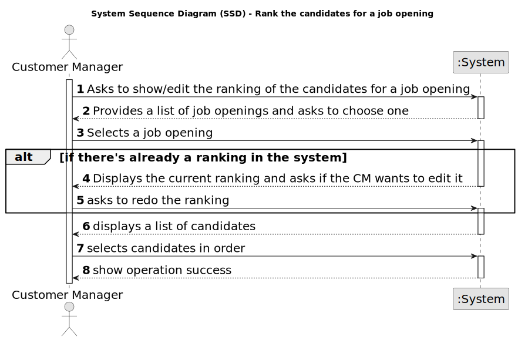

# US 1013 - Rank the candidates for a job opening

## 1. Requirements Engineering

### 1.1. User Story Description

* As Customer Manager, I want to rank the candidates for a job opening.

### 1.2. Customer Specifications and Clarifications

**From the specifications document:**

_N/A_

**From the client clarifications:**

> **Date:** 16/03/2024
>
> **Question 17:** Relativamente à secção 2.2.1, é na fase de Analysis que as entrevistas são avaliadas e é esse resultado que define o ranking dos candidatos? Além disso, para que serve o CV nesta fase? Visto que as entrevistas não são obrigatórias, o que acontece quando estas não se realizam?
>
> **Answer:**  A pontuação das entrevistas é efetuada/calculada na fase das entrevistas. O CV e outros dados (como o resultado das entrevistas) é usado pelo Customer manager na fase de analise para ordenar os candidatos. Mas a ordenação é da responsabilidade do Customer Manager (por exemplo, não tem de seguir a ordem da pontuação nas entrevistas). A US 1013 corresponde à ordenação manual dos candidatos feita pelo Customer Manager. O facto de não haver entrevistas não tem implicações na ordenação dos candidatos pois esta não depende explicitamente das entrevistas.

> **Date:** 13/05/2024
>
> **Question 142:** Mr Client mention a manual ranking (Q17). If the pontuation of an interview is not essential for the candidate's rank, what criteria is to be used when ranking?
>
> **Answer:** Please view again Q17. The ranking is a decision of the Customer Manager based on all the data that he/she may have during the process (including CV and other attached documents and the interviews as well as other data/information that may not be part of the system).
>
> **Question 148:** A minha questão é relativa a como o ranking é feito. O customer manager dá uma nota a cada candidatura e o sistema ordena por ordem crescente sendo assim atribuído o ranking de cada candidatura? Se for assim, a nota terá que escala? Caso ainda seja assim ele só pode atribuir uma nota quando tiver conhecimento de todas? Ou pode ir colocando e o ranking só é atribuído quando todas as candidaturas já estiverem avaliadas?
>
> **Answer:** Ver Q17. A ordenação dos candidatos (ranking) é da responsabilidade do customer manager. Ele pode basear-se no resultado das entrevistas e de outra informação, mas o ranking não é automático. Não há nota nem escala a usar. As candidaturas são ordenadas.

### 1.3. Acceptance Criteria

* **AC 1:** The ranking of the candidates must be manual.

* **AC 2:** The US must allow to both see and edit an ordered list of candidates if such already exists

### 1.4. Found out Dependencies

N/A

### 1.5 Input and Output Data

**Input Data:**

* Selected data:
	* Job Opening
	* Candidates (in order of ranking)

**Output Data:**

* (In)Success of the operation

### 1.6. System Sequence Diagram (SSD)

