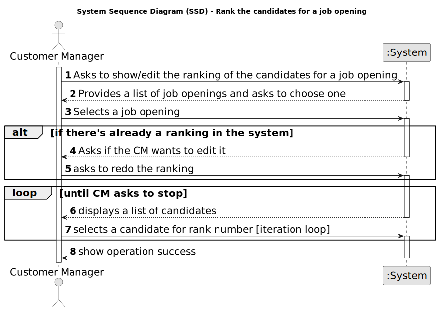

# US 1013 - Rank the candidates for a job opening

## 1. Requirements Engineering

### 1.1. User Story Description

* As Customer Manager, I want to rank the candidates for a job opening.

### 1.2. Customer Specifications and Clarifications

**From the specifications document:**

_N/A_

**From the client clarifications:**

> **Date:** 16/03/2024
>
> **Question 17:** Relativamente à secção 2.2.1, é na fase de Analysis que as entrevistas são avaliadas e é esse resultado que define o ranking dos candidatos? Além disso, para que serve o CV nesta fase? Visto que as entrevistas não são obrigatórias, o que acontece quando estas não se realizam?
>
> **Answer:**  A pontuação das entrevistas é efetuada/calculada na fase das entrevistas. O CV e outros dados (como o resultado das entrevistas) é usado pelo Customer manager na fase de analise para ordenar os candidatos. Mas a ordenação é da responsabilidade do Customer Manager (por exemplo, não tem de seguir a ordem da pontuação nas entrevistas). A US 1013 corresponde à ordenação manual dos candidatos feita pelo Customer Manager. O facto de não haver entrevistas não tem implicações na ordenação dos candidatos pois esta não depende explicitamente das entrevistas.

> **Date:** 13/05/2024
>
> **Question 142:** Mr Client mention a manual ranking (Q17). If the pontuation of an interview is not essential for the candidate's rank, what criteria is to be used when ranking?
>
> **Answer:** Please view again Q17. The ranking is a decision of the Customer Manager based on all the data that he/she may have during the process (including CV and other attached documents and the interviews as well as other data/information that may not be part of the system).
>
> **Question 148:** A minha questão é relativa a como o ranking é feito. O customer manager dá uma nota a cada candidatura e o sistema ordena por ordem crescente sendo assim atribuído o ranking de cada candidatura? Se for assim, a nota terá que escala? Caso ainda seja assim ele só pode atribuir uma nota quando tiver conhecimento de todas? Ou pode ir colocando e o ranking só é atribuído quando todas as candidaturas já estiverem avaliadas?
>
> **Answer:** Ver Q17. A ordenação dos candidatos (ranking) é da responsabilidade do customer manager. Ele pode basear-se no resultado das entrevistas e de outra informação, mas o ranking não é automático. Não há nota nem escala a usar. As candidaturas são ordenadas.

> **Date:** 14/05/2024
>
> **Question 152:** US 1013 - ranking scale - In US 1013, as mentioned before, the customer manager will decide the rank of each candidate's application for a job opening. As such, our team would like to know what is the scale of this rank and a bit of information about how it works. First of all, is the ranking a point system, in which the customer manager will award points to each application, making it so the the ranking is ordered by how many points each application has, or will the customer manager simply assign a place in the rank? For the second option, what I am picturing is the program asking the customer manager what position to place each candidate in, one by one, and the customer manager awarding, 1st, 2nd place and etc.. Second of all, if it is indeed a point system, is there a universal scale it should follow?
>
> **Answer:** See Q148.

> **Date:** 15/05/2024
>
> **Question 155:** US1013 - Rank Entries - Is there a limit on rank entries? Let's say that 100 candidates apply for a job opening. Does the Customer Manager have to sort all 100 candidates?
>
> **Answer:** The order of candidates should include at least all the first candidates within the vacancy number and some following candidates. At the moment, I do not know exactly the number of the following candidates to be ordered. Therefore, I would like for it to be a global configuration property in the system. It could be a number representing a magnitude from the vacancy number. For instance, 1 could mean exactly the same number of vacancies, 2 the double, 0,5 half the number of vacancies. The remainder of the candidates could be just tagged as not ranked.
>
> **Question 157:** US1013 - Rank the candidates for a job Opening is the same as rank the job Applications for a Job Opening, knowing that I can only know the candidates throw the job application?
>
> **Answer:** In the context of a job opening, a candidate is someone that made an application to that job opening. But the same person can be a candidate to other job openings.
>
> **Question 158:** US1013 - Process of ranking - How is the ranking done? The customer manager selects a job opening and is shown the different candidates, and they assign a rank to each one. And the ranking process end when he assigns a rank to all candidates? Example: - Rank the candidate1: - Write the rank: 3 - Rank the candidate2: - Write the rank: 1 - Rank the candidate3: - Write the rank: 4
>
> **Answer:** See Q155. Once again, I do not have specific requirements for UI/UX. But I can provide some ideas. Being a console application limits the UI/UX. However, I see this functionality similar to the way people enter recipients for an email, for instance. In the case of the recipients of an email I simply write their emails separated by a comma. Could it be similar in this case?
>
> **Question 159:** US1013 - Stop the ranking process - When a customer manager starts the ranking process, he can stop and continue later? Or the ranking process must be done in one go?
>
> **Answer:** See Q158. I guess it may depend on how you implement the solution. But, in the case it may work as a “long operation” be aware of when and how to conclude the “operation”.
>
> **Question 160:** US1013 - Edit ranking - The customer manager can change the rank of a candidate after assigning it?
>
> **Answer:** See Q159. That should be possible if none of the interested parties were yet notified of the results.
>
> **Question 162:** US1013 - When the analysis phase ends, the ranking need to have all the candidates? or can the customer manager rank only some of the candidates?
>
> **Answer:** See Q149. All the candidates should be ranked before moving to the result phase.
>
> **Question 163:** US1013 - When the customer manager is ranking the candidates, in terms of UI, should we display information from the application such as interview score, etc... or just the candidate's name and email?
>
> **Answer:** As stated before, I do not have specific requirements for the UI/UX. Use best practices. However, I would like it to be possible for the Customer Manager to have 2 or more instances of the application running, so that he/she could, for instance, see the interviews grades and, at the same time, register the order/ranking of the candidates.

> **Date:** 16/05/2024
>
> **Question 165:** US1013 Clarifications - Mr. Client mentioned in Q155 that the system should have ranking configurations so that the Customer Manager doesn't have to rank all the candidates for a job opening, and that the ones that haven't been manually ranked are to be tagged with "not ranked". However, in Q162, you've said that all the candidates must be ranked before the result phase starts. Can you clarify this situation?
>
> **Answer:** The customer manager must evaluate all the candidates. It is the only way he/she can produce a ranking/order for the candidates and select the “best” candidates to be included in the vacancies for the job opening. In Q155 I was only proposing a way to avoid recording in the system a lot of details that will not have any impact on the next activities. The term “not ranked” maybe is not the best. Maybe “rank not recorded” or something similar could be more appropriated.

> **Date:** 18/05/2024
>
> **Question 183:** US1013 – documents - When ranking the candidates, the customer manager makes decisions based on their CV and other relevant documents. My question is: should there be an option for the customer manager to view the relevant documents before ranking a candidate? Or has the customer manager already made the decision before ranking the candidates and purely uses this functionality to assign the previously planned ranking?
>
> **Answer:** Once again this could be only a UX/UI issue. Please refer to Q17, Q163 and Q140. Also note that there is US1021 for listing application data.

> **Date:** 19/05/2024
>
> **Question 192:** US1013 – Global Configurations – I'm struggling to understang the global configurations defined for US1013. All candidates must be ranked, so that all of them can be notified. Are the global configurations only for persistence purposes? Example: all candidates are ranked and notified, so if 0.5 is in the global definition, then only half of the number of vancancies must be persisted in the system. Is this the scenario that Mr. Client has in mind?
>
> **Answer:** I am assuming you refer to Q155. Suppose you have 2 vacancies. You have 80 candidates. If you configure the property as 1 you need to rank (record in the system) the 2 first candidates plus 2 other candidates. If the property is 0,5 you should rank the 2 first candidates plus 1 third candidate. If the property is 2, you should rank the 2 first candidates plus 4 extra candidates. This is a way to assure that you do not have to record in the system the rank of all the possible candidates, but only a number that includes the ones required to fulfill the vacancies plus some extra (according to the property) for possible exceptions (such as someone leaving the application). But my suggestion was only to help in the UI/UX. You may use any other option.

> **Date:** 20/05/2024
>
> **Question 198:** US1013 – The ranking of candidates should be save in an array to be able to do easier the result phase?
>
> **Answer:** This question is about the design/implementation of the solution. I have no specific opinion regarding this specific question.

> **Date:** 24/05/2024
>
> **Question 215:** US1013 – About the Us1013 which states: "As Customer Manager, I want to rank the candidates for a job opening.". I want to know if two candidates can be tied, which would mean having the same rank for the same job opening
>
> **Answer:** No, ties should not be allowed. It must be clear what candidates are selected to the vacancies.

> **Date:** 25/05/2024
>
> **Question 216:** US1013 – Can we assume that once an interview is evaluated, a score is provided and that score is initially used for the rank entry associated with said application? The Customer Manager is then capable of defining manually the rank order.
>
> **Answer:** I see no need for that. This would be an extra functionality.

> **Date:** 05/06/2024
>
> **Question 241:** US1013 - Na US1013 é suposto dar classificação aos candidatos, mas surgiu-nos uma questão que é após a conclusão desta US, a mesma deve avançar a fase do job opening, ou seja, passar da fase de analise (Analysis) para a fase de resultado (Result)?
>
> **Answer:** Em principio a mudança de fases deve ser feita apenas no âmbito da respetiva US.

### 1.3. Acceptance Criteria

* **AC 1:** The ranking of the candidates must be manual.

* **AC 2:** The US must allow to both see and edit an ordered list of candidates if such already exists

### 1.4. Found out Dependencies

* **US 1021 - List the all data of an application:** The Customer Manager must have access to all the data of an application to be able to rank the candidates.

* **US 2002 - Register applications:** The applications must be registered in the system to be able to rank the candidates.

### 1.5 Input and Output Data

**Input Data:**

* Selected data:
	* Job Opening
	* Candidates (in order of ranking)

**Output Data:**

* (In)Success of the operation

### 1.6. System Sequence Diagram (SSD)

