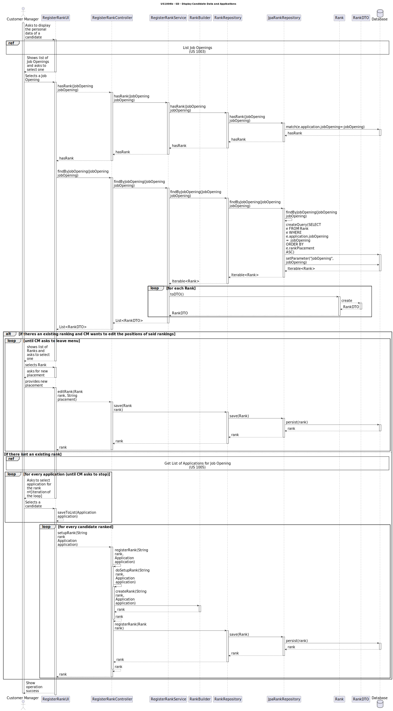

# US 1013 - Rank the candidates for a job opening

## 3. Design - User Story Realization

### 3.1 Rationale

| Interaction ID | Question: Which class is responsible for...                        | Answer                   | Justification (with patterns)                                                                                 |
|:---------------|:-------------------------------------------------------------------|:-------------------------|:--------------------------------------------------------------------------------------------------------------|
| Step 1  		     | 	... interacting with the actor?                                   | RankCandidatesUI         | Pure Fabrication: there is no reason to assign this responsibility to any existing class in the Domain Model. |
| 			  		        | 	... asking to select the job opening?						   		                  | RankCandidatesUI         | Information Expert: The UI knows how to interact with the user and ask for the desired job opening.           |
| 			  		        | 	... coordinating the US?                                          | RankCandidatesController | Controller: The controller is responsible for handling the user's request and coordinating the use case.      |
| 			  		        | 	... finding the applications for the job opening selected?							 | ApplicationRepository    | Information Expert: The repository knows how to find the specified applications.                              |
| 			  		        | 	... querying the database?						                                  | JpaApplicationRepository | Information Expert: The JpaBaseRepository knows how to interact with the database.                            |
| 			  		        | 	... saving the rank?						                                        | RankRepository           | Information Expert: The repository knows how to save a rank.                                                  |
| 			  		        | 	... creating the rank?						                                      | Rank                     | Information Expert: The Rank class knows how to create a new rank.                                            |

### Systematization ##

According to the taken rationale, the conceptual classes promoted to software classes are:

* Rank

Other software classes (i.e. Pure Fabrication) identified:

* RankCandidatesUI
* RankCandidatesController
* RankRepository

These classes are responsible for the user interface, controlling the use case, and interacting with the database, respectively.

## 3.2. Sequence Diagram (SD)

## 3.3. Class Diagram (CD)

N/A
