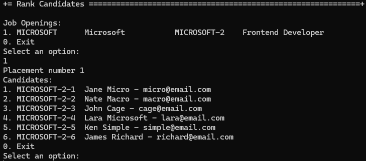
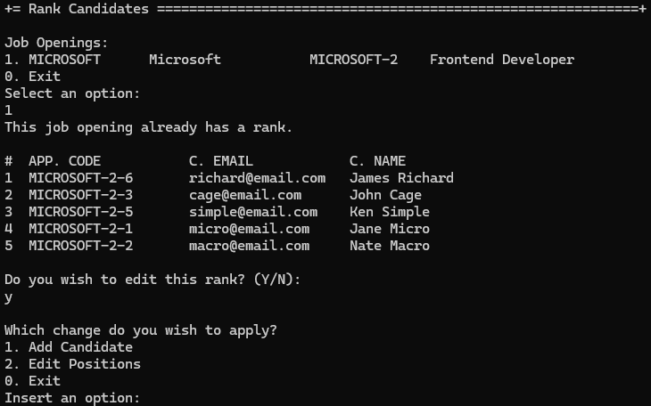
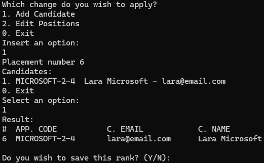
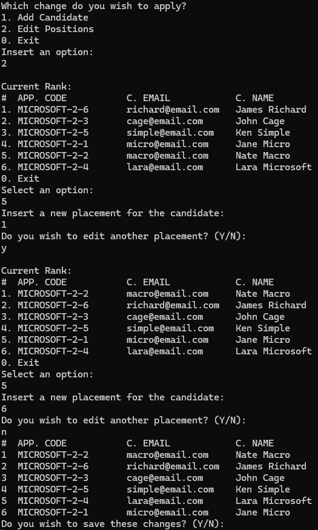

# US 1013 - Rank the candidates for a job opening

# 4. Tests

**Some tests of the Rank class**
```java
@Test
public void ensureRankEqualsPassesForTheSameRankPlacement() throws Exception {
    final Rank aRank = getDummyRank(RANK_PLACEMENT);
    final Rank anotherRank = getDummyRank(RANK_PLACEMENT);
    final boolean expected = aRank.equals(anotherRank);
    assertTrue(expected);
}

@Test
public void ensureRankEqualsAreTheSameForTheSameInstance() throws Exception {
    final Rank aRank = getDummyRank(RANK_PLACEMENT);
    final boolean expected = aRank.equals(aRank);
    assertTrue(expected);
}

@Test
public void ensureRankEqualsFailsForDifferentObjectTypes() throws Exception {
    final Rank aRank = getDummyRank(RANK_PLACEMENT);
    final boolean expected = aRank.equals(new Object());
    assertFalse(expected);
}

@Test
public void ensureRankIsTheSameAsItsInstance() throws Exception {
    final Rank aRank = getDummyRank(RANK_PLACEMENT);
    final boolean expected = aRank.sameAs(aRank);
    assertTrue(expected);
}
```

**Some tests of the RegisterRankService**
```java
@Test
void testHasRank() {
    when(mockRepo.hasRank(mockJobOpening)).thenReturn(true);
    Boolean result = service.hasRank(mockJobOpening);
    assertTrue(result);
}

@Test
void testFindByJobOpening() {
    when(mockRepo.findByJobOpening(mockJobOpening)).thenReturn(Arrays.asList(mockRank));
    Iterable<RankDTO> result = service.findByJobOpening(mockJobOpening);
    assertNotNull(result);
}

@Test
void testSelectedRank() {
    when(mockRankDTO.getId()).thenReturn("1");
    when(mockRepo.ofIdentity(Long.valueOf(mockRankDTO.getId()))).thenReturn(Optional.of(mockRank));
    Rank result = service.selectedRank(mockRankDTO);
    assertEquals(mockRank, result);
}
```

# 5. Construction (Implementation)

**Rank**
```java
@Entity
@Table(name = "T_RANK")
public class Rank implements AggregateRoot<Long> {

    private static final long serialVersionUID = 1L;

    @Version
    private Long version;

    @Id
    @GeneratedValue(strategy = GenerationType.IDENTITY)
    private Long pk;

    @Column(nullable = false)
    private RankPlacement rankPlacement;

    @OneToOne
    private Application application;

    Rank(final RankPlacement rankPlacement, final Application application) {
        Preconditions.noneNull(new Object[] { rankPlacement, application });
        this.rankPlacement = rankPlacement;
        this.application = application;
    }

    protected Rank() {
        // for ORM only
    }

    @Override
    public int hashCode() {
        return DomainEntities.hashCode(this);
    }

    @Override
    public boolean equals(final Object o) {
        return DomainEntities.areEqual(this, o);
    }

    @Override
    public boolean sameAs(final Object other) {
        return DomainEntities.areEqual(this, other);
    }

    @Override
    public Long identity() {
        return this.pk;
    }

    public RankPlacement rankPlacement() {
        return this.rankPlacement;
    }

    public Application application() {
        return this.application;
    }

    public RankDTO toDTO() {
        return new RankDTO(this.pk.toString(), this.application.applicationCode().toString(),
                this.rankPlacement.toString(), this.application.candidate().emailAddress().toString(),
                this.application.candidate().name().toString());
    }

    public void replace(final RankPlacement placement) {
        this.rankPlacement = placement;
    }

    @Override
    public String toString() {
        return pk.toString();
    }
}
```

**RegisterRankController**
```java
@UseCaseController
public class RegisterRankController {

    private final AuthorizationService authz;
    private final RankRepository repository;
    private final RegisterRankService service;

    public RegisterRankController(AuthorizationService authz, RankRepository repository) {
        this.authz = authz;
        this.repository = repository;
        this.service = new RegisterRankService(repository);
    }

    public Rank setupRank(final String rankPlacement, final Application application) {
        authz.ensureAuthenticatedUserHasAnyOf(BaseRoles.CUSTOMER_MANAGER, BaseRoles.POWERUSER);
        return registerRank(rankPlacement, application);
    }

    private Rank registerRank(final String rankPlacement, final Application application) {
        final Rank rank = doSetupRank(rankPlacement, application);
        return repository.save(rank);
    }

    private Rank doSetupRank(final String rankPlacement, final Application application) {
        return new RankBuilder().with(rankPlacement, application).build();
    }

    public Boolean hasRank(final JobOpening jobOpening) {
        return service.hasRank(jobOpening);
    }

    public Iterable<RankDTO> findByJobOpening(final JobOpening jobOpening) {
        return service.findByJobOpening(jobOpening);
    }

    public Rank selectedRank(final RankDTO rankDTO) {
        return service.selectedRank(rankDTO);
    }

    public Rank editRank(final Rank rank, final String rankPlacement) {
        rank.replace(RankPlacement.valueOf(rankPlacement));
        return repository.save(rank);
    }

    public Optional<Long> lastPlacement() {
        return service.lastPlacement();
    }
}
```

**RegisterRankService**
```java
public class RegisterRankService {
    private final RankRepository rankRepository;

    public RegisterRankService(RankRepository rankRepository) {
        this.rankRepository = rankRepository;
    }

    public Boolean hasRank(final JobOpening jobOpening) {
        return rankRepository.hasRank(jobOpening);
    }

    public Iterable<RankDTO> findByJobOpening(final JobOpening jobOpening) {
        List<RankDTO> RankDTOs = new ArrayList<>();
        final Iterable<Rank> ranks = rankRepository.findByJobOpening(jobOpening);
        ranks.forEach(rank -> RankDTOs.add(rank.toDTO()));
        return RankDTOs;
    }

    public Rank selectedRank(final RankDTO rankDTO) {
        Rank selectedRank = rankRepository.ofIdentity(Long.valueOf(rankDTO.getId()))
                .orElseThrow(IllegalArgumentException::new);
        return selectedRank;
    }

    public Optional<Long> lastPlacement() {
        return rankRepository.findHighestSequence();
    }
}
```

# 6. Integration and Demo 

In the following image, we can see a demonstration of the registration of a candidate for a job opening.

<p align="center">Rank applications</p>



For each placement, the user must choose one candidate to occupy the position, as shown in the image above. The minimum number of candidates is the number of positions available for the job opening.

<p align="center">Edit Rank</p>



If there is already a rank for the job opening, the user can edit the rank, as shown in the image above.

The user can edit the positions of the candidates as well as add a candidate to the rank.

<p align="center">Add to rank</p>



The user can add a candidate to the rank, as shown in the image above.

<p align="center">Edition of Positions</p>



The user can also change the position of the candidates by choosing a candidate and providing the new position, as shown in the image above.

# 7. Observations

The implementation of the ranking of candidates for a job opening was successfully implemented. The system allows the user to rank the candidates and edit the positions of the candidates. The user can also add a candidate to the rank.

