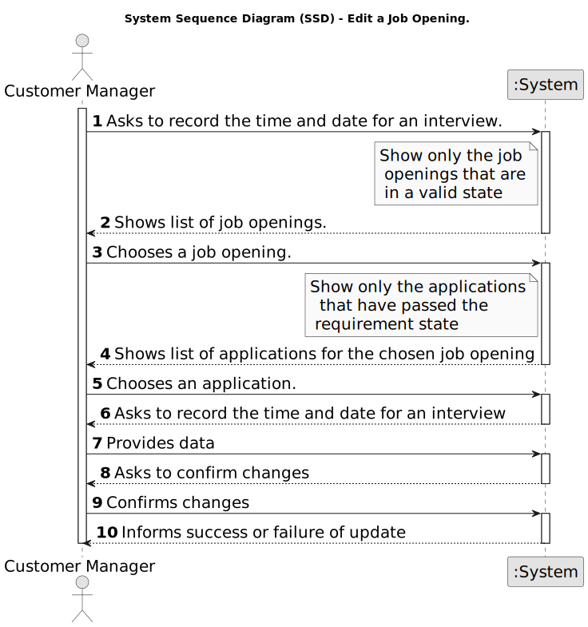

# US 1014 - Record the time and date for an interview

## 1. Requirements Engineering

### 1.1. User Story Description

* As Customer Manager, I want to record the time and date for an interview with a candidate.

### 1.2. Customer Specifications and Clarifications

**From the specifications document:**

- A customer manager will register job offers for the entities he manages in the backoffice. The customer manager will also manage other aspects of job offers.

**From the client clarifications:**

> **Date:** 2024-04-04
>
> **Question 40:** Uma entrevista pode ter apenas uma questão? US1014, time and date, quer dizer data de inicio e não data final? Podem haver entrevistas em paralelo?
>
> **Answer:** Quanto ao número de perguntas numa entrevista, não está definido nenhum limite inferior ou superior. Ou seja, pode haver uma entrevista com apenas 1 pergunta (não fará sentido não ter perguntas). A US1014 refere-se à marcação da data de uma entrevista com um candidato. Algo como indicar o dia e a hora (ex: 23 de abril pelas 14:00). Em relação à marcação de entrevistas “sobrepostas” (com a mesma data de inicio), neste momento, seria algo a permitir (pode, por exemplo, o customer manager delegar noutra pessoa a condução da entrevista). Isso não invalida que devam validar se as entrevistas ocorrem dentro da fase das entrevistas.

> **Date:** 2024-05-13
>
> **Question 145:** Em relação à marcação da intervista, só deve ser possível marcar esta data quando? Só será possível marcar a entrevista quando a fase de recrutamento se encontrar na fase de intervista? Ou será possivel marcar noutras fases anteriores?
>
> **Answer:** Por mim pode ser possível marcar as entrevistas antes mas deve-se ter em atenção se o candidato “passou” o screening. Não faz sentido marcar uma entrevista para um candidato que não foi aceite. Tenham em atenção este tipo de aspetos.

> **Date:** 2024-05-17
>
> **Question 182:** In the us "US 1014 - As Customer Manager, I want to record the time and date for an interview with a candidate." Is it possible to schedule interviews for any day and time or we must take into account weekends, working hours and holidays, for example?
>
> **Answer:** The system should display the day of the week for the selected date. But the system should accept any valid date.

> **Date:** 2024-05-17
>
> **Question 239:** Should we type an interviewer because of the possible parallers interviews or should we only set the date and time of the interview for this US and use this info only for future settings of data about the interview?
>
> **Answer:** Please see other questions regarding this US. For the moment there is no requirement to register the name of the interviewer. However, the system should warn the user if he/she is scheduling an interview for a time already taken by other interview (for the same Customer Manager).

### 1.3. Acceptance Criteria

* **AC1:** The interview date and time must be recorded inside the interview phase of the recruitment process.

* **AC2:** The date /time must follow this format: `YYYY-MM-DD / HH:MM`.

### 1.4. Found out Dependencies

* **US 1010:** *As Customer Manager, I want to open or close phases of the process for a job opening (Candidate need to be aproved in the "Screening").
* **US 1015:** *As Customer Manager, I want to execute the process of verification of requirements of applications for a job opening (Application need to be in the phase of "Interview"/"Requirement" to be able to record the date and time of the interview).

### 1.5 Input and Output Data

**Input Data:**

* Generated data:
	* Date and time for the interview

* Selected data:
	* Job opening
	* candidate

**Output Data:**

* (In)Success of the operation

### 1.6. System Sequence Diagram (SSD)

