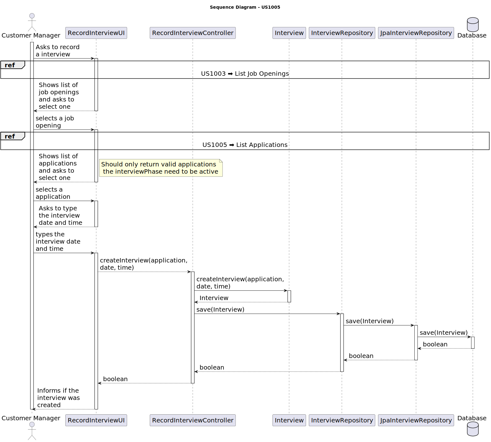
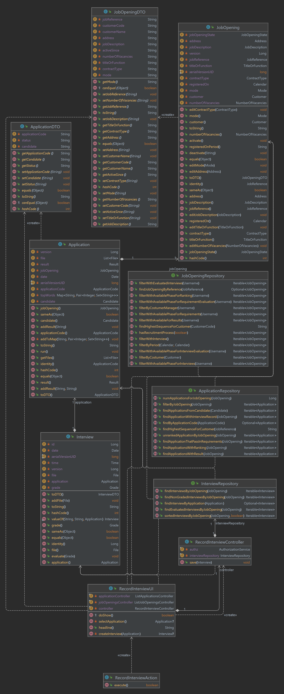

# US 1014 - Record the time and date for an interview

## 3. Design - User Story Realization

### 3.1 Rationale

| Interaction ID | Question: Which class is responsible for... | Answer               | Justification (with patterns)                                                                                 |
|:-------------  |:--------------------- |:---------------------|:--------------------------------------------------------------------------------------------------------------|
| Step 1  		 |	... interacting with the actor?                            | RecordInterviewUI         | Pure Fabrication: there is no reason to assign this responsibility to any existing class in the Domain Model. |
| 			  		 |	... coordinating the US?                               | RecordInterviewController | Controller: The controller is responsible for handling the user's request and coordinating the use case. |
| 			  		 |	... create the interview?				     		   | Interview                 | Information Expert: The Interview class knows how to create a Interview. |
| 			  		 |	... saving the interview?						       | InterviewRepository       | Information Expert: The repository knows how to save a interview. |
| 			  		 |	... querying the database for interviews?			   | JpaInterviewRepository    | Information Expert: The JpaInterviewRepository knows how to interact with the database. |
| 			  		 |	... applying the filter?						       | JobOpeningService	       | Creator: The service knows how to apply a filter to the job openings. |
| 			  		 |	... creating the job opening DTO?					   | JobOpening                | Information Expert: The JobOpening class knows how to create a new JobOpeningDTO. |
| 			  		 |	... saving the job opening?						       | JobOpeningRepository      | Information Expert: The repository knows how to save a job opening. |
| 			  		 |	... querying the database for filtered job openings?   | JpaJobOpeningRepository   | Information Expert: The JpaJobOpeningRepository knows how to interact with the database. |
| 			  		 |	... coordinating the US?                               | ListApplicationService    | Creator: The service knows how to apply a filter to the job openings. |
| 			  		 |	... creating the job opening?						   | Application               | Information Expert: The Application class knows how to create a new application. |
| 			  		 |	... saving the job opening?						       | ApplicationRepository     | Information Expert: The repository knows how to save an application. |
| 			  		 |	... querying the database for job opening?			   | JpaApplicationRepository  | Information Expert: The JpaApplicationRepository knows how to interact with the database. |

### Systematization ##

According to the taken rationale, the conceptual classes promoted to software classes are:

* Interview
* Time
* Date
* Result
* Application
* JobOpening

Other software classes (i.e. Pure Fabrication) identified:

* RecordInterviewUI
* RecordInterviewController
* InterviewRepository
* JpaInterviewRepository
* InterviewRepository
* ListApplicationsService
* ListJobOpeningsService
* ApplicationRepository
* JpaApplicationRepository
* JobOpeningRepository
* JpaJobOpeningRepository

These classes are responsible for the user interface, controlling the use cases, editing and saving the job openings, job opening interviews, and job opening requirements, and interacting with the database, respectively.

## 3.2. Sequence Diagram (SD)

## 3.3. Class Diagram (CD)

