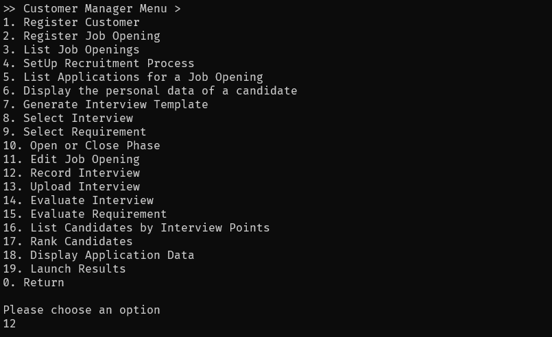
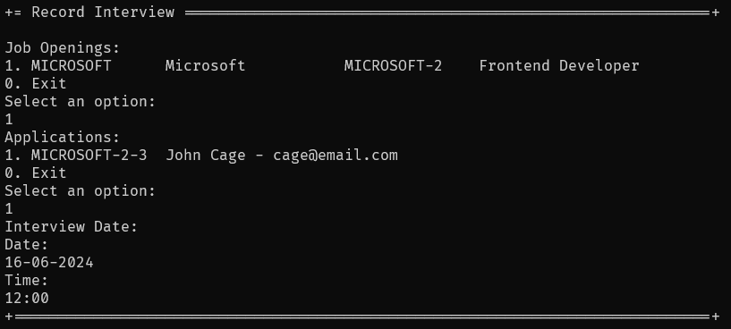

# US 1014 - Record the time and date for an interview

# 4. Tests

**Some tests of the Interview class**
```java
@Test
public voidensureApplicationEqualsPassesForTheSameApplicationValues() throws Exception {

        Interview i = Interview.valueOf(Date.today().toString(), "10:00",
                        getNewDummyApplication(APPLICATION_NUMBER));
        Interview i2 = Interview.valueOf(Date.today().toString(), "10:00",
                        getNewDummyApplication(APPLICATION_NUMBER));

        final boolean expected = i.equals(i2);

        assertTrue(expected);
}

@Test
public void ensureApplicationEqualsFailsForDifferenteApplicationValues() throws Exception {

        Interview i = Interview.valueOf(Date.today().toString(), "10:00",
                        getNewDummyApplication(APPLICATION_NUMBER));
        Interview i2 = Interview.valueOf(Date.today().toString(), "09:00",
                        getNewDummyApplication(APPLICATION_NUMBER2));

        final boolean expected = i.equals(i2);

        assertTrue(expected);
}

@Test
public void ensureApplicationEqualsAreTheSameForTheSameInstance() throws Exception {
        Interview i = Interview.valueOf(Date.today().toString(), "10:00",
                        getNewDummyApplication(APPLICATION_NUMBER));

        final boolean expected = i.equals(i);

        assertTrue(expected);
}

@Test
public void ensureApplicationEqualsFailsForDifferenteObjectTypes() throws Exception {
        Interview i = Interview.valueOf(Date.today().toString(), Time.now().toString(),
                        getNewDummyApplication(APPLICATION_NUMBER));

        final boolean expected = i.equals(Interview.valueOf(Date.today().toString(), Time.now().toString(),
                        getNewDummyApplication(APPLICATION_NUMBER2)));

        assertTrue(expected);
}

@Test
public void testInterviewCreationWithNullDate() {
        assertThrows(IllegalArgumentException.class, () -> {
                Interview.valueOf(null, "10:00", getNewDummyApplication(APPLICATION_NUMBER));
        });
}

@Test
public void testInterviewCreationWithNullTime() {
        assertThrows(IllegalArgumentException.class, () -> {
                Interview.valueOf(Date.today().toString(), null, getNewDummyApplication(APPLICATION_NUMBER));
        });
}

@Test
public void testInterviewCreationWithNullApplication() {
        assertThrows(IllegalArgumentException.class, () -> {
                Interview.valueOf(Date.today().toString(), "10:00", null);
        });
}

@Test
public void testInterviewCreationWithInvalidTime() {
        assertThrows(IllegalArgumentException.class, () -> {
                Interview.valueOf(Date.today().toString(), "25:00", getNewDummyApplication(APPLICATION_NUMBER));
        });
}

@Test
public void testInterviewCreationWithInvalidDate() {
        assertThrows(IllegalArgumentException.class, () -> {
                Interview.valueOf("2022-13-32", "10:00", getNewDummyApplication(APPLICATION_NUMBER));
        });
}
```


# 5. Construction (Implementation)

**Interview**
```java
@Entity
@Table(name = "T_INTERVIEW")
public class Interview implements AggregateRoot<Long> {

    private static final long serialVersionUID = 1L;

    @Id
    @GeneratedValue(strategy = GenerationType.IDENTITY)
    private Long id;

    @Version
    private Long version;

    @Column(nullable = false)
    private Date date;

    @Column(nullable = false)
    private Time time;

    @ManyToOne(optional = false)
    @JoinColumn(name = "Application", unique = true)
    private Application application;

    @Column(nullable = true)
    private File file;

    @Column(nullable = true)
    private Grade grade;

    protected Interview(final String date, final String time, final Application application) {
        Preconditions.noneNull(new Object[] { date, time, application });
        this.date = Date.valueOf(date);
        this.time = Time.valueOf(time);
        this.application = application;
    }

    protected Interview() {
        // for ORM only
    }

    public static Interview valueOf(final String date, final String time, final Application application) {
        return new Interview(date, time, application);
    }

    public void addFile(final File file) {
        this.file = file;
    }

    public void evaluate(final Grade grade) {
        this.grade = grade;
    }

    public Application application() {
        return this.application;
    }

    public File file() {
        return this.file;
    }

    public Grade grade() {
        return this.grade;
    }

    @Override
    public int hashCode() {
        return DomainEntities.hashCode(this);
    }

    @Override
    public boolean equals(final Object o) {
        return DomainEntities.areEqual(this, o);
    }

    @Override
    public boolean sameAs(final Object other) {
        return DomainEntities.areEqual(this, other);
    }

    @Override
    public Long identity() {
        return this.id;
    }

    public InterviewDTO toDTO() {
        return new InterviewDTO(this.application.applicationCode().toString(),
                this.application.candidate().emailAddress().toString(),
                this.grade == null ? null : this.grade.toString());
    }

    public String toString() {
        return this.date.toString() + "-" + this.time.toString();
    }
}
```

**Time**
```java

@Embeddable
public class Time implements ValueObject, Comparable<Time> {

    private static final long serialVersionUID = 1L;
    private static final DateTimeFormatter TIME_FORMATTER = DateTimeFormatter.ofPattern("HH:mm");

    @Temporal(TemporalType.TIME)
    private final LocalTime time;

    protected Time(final String timeStr) {
        Preconditions.nonEmpty(timeStr, "Time should neither be null nor empty");
        Preconditions.ensure(timeStr.matches("([01]?[0-9]|2[0-3]):[0-5][0-9]"), "Invalid time format");
        this.time = LocalTime.parse(timeStr, TIME_FORMATTER);
    }

    protected Time() {
        this.time = null;
    }

    public static Time valueOf(final String time) {
        return new Time(time);
    }

    public boolean isAfter(final Time o) {
        return this.time.isAfter(o.time);
    }

    public boolean isBefore(final Time o) {
        return this.time.isBefore(o.time);
    }

    public static Time now() {
        String formattedTime = LocalTime.now().format(TIME_FORMATTER);
        return valueOf(formattedTime);
    }

    @Override
    public boolean equals(final Object o) {
        if (this == o) {
            return true;
        }
        if (!(o instanceof Time)) {
            return false;
        }

        final Time that = (Time) o;
        return this.time.equals(that.time);
    }

    @Override
    public String toString() {
        return time.format(TIME_FORMATTER);
    }

    @Override
    public int compareTo(final Time arg0) {
        return time.compareTo(arg0.time);
    }

}


```

**RecordInterviewController**
```java
@UseCaseController
public class RecordInterviewController {
    private final InterviewRepository interviewRepository;
    private final AuthorizationService authz;

    public RecordInterviewController(InterviewRepository interviewRepository, AuthorizationService authz) {
        this.interviewRepository = interviewRepository;
        this.authz = authz;
    }

    public void save(Interview interview) {
        authz.ensureAuthenticatedUserHasAnyOf(BaseRoles.CUSTOMER_MANAGER, BaseRoles.POWERUSER);
        interviewRepository.save(interview);
    }

}
```

# 6. Integration and Demo 

In the following image, we can see a demonstration of the registration of a candidate for a job opening.

<p align="center">Customer Manager UI</p>



The user can access the record interview option, as shown in the image above.

<p align="center">Record Interview</p>




The user can record the interview by choosing the job opening and the application, as shown in the image above.

Next, the user can record the interview by providing the date and time of the interview, as shown in the image above.


# 7. Observations

The implementation of the recording of a interview for a job opening was successfully implemented. The user can also add the date and time of the interview.

