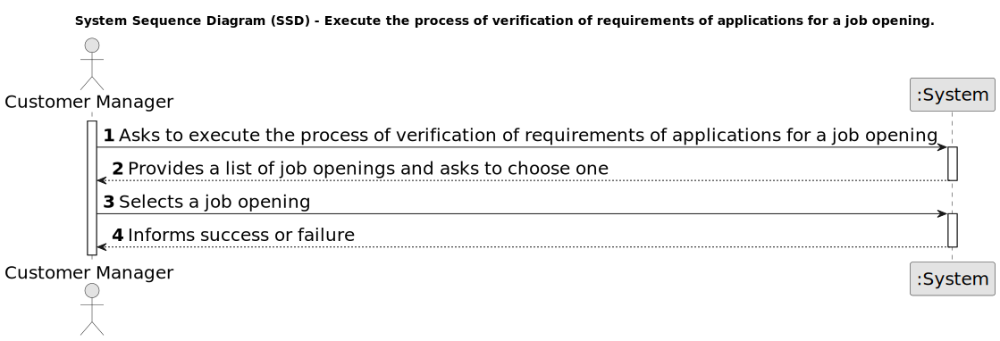

# US 1015 - Execute the process of verification of requirements of applications for a job opening

## 1. Requirements Engineering

### 1.1. User Story Description


* As Customer Manager, I want to execute the process of verification of requirements of applications for a job opening.


### 1.2. Customer Specifications and Clarifications

**From the specifications document:**

- **Figure 2.2** illustrates an example of a template text file with requirements for a job opening.
In this example, the evaluation of this requirements (with the existing values) could result in a
rejection since the candidate has no degree. The system should provide a justification, such as
"A minimum Bachelor degree is required for the job position.".

<p align="center">
  <strong>Figure 2.2: User Input Example</strong>
</p>

```
- #Enter the number of years of experience (integer)
  - Experience-years: 2

- #Select one degree (None; Bachelor; Master; PhD)
  - Academic-degree: None

- #Select one or more programming languages you are proficient in (java; javascript; python)
  - Programming-languages: java, javascript
```


**From the client clarifications:**

> **Date:** 15/04/2024
>
> **Question 69:** US1016 – Acerca da US 1016 - "As Customer Manager, I want the system to notify candidates, by email, of the result of the verification process" qual é o processo através do qual essa notificação é gerada? Após a avaliação do Requirement Specification module, este gera um resultado "Aprovado" ou "Rejeitado". Este resultado despoleta automaticamente uma notificação para o candidato ou é o Customer Manager que tem a responsabilidade de informar o candidato através do sistema do resultado da verificação (ex. depois de um resultado negativo ser gerado, o Customer Manager vai no sistema rejeitar o candidato para que seja enviado o email)?
>
> **Answer:** É a segunda opção que apresenta. A US1015 permite que o Customer Manager invoque o processo de verificação de requisitos. Depois disso todas as candidaturas devem estar aceites ou recusadas. É então possível ao Customer Manager invocar a notificação através da US1016.

> **Date:** 23/04/2024
>
> **Question 119:** Management of screening data - We have a question about the management of the screen phase of the recruitment process. Specifically, after the applications are filtered during the screening process, I'm unsure about who manages the results and oversees this phase. Could you please clarify if the responsibility for managing the screening results falls under the customer manager, the operators, or both?
>
> **Answer:** In US2003 and US2004 it is the Operator that “downloads” a template file to register the requirements, registers the answers for the requirements in the file, and then uploads the file. It is then the Costumer manager that executes the verification process (US1015) and executes the notification of the results (US1016)

### 1.3. Acceptance Criteria

* **AC 1:** The process of verification of requirements of applications for a job opening is made automatically by the system, being the Customer Manager the one who triggers the operation.

### 1.4. Found out Dependencies

* **US 1009 - Select the requirements specification plugin:** The requirements specification plugin must be selected to execute the verification process.

* **US 2004 - Register the answers for the requirements:** The answers for the requirements must be registered before the verification process can be executed.

### 1.5 Input and Output Data

**Input Data:**

* Selected data:
	* Job Opening

**Output Data:**

* (In)Success of the operation


### 1.6. System Sequence Diagram (SSD)



