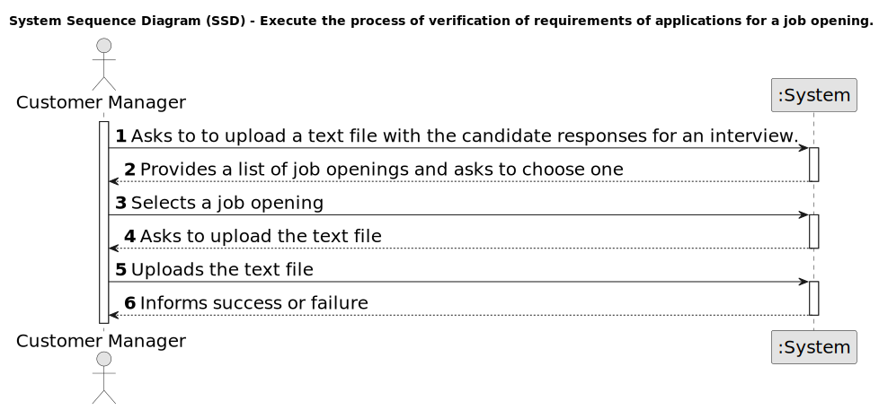

# US 1017 - Upload a text file with the candidate responses for an interview.

## 1. Requirements Engineering

### 1.1. User Story Description

* As Customer Manager, I want to upload a text file with the candidate responses for an interview.

### 1.2. Customer Specifications and Clarifications

**From the specifications document:**

- The Customer Manager will be able to upload a text file with the candidate responses for an interview. The system will automatically verify the requirements of the applications for a job opening.

**From the client clarifications:**

- No additional clarifications were provided.

### 1.3. Acceptance Criteria

* **AC 1:** The Customer Manager need to have a active job opening to upload the text file with the candidate responses for an interview.

### 1.4. Found out Dependencies

* No dependencies were found.

### 1.5 Input and Output Data

**Input Data:**

* Selected data:
	* Job Opening

* Input data:
  * Text file with the candidate responses for an interview

**Output Data:**

* (In)Success of the operation

### 1.6. System Sequence Diagram (SSD)

