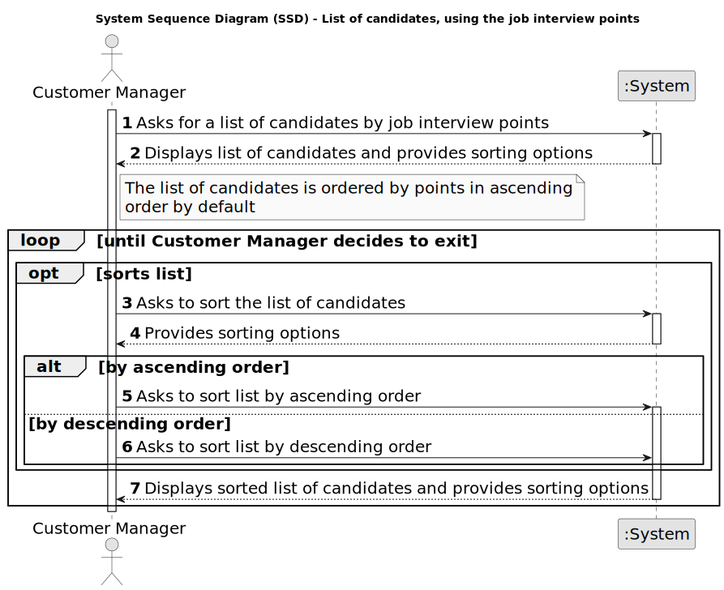

# US 1019 - Get an ordered list of candidates, using the job interview points

## 1. Requirements Engineering

### 1.1. User Story Description

* As Customer Manager, I want to get an ordered list of candidates, using the job interview points (grades), to help me analyze the candidates.

### 1.2. Customer Specifications and Clarifications

**From the specifications document:**

_N/A_

**From the client clarifications:**

> **Date:** 2024-05-16
>
> **Question 169:** As Customer Manager, I want to get an ordered list of candidates, using the job interview points (grades), to help me analyze the candidates.", a lista que pretende é relacionada a uma job opening correto? A maneira de ordenação é ascendente ou quer uma opção que inclua ascendente e descendente?
>
> **Answer:** Sim, a ordenação é relativa a candidaturas para um job opening. A ordenação deve ser descendente, do que tem maior pontuação para o que tem menor pontuação.

> **Date:** 2024-05-17
>
> **Question 177:** As Customer Manager, I want to get an ordered list of candidates, using the job interview points (grades), to help me analyze the candidates. Pretende que para uma determinada Job Opening de um cliente meu, retorno uma lista ordenada de candidatos e suas notas da entrevista. Penso implementar essa funcionalidade da seguinte forma:
>
> Job Opening : XXX
>
> | Nome | Email | Grade |
> |:----:|:-----:|:-----:|
> | `Jane Doe` | `jane@doe.pt` | `85` |
> | `John Doe` | `john@doe.pt` | `70` |
>
> Ou seja com ordenação descendente.
>
> Conforme refere Q153 consegue ver numa instancia esta lista, e noutra instancia faz o ranking que achar pertinente.
>
> Acha bem?
>
> **Answer:** Penso que queira fazer referência a Q163. Relativamente ao exemplo que apresenta parece-me que satisfaz o que pretendo.

> **Date:** 2024-05-20
>
> **Question 197:** Na questao Q169 é mencionado para a listagem ser ordenada descendentemente da nota da entrevista (como mencionado tambem na própria US), no entanto, a questão é, como idealiza a ordenação caso a job opening não possua entrevista?
>
> **Answer:** Esta US não faz sentido para processos que não tenham entrevista.

> **Date:** 2024-05-21
>
> **Question 204:** Segundo a resposta A197, devemos então apenas permitir a listagem de job openings que tenham entrevista?
>
> **Answer:** Penso que não percebi bem a referência à listagem de job openings. Esta US não faz sentido para job openings que não tenham entrevista, uma vez que assenta na listagem dos candidatos e dos seus pontos nas entrevista.

> **Date:** 2024-05-28
>
> **Question 226:** Na descrição da user story : " As Customer Manager, I want to get an ordered list of candidates, using the job interview points (grades), to help me analyze the candidates". A intenção "analyze the candidates" impõe alguma mudança/remoção de candidatos no sistema?
>
> **Answer:** A referência a “analize the candidates” é apenas para passar a ideia que se pretende nesta US que o sistema disponibilize uma forma do Customer Manager conseguir consultar o resultado das entrevistas de forma a ajudar a decidir o ranking dos candidatos. Nada mais. O ranking doa candidatos é registado no sistema através da US 1013.

### 1.4. Found out Dependencies

* **US 1018 - Execute the process that evaluates the interviews for a job opening:** The system must have the job interview points to be able to order the candidates.

### 1.5 Input and Output Data

**Input Data:**

* Selected data:
	* Job Opening

**Output Data:**

* (In)Success of the operation
* List of candidates ordered by job interview points

### 1.6. System Sequence Diagram (SSD)

